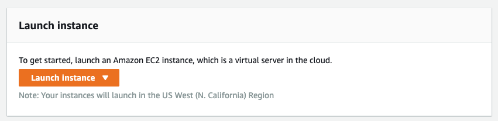
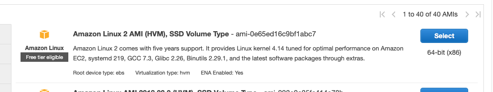
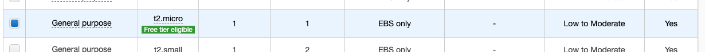
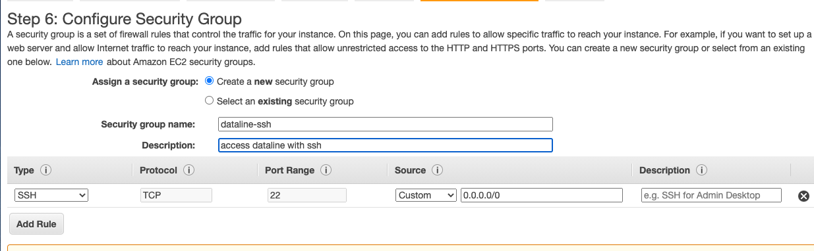
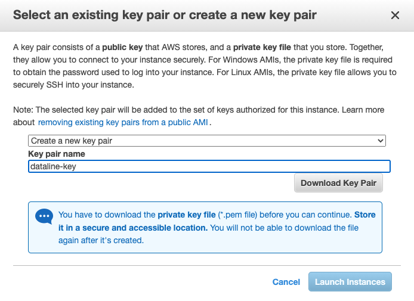
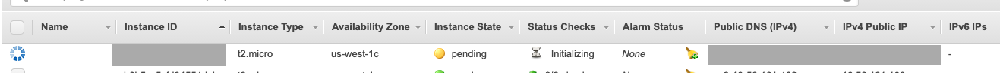

# On AWS \(EC2\)


The instructions have been tested on `Amazon Linux 2 AMI (HVM)`


## Create a new instance

* Launch a new instance



* Select instance AMI



* Select instance type
  * For testing out Airbyte, a `t2.medium` instance is likely sufficient.
  * For long-running Airbyte installations, we recommend a `t2.large` instance.



* `Next: Configure Instance Details` 
  * You can tune parameters or keep the defaults
* `Next: Add Storage`
  * You can tune parameters or keep the defaults
* `Next: Add Tags`
  * You can tune parameters or keep the defaults
* `Next: Configure Security Groups`
  * We are going to allow network for `ssh` 



* `Review and Launch`
* `Launch`
* Create a ssh key so you can connect to the instance
  * Download the key \(and don't lose it or you won't be able to connect to the instance\)



* `Launch Instances`



* Wait for the instance to become `Running`

## Install environment


Note: The following commands will be entered either on your local terminal or in your ssh session on the instance terminal. The comments above each command block will indicate where to enter the commands.


* Connect to your instance

```bash
# In your workstation terminal
SSH_KEY=~/Downloads/airbyte-key.pem # or wherever you've downloaded the key
INSTANCE_IP=REPLACE_WITH_YOUR_INSTANCE_IP
chmod 400 $SSH_KEY # or ssh will complain that the key has the wrong permissions
ssh -i $SSH_KEY ec2-user@$INSTANCE_IP
```

* Install `docker`

```bash
# In your ssh session on the instance terminal
sudo yum update -y
sudo yum install -y docker
sudo service docker start
sudo usermod -a -G docker $USER
```

* Install `docker-compose`

```bash
# In your ssh session on the instance terminal
sudo wget https://github.com/docker/compose/releases/download/1.26.2/docker-compose-$(uname -s)-$(uname -m) -O /usr/local/bin/docker-compose
sudo chmod +x /usr/local/bin/docker-compose
docker-compose --version
```

* Close the ssh connection to ensure the group modification is taken into account

```bash
# In your ssh session on the instance terminal
logout
```

## Install & start Airbyte

* Connect to your instance

```bash
# In your workstation terminal
ssh -i $SSH_KEY ec2-user@$INSTANCE_IP
```

* Install Airbyte

```bash
# In your ssh session on the instance terminal
mkdir airbyte && cd airbyte
wget https://raw.githubusercontent.com/airbytehq/airbyte/master/{.env,docker-compose.yaml}
docker-compose up -d
```

## Connect to Airbyte


For security reasons, we strongly recommend to not expose Airbyte on Internet available ports. Future versions will add support for SSL & Authentication.


* Create ssh tunnel for port 8000


If you want to use different ports you will need to modify `API_URL` in your `.env` file and restart Airbyte.


```bash
# In your workstation terminal
ssh -i $SSH_KEY -L 8000:localhost:8000 -N -f ec2-user@$INSTANCE_IP
```

* Just visit [http://localhost:8000](http://localhost:8000) in your browser and start moving some data!

## Pushing Airbyte logs to CloudWatch

If you want to get your logs from your Airbyte Docker containers in CloudWatch, simply follow [this](https://aws.amazon.com/pt/premiumsupport/knowledge-center/cloudwatch-docker-container-logs-proxy/) guide to do so.

## Troubleshooting

If you encounter any issues, just connect to our [Slack](https://slack.airbyte.io). Our community will help! We also have a [FAQ](../troubleshooting/on-deploying.md) section in our docs for common problems.

