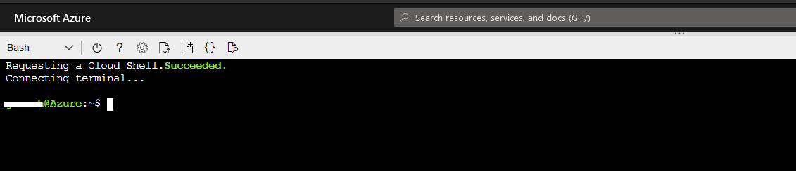
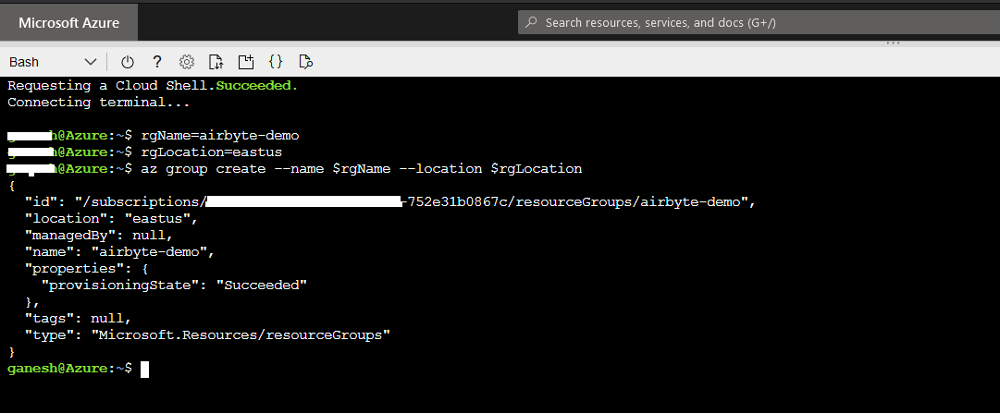
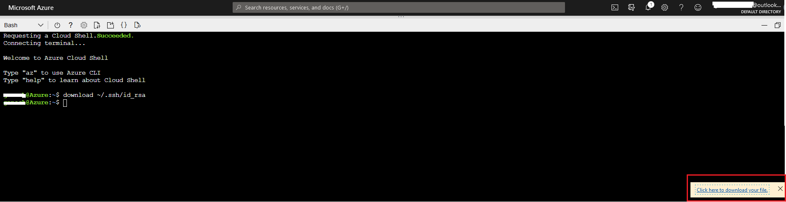

# On Azure\(VM\)


The instructions have been tested on `Azure VM Linux (ubuntu 18.04)`


## Launch Azure Cloud Shell

Launch cloud shell by going to [https://shell.azure.com/bash](https://shell.azure.com/bash)



## Create a new virtual machine

### Create resource group

```bash
# Inside Azure cloud shell
rgName=airbyte-demo
rgLocation=eastus
az group create --name $rgName --location $rgLocation
```



### Create virtual machine

```bash
# Inside Azure cloud shell
userName=byteuser
vmName=airbyte
dnsName=$(head -3 /dev/urandom | tr -dc a-z | cut -c -16)
publicIp=$(az vm create --resource-group $rgName \
  --name $vmName --image UbuntuLTS \
  --admin-username $userName \
  --public-ip-address-dns-name $dnsName \
  --generate-ssh-keys --query 'publicIpAddress' -o json)
echo $publicIp
```

This step will create a virtual machine and add a user account named `byteuser`. The `--generate-ssh-keys` option will generate a new ssh key and put it to the default key location \(~/.ssh\)

**Note: Copy the `publicIpAddress` output, you will need this address later to connect from your workstation.**


### Download SSH key

```bash
# Inside Azure cloud shell
download ~/.ssh/id_rsa
```

Make sure to update the permissions on the private key, or you'll get an error telling you that permissions for this file are too open.
```bash
chmod 600 ./$YOUR_PATH_TO_DOWNLOADS/id_rsa
```

Above command will generate download link and give you pop-up on right bottom side, click on `Click here to download your file.` to download private key. Note: Save this file, you will need it to connect to your VM in [Connect to Airbyte](on-azure-vm-cloud-shell.md#connect-to-airbyte) step.



### Connect to virtual machine

If you get this error: `Could not resolve hostname "XX.XXX.X.XXX": Name or service not known`, just manually enter the publicIp host name when running the ssh command.

```bash
# Inside Azure cloud shell
ssh $userName@$publicIp
```

## Install environment

* Install `docker`

```bash
# Inside Azure cloud shell
sudo apt-get update -y
sudo apt-get install apt-transport-https ca-certificates curl gnupg lsb-release -y
curl -fsSL https://download.docker.com/linux/ubuntu/gpg | sudo gpg --dearmor -o /usr/share/keyrings/docker-archive-keyring.gpg
echo "deb [arch=amd64 signed-by=/usr/share/keyrings/docker-archive-keyring.gpg] https://download.docker.com/linux/ubuntu $(lsb_release -cs) stable" | sudo tee /etc/apt/sources.list.d/docker.list > /dev/null
sudo apt-get update
sudo apt-get install docker-ce docker-ce-cli -y
sudo usermod -a -G docker $USER
```

* Install `docker-compose`

```bash
# Inside Azure cloud shell
sudo wget https://github.com/docker/compose/releases/download/1.26.2/docker-compose-$(uname -s)-$(uname -m) -O /usr/local/bin/docker-compose
sudo chmod +x /usr/local/bin/docker-compose
docker-compose --version
```

* Close the ssh connection to ensure the group modification is taken into account

```bash
# Inside Azure cloud shell
logout
```

* Reconnect to virtual machine 

```bash
# Inside Azure cloud shell
ssh $userName@$publicIp
```

## Install and Start Airbyte

```bash
# Inside Azure cloud shell
mkdir airbyte && cd airbyte
wget https://raw.githubusercontent.com/airbytehq/airbyte/master/{.env,docker-compose.yaml}
sudo docker-compose up -d
```

## Connect to Airbyte


For security reasons, we strongly recommend to not expose Airbyte on Internet available ports. Future versions will add support for SSL & Authentication.



This part assumes that you have access to a terminal on your workstation


* Create ssh tunnel for port 8000

  ```bash
  # Inside your workstation terminal
  # 1. Replace $SSH_KEY with private key path downloaded from earlier steps
  # 2. Replace $INSTANCE_IP with publicIpAddress noted from earlier steps
  ssh -N -L 8000:localhost:8000 -i $SSH_KEY byteuser@$INSTANCE_IP
  ```

* Just visit [http://localhost:8000](http://localhost:8000) in your browser and start moving some data!

## Troubleshooting

If you encounter any issues, just connect to our [Slack](https://slack.airbyte.io). Our community will help! We also have a [FAQ](../troubleshooting/on-deploying.md) section in our docs for common problems.

