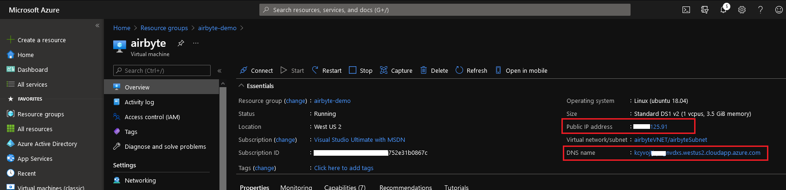

# On Azure Virtual Machine - Cloud Shell


The instructions have been tested on `Azure VM Linux (ubuntu 18.04)`


## Launch Azure Cloud Shell

Launch cloud shell by going to [https://shell.azure.com/bash](https://shell.azure.com/bash)


## Create a new virtual machine

#### Create resource group

```bash
# create resource group. yopu can change name and location
rgName=airbyte-demo
rgLocation=eastus
az group create --name $rgName --location $rgLocation
```


#### Create virtual machine

```bash
userName=byteuser
vmName=airbyte
dnsName=$(head -3 /dev/urandom | tr -dc a-z | cut -c -16)
publicIp=$(az vm create --resource-group $rgName \
  --name $vmName --image UbuntuLTS \
  --admin-username $userName \
  --public-ip-address-dns-name $dnsName \
  --generate-ssh-keys --query 'publicIpAddress' -o json)
echo $publicIp
#get fqdns
fqdns=$(az vm show -d -g $rgName -n $vmName --query fqdns -o tsv)
echo $fqdns
```

This step will create virtual machine and add user account named `byteuser`. ``--generate-ssh-keys`` option will generate new ssh key and put it to default key location(~/.ssh)

**_Note ``publicIpAddress`` from the output, you will need this addres to access airbyte_**


#### Open ports to access AirByte


For security reasons, we strongly recommend to not expose Airbyte on Internet available ports. Future versions will add support for SSL & Authentication.


```bash
# open ports for airbyte
az vm open-port --port 8000 --resource-group $rgName --name $vmName
az vm open-port --port 8001 --resource-group $rgName --name $vmName
```

#### Connect to virtual machine & install environment

- Connect to virtual machine 

```bash
# connect to vm 
ssh $userName@$publicIp
# Update the apt package index and install packages to allow apt to use a repository over HTTPS
sudo apt-get update -y
sudo apt-get install \
    apt-transport-https \
    ca-certificates \
    curl \
    gnupg \
    lsb-release -y
```
- Install docker
  
```bash
# Add Docker’s official GPG key:
curl -fsSL https://download.docker.com/linux/ubuntu/gpg | sudo gpg --dearmor -o /usr/share/keyrings/docker-archive-keyring.gpg

#setup the stable repository
echo \
  "deb [arch=amd64 signed-by=/usr/share/keyrings/docker-archive-keyring.gpg] https://download.docker.com/linux/ubuntu \
  $(lsb_release -cs) stable" | sudo tee /etc/apt/sources.list.d/docker.list > /dev/null
# Update the apt package index
sudo apt-get update

# install docker
sudo apt-get install docker-ce docker-ce-cli -y
docker --version

sudo usermod -a -G docker $USER
```
- Install docker-compose

```bash
# install docker-compose
sudo wget https://github.com/docker/compose/releases/download/1.26.2/docker-compose-$(uname -s)-$(uname -m) -O /usr/local/bin/docker-compose
sudo chmod +x /usr/local/bin/docker-compose
docker-compose --version
```

- Install and Start Airbyte

```bash
mkdir airbyte && cd airbyte
wget https://raw.githubusercontent.com/airbytehq/airbyte/master/{.env,docker-compose.yaml}
sudo docker-compose up -d
#logout
logout
```

#### Connect to Airbyte



For security reasons, we strongly recommend to not expose Airbyte on Internet available ports. Future versions will add support for SSL & Authentication.


```bash
# get fqdns
echo "http://${fqdns}:8000" # example - skdhfvhsdofyo.westus2.cloudapp.azure.com:8000
```
- Visit URL you received from above command and start moving some data!
- Or you can go to your virtual machine overview and get public Ip or DNS name and access Airbyte on port 8000



## Troubleshooting

If you encounter any issues, just connect to our [Slack](https://slack.airbyte.io). Our community will help! We also have a [FAQ](../faq/technical-support.md) section in our docs for common problems.


