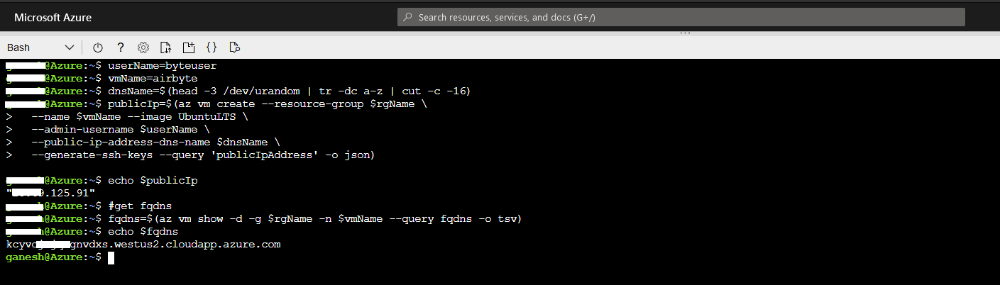

# On Azure Virtual Machine - Cloud Shell


The instructions have been tested on `Azure VM Linux (ubuntu 18.04)`


## Launch Azure Cloud Shell

Launch cloud shell by going to [https://shell.azure.com/bash](https://shell.azure.com/bash)


## Create a new virtual machine

#### Create resource group

```bash
# Inside Azure cloud shell

# create resource group. yopu can change name and location
rgName=airbyte-demo
rgLocation=eastus
az group create --name $rgName --location $rgLocation
```


#### Create virtual machine

```bash
# Inside Azure cloud shell

userName=byteuser
vmName=airbyte
dnsName=$(head -3 /dev/urandom | tr -dc a-z | cut -c -16)
publicIp=$(az vm create --resource-group $rgName \
  --name $vmName --image UbuntuLTS \
  --admin-username $userName \
  --public-ip-address-dns-name $dnsName \
  --generate-ssh-keys --query 'publicIpAddress' -o json)
echo $publicIp
```

This step will create a virtual machine and add a user account named `byteuser`. The ``--generate-ssh-keys`` option will generate a new ssh key and put it to the default key location (~/.ssh)

**Note: Copy the ``publicIpAddress`` output, you will need this address later to connect from your workstation.**



#### Download SSH key

```bash
# Inside Azure cloud shell

#run this command to generate download link
download ~/.ssh/id_rsa
```
Above command will generate download link and give you pop-up on right bottom side, click on `Click here to download your file.` to download private key. 
Note: Save this file, you will need it to connect to your VM in [Connect to Airbyte](#connect-to-airbyte) step.


#### Connect to virtual machine

- Connect to virtual machine 

```bash
# Inside Azure cloud shell

# connect to vm 
ssh $userName@$publicIp
```

## Install environment

- Install `docker`
  
```bash
# Inside Azure cloud shell

# Update the apt package index and install packages to allow apt to use a repository over HTTPS
sudo apt-get update -y
sudo apt-get install \
    apt-transport-https \
    ca-certificates \
    curl \
    gnupg \
    lsb-release -y

# Add Docker’s official GPG key:
curl -fsSL https://download.docker.com/linux/ubuntu/gpg | sudo gpg --dearmor -o /usr/share/keyrings/docker-archive-keyring.gpg

#setup the stable repository
echo \
  "deb [arch=amd64 signed-by=/usr/share/keyrings/docker-archive-keyring.gpg] https://download.docker.com/linux/ubuntu \
  $(lsb_release -cs) stable" | sudo tee /etc/apt/sources.list.d/docker.list > /dev/null
# Update the apt package index
sudo apt-get update

# install docker
sudo apt-get install docker-ce docker-ce-cli -y
docker --version

sudo usermod -a -G docker $USER
```
- Install `docker-compose`

```bash
# Inside Azure cloud shell

# install docker-compose
sudo wget https://github.com/docker/compose/releases/download/1.26.2/docker-compose-$(uname -s)-$(uname -m) -O /usr/local/bin/docker-compose
sudo chmod +x /usr/local/bin/docker-compose
docker-compose --version
```

## Install and Start Airbyte

```bash
# Inside Azure cloud shell

mkdir airbyte && cd airbyte
wget https://raw.githubusercontent.com/airbytehq/airbyte/master/{.env,docker-compose.yaml}
sudo docker-compose up -d
#logout
logout
```

## Connect to Airbyte


For security reasons, we strongly recommend to not expose Airbyte on Internet available ports. Future versions will add support for SSL & Authentication.


- Create ssh tunnels for port 8000 (the static web server) and port 8001 (the api server)
```bash
# Inside your workstation terminal

# 1. Replace $SSH_KEY with private key path downloaded from earlier steps
# 2. Replace $INSTANCE_IP with publicIpAddress noted from earlier steps
ssh -i $SSH_KEY -L 8000:localhost:8000 -L 8001:localhost:8001 -N -f byteuser@$INSTANCE_IP
```
- Just visit http://localhost:8000 in your browser and start moving some data!


## Troubleshooting

If you encounter any issues, just connect to our [Slack](https://slack.airbyte.io). Our community will help! We also have a [FAQ](../faq/technical-support.md) section in our docs for common problems.
