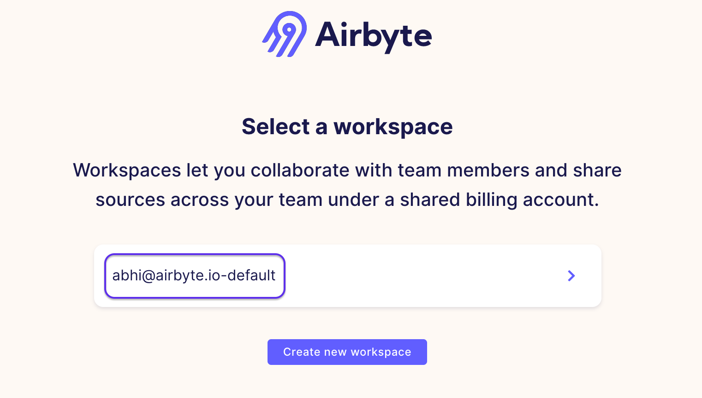
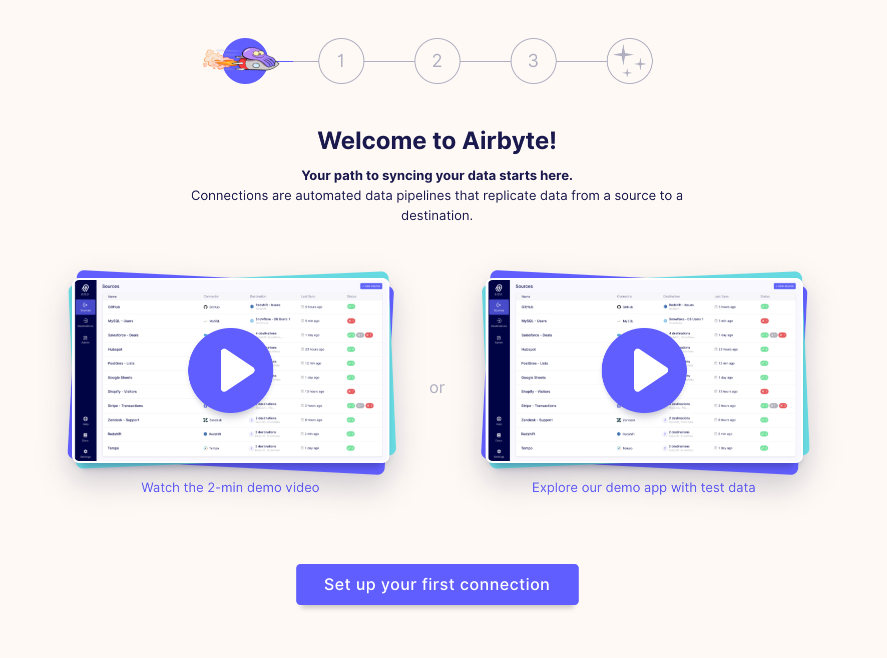

# On Airbyte Cloud

## Overview

Airbyte Cloud requires no setup and can be immediately run from your web browser.

## Setup Guide

**1. Using the Airbyte Cloud invite link provided to you, click `Sign up`, and verify your email.**

**2. Click on the default workspace.**

You will be provided 1000 credits to get your first few syncs going!

**3. Click on `Onboarding` and follow the directions to create your first connection. Or if you know what you're doing, just get started!**

**4. You're done!**
