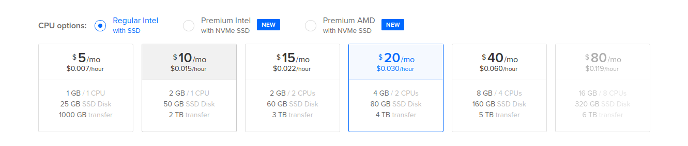

# On DigitalOcean \(Droplet\)

The instructions have been tested on `DigitalOcean Droplet ($5)`. 

Alternatively, you can one-click deploy Airbyte to DigitalOcean using their marketplace:<br>
<a href="https://cloud.digitalocean.com/droplets/new?onboarding_origin=marketplace&appId=95451155&image=airbyte&utm_source=deploying-airbyte_on-digitalocean-droplet"></a>

## Create a new droplet

* Launch a new droplet


* Select image distribution 


* Select droplet type
  * For testing out Airbyte, a `$20/month` droplet is likely sufficient.
  * For long-running Airbyte installations, we recommend a `$40/month` instance.



* `Region` 
  * Generally, choose a datacenter close to you.
* `Authentication`
  * Password
* `Create Droplet`


* Wait for the droplet to enter the `Running` state.

## Install environment

Note: The following commands will be entered either on your local terminal or in your ssh session on the instance terminal. The comments above each command block will indicate where to enter the commands.

* Connect to your instance

* `Click on Console`


* Install `docker`

```bash
# In your ssh session on the instance terminal
sudo apt update
sudo apt install apt-transport-https ca-certificates curl software-properties-common
curl -fsSL https://download.docker.com/linux/ubuntu/gpg | sudo apt-key add -
sudo add-apt-repository "deb [arch=amd64] https://download.docker.com/linux/ubuntu focal stable"
sudo apt install docker-ce
sudo systemctl status docker
sudo usermod -aG docker ${USER}
su - ${USER}
```

* Install `docker-compose`

```bash
# In your ssh session on the instance terminal
sudo wget https://github.com/docker/compose/releases/download/1.26.2/docker-compose-$(uname -s)-$(uname -m) -O /usr/local/bin/docker-compose
sudo chmod +x /usr/local/bin/docker-compose
docker-compose --version
```
## Install & start Airbyte

* Connect to your instance

* `Click on Console`


* Install Airbyte

```bash
# In your ssh session on the instance terminal
mkdir airbyte && cd airbyte
wget https://raw.githubusercontent.com/airbytehq/airbyte/master/{.env,docker-compose.yaml}
docker-compose up -d
```

## Troubleshooting

If you encounter any issues, just connect to our [Slack](https://slack.airbyte.io). Our community will help! We also have a [FAQ](../troubleshooting/on-deploying.md) section in our docs for common problems.

