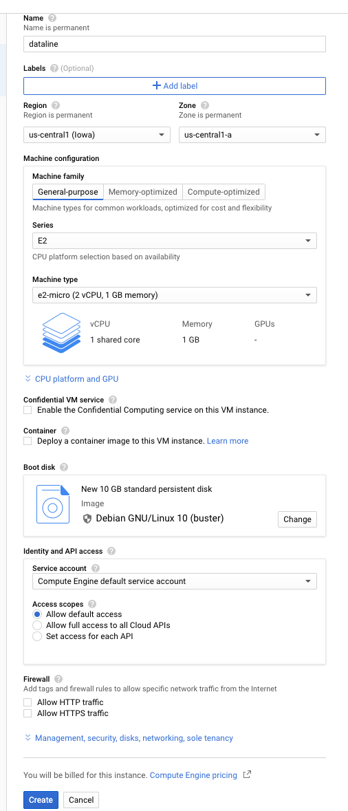

import Tabs from '@theme/Tabs';
import TabItem from '@theme/TabItem';

# On GCP (Compute Engine)

:::info

The instructions have been tested on `Debian GNU/Linux 10 (buster)`

:::

## Create a new instance

* Launch a new instance


* Configure new instance
  * For testing out Airbyte, an `e2.medium` instance is likely sufficient. Airbyte uses a lot of disk space with images and logs, so make sure to provision at least 30GBs of disk per node. 
  * For long-running Airbyte installations, we recommend a `n1-standard-2` instance.



* `Create`

## Install environment

:::info

Note: The following commands will be entered either on your local terminal or in your ssh session on the instance terminal. The comments above each command block will indicate where to enter the commands.

:::

* Set variables in your terminal

```bash
# In your workstation terminal
PROJECT_ID=PROJECT_ID_WHERE_YOU_CREATED_YOUR_INSTANCE
INSTANCE_NAME=airbyte # or anyother name that you've used
```

* Install `gcloud`

<Tabs groupId="operating-systems">
<TabItem value="linux" label="Linux">

```bash
echo "deb [signed-by=/usr/share/keyrings/cloud.google.gpg] https://packages.cloud.google.com/apt cloud-sdk main" | sudo tee -a /etc/apt/sources.list.d/google-cloud-sdk.list
sudo apt-get install apt-transport-https ca-certificates gnupg
curl https://packages.cloud.google.com/apt/doc/apt-key.gpg | sudo apt-key --keyring /usr/share/keyrings/cloud.google.gpg add -
sudo apt-get update && sudo apt-get install google-cloud-sdk
```

</TabItem>
<TabItem value="mac" label="macOS">

```bash
# In your workstation terminal
brew install --cask google-cloud-sdk
gcloud init # Follow instructions```
```

</TabItem>
</Tabs>

* List all instances in your project

```bash
# Verify you can see your instance
gcloud --project $PROJECT_ID compute instances list
[...] # You should see the airbyte instance you just created
```

* Connect to your instance

```bash
# In your workstation terminal
gcloud --project=$PROJECT_ID beta compute ssh $INSTANCE_NAME
```

* Install `docker`

```bash
# In your ssh session on the instance terminal
sudo apt-get update
sudo apt-get install -y apt-transport-https ca-certificates curl gnupg2 software-properties-common
curl -fsSL https://download.docker.com/linux/debian/gpg | sudo apt-key add --
sudo add-apt-repository "deb [arch=amd64] https://download.docker.com/linux/debian buster stable"
sudo apt-get update
sudo apt-get install -y docker-ce docker-ce-cli containerd.io
sudo usermod -a -G docker $USER
```

* Install `docker-compose`

```bash
# In your ssh session on the instance terminal
sudo apt-get -y install wget
sudo wget https://github.com/docker/compose/releases/download/1.26.2/docker-compose-$(uname -s)-$(uname -m) -O /usr/local/bin/docker-compose
sudo chmod +x /usr/local/bin/docker-compose
docker-compose --version
```

* Close the ssh connection to ensure the group modification is taken into account

```bash
# In your ssh session on the instance terminal
logout
```

## Install & start Airbyte

* Connect to your instance

```bash
# In your workstation terminal
gcloud --project=$PROJECT_ID beta compute ssh $INSTANCE_NAME
```

* Install Airbyte

```bash
# In your ssh session on the instance terminal
mkdir airbyte && cd airbyte
wget https://raw.githubusercontent.com/airbytehq/airbyte/master/{.env,docker-compose.yaml}
docker-compose up -d
```

## Connect to Airbyte

:::danger

For security reasons, we strongly recommend to not expose Airbyte publicly. Future versions will add support for SSL & Authentication.

:::

* Create ssh tunnel.

```bash
# In your workstation terminal
gcloud --project=$PROJECT_ID beta compute ssh $INSTANCE_NAME -- -L 8000:localhost:8000 -N -f
```

* Just visit [http://localhost:8000](http://localhost:8000) in your browser and start moving some data!

## Troubleshooting

If you encounter any issues, just connect to our [Slack](https://slack.airbyte.io). Our community will help! We also have a [FAQ](../troubleshooting/on-deploying.md) section in our docs for common problems.

