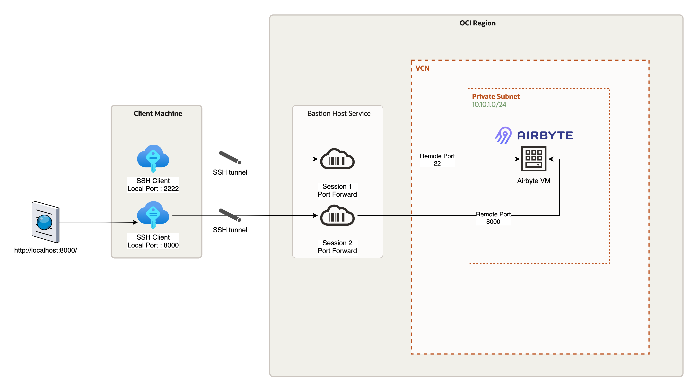
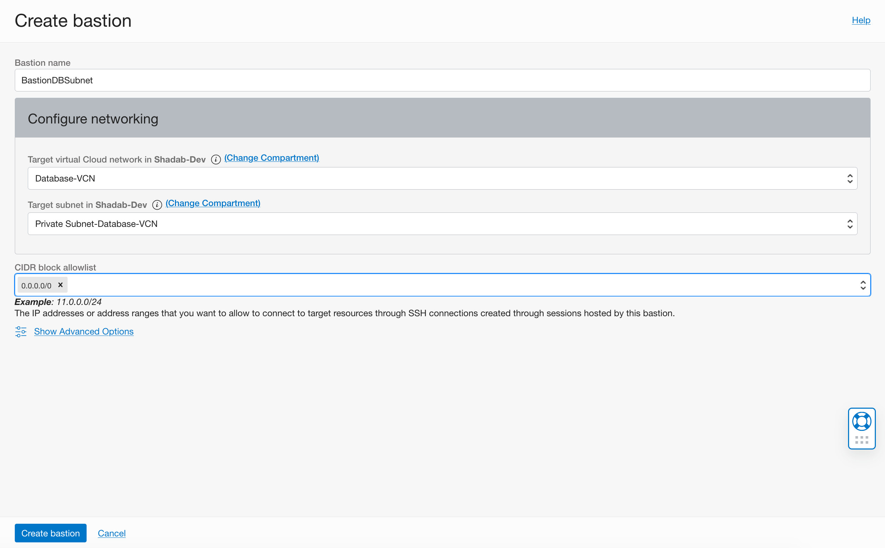
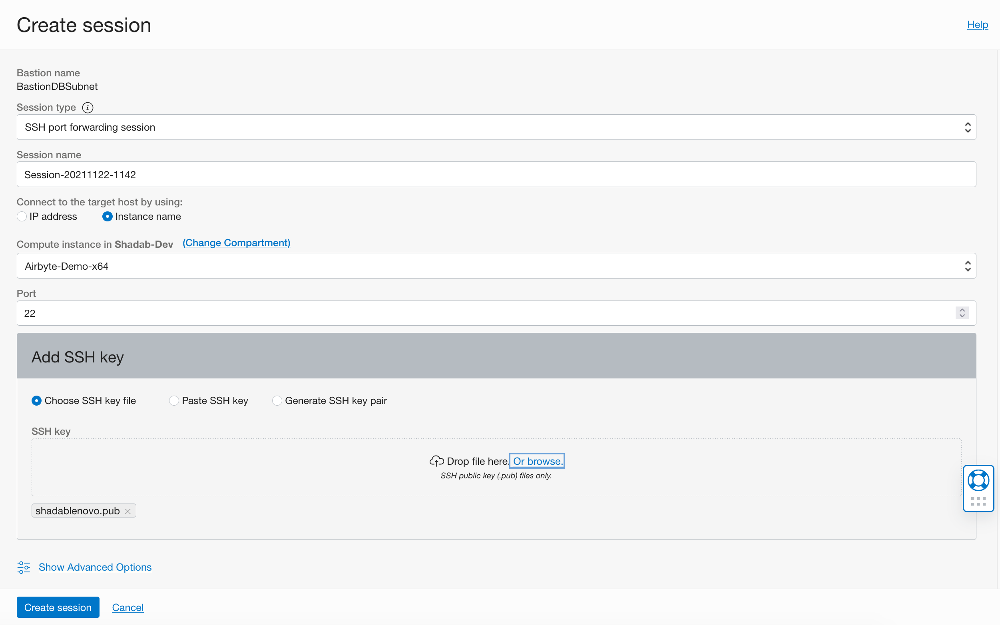
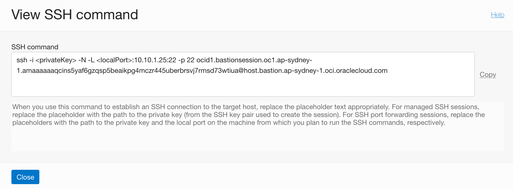
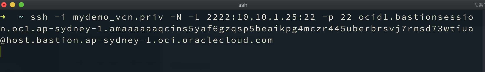
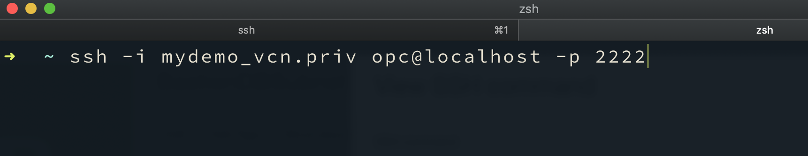
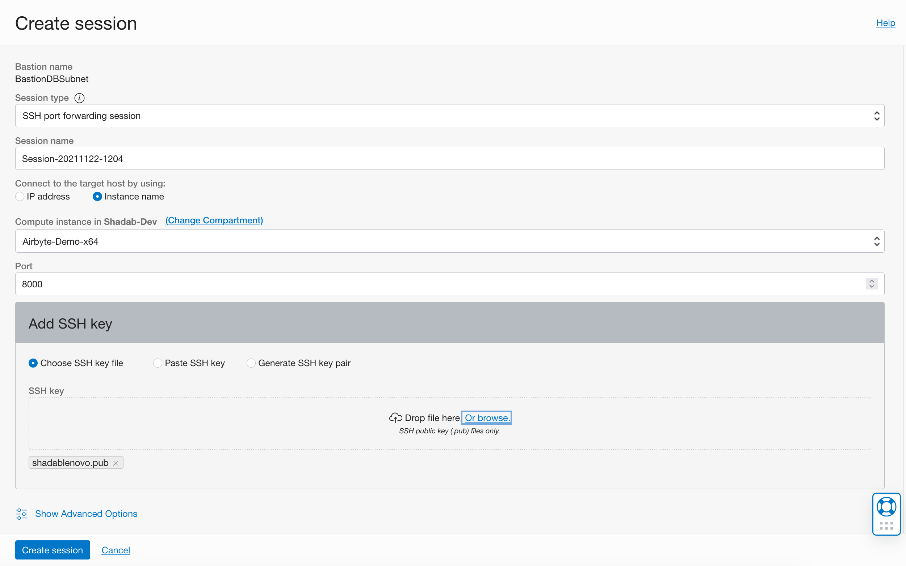
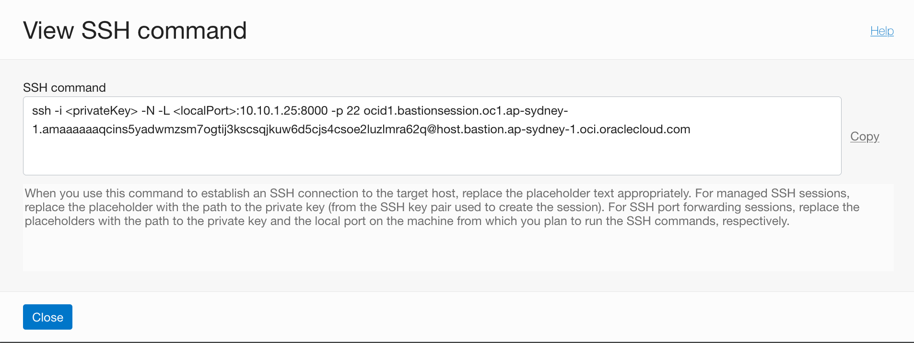
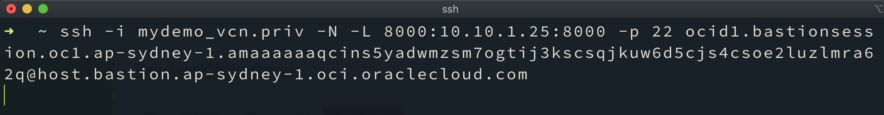

# On Oracle Cloud Infrastructure VM

Install Airbyte on Oracle Cloud Infrastructure VM running Oracle Linux 7

## Create OCI Instance

Go to OCI Console &gt; Compute &gt; Instances &gt; Create Instance


Deploy it in a VCN which has a Private subnet. Ensure you select shape as 'Intel' 

## Whitelist Port 8000 for a CIDR range in Security List of OCI VM Subnet

Go to OCI Console &gt; Networking &gt; Virtual Cloud Network

Select the Subnet &gt; Security List &gt; Add Ingress Rules


### Connection Method 1 : Create SSH Tunnel via a Bastion Host to Login to the Instance 

Keep in mind that it is highly recommended to not have a Public IP for the Instance where you are running Airbyte.

#### SSH Local Port Forward to Airbyte VM

On your local workstation:

```bash
ssh opc@bastion-host-public-ip -i <private-key-file.key> -L 2200:oci-private-instance-ip:22
ssh opc@localhost -i <private-key-file.key> -p 2200
```

### Connection Method 2 : Create OCI Bastion Host Service to Login to the Instance 



#### Create Bastion Host Service from OCI Console


#### Create Port forwarding SSH Session from Bastion Service


#### Create SSH port forwarding session on Local machine 

```text
ssh -i <privateKey> -N -L <localPort>:10.10.1.25:22 -p 22 ocid1.bastionsession.oc1.ap-sydney-1.amaaaaaaqcins5yaf6gzqsp5beaikpg4mczr445uberbrsvj7rmsd73wtiua@host.bastion.ap-sydney-1.oci.oraclecloud.com
```




### Login to Airbyte Instance using Port forwarding session from Local machine 

```text
 ssh -i mydemo_vcn.priv opc@localhost -p 2222
```




## Install Airbyte Prerequisites on OCI VM

### Install Docker

```text
sudo yum update -y

sudo yum install -y docker

sudo service docker start

sudo usermod -a -G docker $USER
```


### Install Docker Compose

```text
sudo wget https://github.com/docker/compose/releases/download/1.26.2/docker-compose-$(uname -s)-$(uname -m) -O /usr/local/bin/docker-compose

sudo chmod +x /usr/local/bin/docker-compose

sudo /usr/local/bin/docker-compose --version
```


### Install Airbyte

```text
mkdir airbyte && cd airbyte

wget https://raw.githubusercontent.com/airbytehq/airbyte/master/{.env,docker-compose.yaml}

which docker-compose

sudo /usr/local/bin/docker-compose up -d
```

### Airbyte URL Access Method 1 : Local Port Forward to Airbyte VM using Bastion host

```text
ssh opc@bastion-host-public-ip -i <private-key-file.key> -L 8000:oci-private-instance-ip:8000
```

### Access Airbyte

Open URL in Browser : [http://localhost:8000/](http://localhost:8000/)


### Airbyte URL Access Method 2 : Local Port Forward to Airbyte VM using OCI Bastion Service

#### Create port-forwarding session to Port 8000


```text
ssh -i <privateKey> -N -L <localPort>:10.10.1.25:8000 -p 22 ocid1.bastionsession.oc1.ap-sydney-1.amaaaaaaqcins5yadwmzsm7ogtij3kscsqjkuw6d5cjs4csoe2luzlmra62q@host.bastion.ap-sydney-1.oci.oraclecloud.com
```

#### Open port-forwarding tunnel to Port 8000 and connect from browser

```text
ssh -i mydemo_vcn.priv -N -L 8000:10.10.1.25:8000 -p 22 ocid1.bastionsession.oc1.ap-sydney-1.amaaaaaaqcins5yadwmzsm7ogtij3kscsqjkuw6d5cjs4csoe2luzlmra62q@host.bastion.ap-sydney-1.oci.oraclecloud.com
```




### Access Airbyte

Open URL in Browser : [http://localhost:8000/](http://localhost:8000/)


/ _Please note Airbyte currently does not support SSL/TLS certificates_ /


