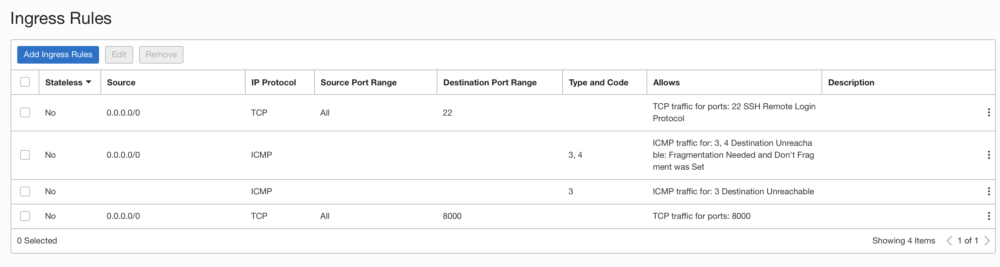

# On Oracle Cloud Infrastructure VM

Install Airbyte on Oracle Cloud Infrastructure VM running Oracle Linux 7

## Create OCI Instance

Go to OCI Console &gt; Compute &gt; Instances &gt; Create Instance


Ensure you select shape as 'Intel' 

## Whitelist Port 8000 for a CIDR range in Security List of OCI VM Subnet

Go to OCI Console &gt; Networking &gt; Virtual Cloud Network

Select the Subnet &gt; Security List &gt; Add Ingress Rules



## Login to the Instance/VM with the SSH key and 'opc' user

```text
chmod 600 private-key-file

ssh -i private-key-file opc@oci-private-instance-ip -p 2200
```

## Install Airbyte Prerequisites on OCI VM

### Install Docker

```text
sudo yum update -y

sudo yum install -y docker

sudo service docker start

sudo usermod -a -G docker $USER
```


### Install Docker Compose

```text
sudo wget https://github.com/docker/compose/releases/download/1.26.2/docker-compose-$(uname -s)-$(uname -m) -O /usr/local/bin/docker-compose

sudo chmod +x /usr/local/bin/docker-compose

sudo /usr/local/bin/docker-compose up -d
```


### Install Airbyte

```text
mkdir airbyte && cd airbyte

wget https://raw.githubusercontent.com/airbytehq/airbyte/master/{.env,docker-compose.yaml}

which docker-compose

docker-compose up -d
```


## Create SSH Tunnel to Login to the Instance

it is highly recommended to not have a Public IP for the Instance where you are running Airbyte\).

### SSH Local Port Forward to Airbyte VM

From your local workstation

```text
ssh opc@bastion-host-public-ip -i <private-key-file.key> -L 2200:oci-private-instance-ip:22
ssh opc@localhost -i <private-key-file.key> -p 2200
```

### Airbyte GUI Local Port Forward to Airbyte VM

```text
ssh opc@bastion-host-public-ip -i <private-key-file.key> -L 8000:oci-private-instance-ip:8000
```

## Access Airbyte

Open URL in Browser : [http://localhost:8000/](http://localhost:8000/)


/ _Please note Airbyte currently does not support SSL/TLS certificates_ /

