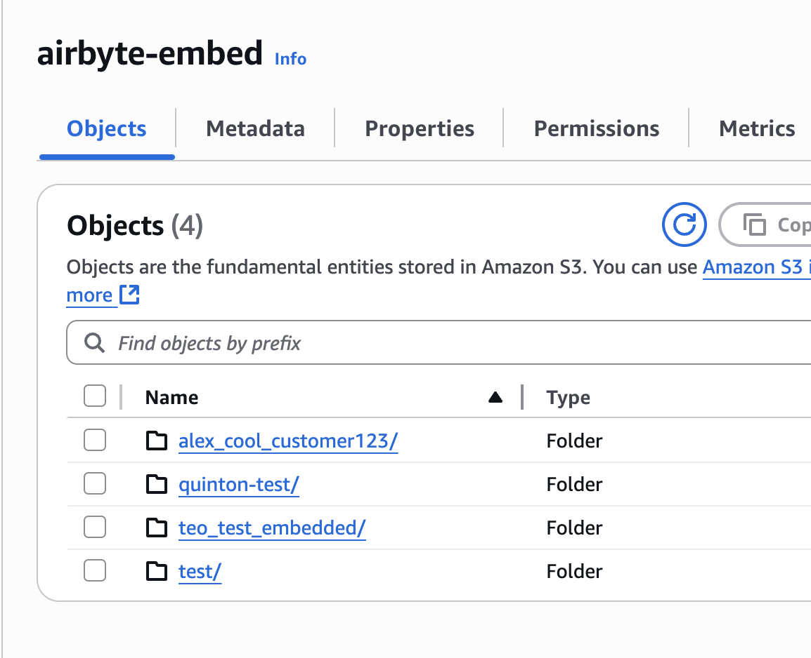

# Get Started with Widget

## Airbyte Credentials

To use Airbyte Embedded, must have an active Airbyte Cloud with Embedded enabled. (Please [contact sales](https://share.hsforms.com/2uRdBz9VoTWiCtjECzRYgawcvair) if you would like to sign up for a trial of Airbyte Embedded). Once you have your Airbyte instance enabled, log in, and navigate to **Settings > Embedded**. Note down the following values. 

- `Organization Id`: Unique identifier to your Airbyte instance.
- `Client Id`: Unique app id. Required for API access.
- `Client Secret`: Secret key used to obtain a refresh token for API access.

If you the client Id and Client Secret are blank, you will need to create a new Application via **Settings > Applications.** 

In addition to the Embedded keys above, you will require an external user id, `External User Id`. This is a a unique identifier you create and assign when initiating the Embedded Widget. `External User Id`. You must create one unique identifier for each of your users using a UUID generator, or internal customer identifier.  The sample onboarding app uses the email provided for the external user id. In production, you may need to change this to use a common UUID library such as  [this](https://www.npmjs.com/package/uuid). 

## Configure .env

Clone the [sample app via Github](https://github.com/airbytehq/embedded-sampleweb-reactjs), and navigate to embedded-sampleweb-reactjs/server.

```bash
git clone <repository-url>
cd embedded-sampleweb-reactjs/server
```

 Then, copy the .env.local.example to .env:

```bash
 cp .env.example .env
```

Set the `SONAR_ALLOWED_ORIGIN` to be the url where your onboarding app will be deployed. Or use http://localhost:5173 for the default React host/port when running locally

```bash
# Airbyte Embedded Configuration
## For security reasons, we require that the widget can only we attached to a specific origin.
## If you're developing locally, it will look like: http://localhost:5173
## Once you're in production, it will look like: https://app.abc.com
SONAR_ALLOWED_ORIGIN=your_deployed_webapp_url
```

Paste in your the Organization Id, Client Id, Client Secret to the following keys:

```bash
## These 3 pieces of information are available in your initial workspace: Settings > Embedded
SONAR_AIRBYTE_ORGANIZATION_ID=your_organization_id
SONAR_AIRBYTE_CLIENT_ID=your_client_id
SONAR_AIRBYTE_CLIENT_SECRET=your_client_secret
```

The sample web app uses basic authentication to protect the webapp. This is fine for testing, but it is recommended to be changed for product use. Set your password in the .env file:

```bash
SONAR_WEBAPP_PASSWORD=your_password
```

Next, you need to provide configuration details to an [S3 bucket](https://docs.aws.amazon.com/AmazonS3/latest/userguide/GetStartedWithS3.html) running on AWS. This S3 bucket is the AI Destination Store from the AI Hub Blueprint. It is where customer data will be written.

```bash
# AWS Credentials
SONAR_AWS_ACCESS_KEY=your_aws_access_key
SONAR_AWS_SECRET_ACCESS_KEY=your_aws_secret_access_key

# S3 Configuration
SONAR_S3_BUCKET=your_s3_bucket_name
SONAR_S3_BUCKET_REGION=your_s3_bucket_region
SONAR_S3_BUCKET_PREFIX=your_s3_bucket_prefix
```

The following values are examples of what an S3 configuration should look like:



```bash
# S3 Configuration
SONAR_S3_BUCKET=airbyte-embed
SONAR_S3_BUCKET_REGION=us-east-2
SONAR_S3_BUCKET_PREFIX=quinton-test
```

## Create Connector to S3

Next, you need to create the S3 destination connector within your Airbyte Embedded instance. You can use the provided script within the sample app, which relies on the values in the .env file created above.

```bash
./setup-s3.sh
```

:::caution
Only run this script once. Running it multiple times will create multiple connections to s3 and may cause errors when customer data syncs.
:::
