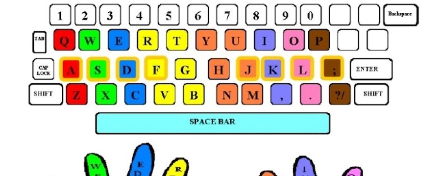

# Contributions to docs



## Did you just learn something?!
- maybe write a doc for it!

## Where to put stuff
- Try and utilize existing folder structure
- If it fits in an existing category: great!
- If it doesn't add it to `/docs/` top level
  - If it makes sense to make a new category with other top level make a new directory
- **images** and other assets live in `/docs/assets/`
- New folders **need at least 2 markdown files** for docusarus to recognise the folder in the sidebar

## Testing your changes locally

[more in depth local change guide here](locally_testing_docusaurus.md)
- You can see what the docs website will look like locally try:
```bash
cd docusaurus
yarn build && yarn serve
# press control-c to exit the server
```
- if you change **anything at all** 
  - Your changes will not show up on the website until you re-run `yarn build && yarn serve`
