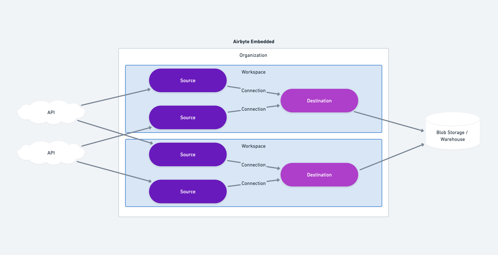

<head>
  <!-- HIDE PAGE FROM SEARCH ENGINES FOR NOW -->
  <meta name="robots" content="noindex, nofollow" />
</head>

# Airbyte Embedded Operator Guide

Last Updated: March 18th, 2025

## Welcome!

Welcome to Airbyte Embedded. This Airbyte product is made for operators of AI and Analytic tools who need to ingest data from their users at scale. This product is a way of “white labeling" and using Airbyte under the hood to configure and manage the data pipelines for your product at scale. This document is a high-level guide of the integration process and contains our recommendations and best-practices.

This guide is meant to be used in conjunction with the “SongSync” example project @ [https://github.com/airbytehq/song-sync](https://github.com/airbytehq/song-sync) (⚠️ coming soon)

## Customer and Connection Architecture

This section references the [Airbyte Core Concepts](/using-airbyte/core-concepts/)



At the highest level, you will be creating:

- An **organization** to contain all of your syncs, for all of your customers.
- Multiple **workspaces**, one for each of your customers.
- A single **destination** per workspace.
- Multiple **sources**, one for each integration a customer wants.
- Multiple **connections**, one for each configured source by your customers.

**Why a single Organization**

- Organizations contain user, API token, and billing information.

**Why multiple Workspaces**

- Workspaces are logical groupings of syncs which can be managed (e.g. deleted and monitored) as a unit.
- Workspaces are where data sovereignty is set (e.g. USA vs EU data planes). This allows configuration per customer.

**Why a single Destination in each Workspace**

- As you are loading data from your customer’s tools into your infrastructure, you’ll configure a single destination to receive data from all sources in the workspace
- Having different destinations per customer (workspace) allows you to configure different destination settings per customer (e.g. schema/dataset/bucket)

**Why multiple sources**

- A source connects to each individual API/dataset and stores each customer’s credentials.

**Why multiple connections**

- The joining of a source to a destination is called a connection, so each source produces at least one connection
- Connections are where sync frequency, stream selection, column selection, and where mappings are configured.

All of the above can be configured with the Airbyte API, described at [https://reference.airbyte.com](https://reference.airbyte.com). For commonly repeated tasks, use a template to speed up future configurations. For example, when a customer is onboarded, that would be a good time to both create the workspace and destination.

(⚠️ draft)

```js
async function createWorkspace(body: Workspace) {
  const workspaceResponse = await createAirbyteWorkspace(body);
  if ("error" in workspaceResponse) return workspaceResponse;

  const templatedBody = renderTemplate("destination-s3.mustache.json", {
    name: `songsync-destination-${workspaceResponse.workspaceId}`,
    workspaceId: workspaceResponse.workspaceId,
    access_key_id: process.env.AWS_ACCESS_KEY_ID,
    secret_access_key: process.env.AWS_SECRET_ACCESS_KEY,
    s3_bucket_name: process.env.AWS_S3_BUCKET,
    s3_bucket_region: process.env.AWS_REGION,
  }) as Destination;

  await createAirbyteDestination(templatedBody);

  return workspaceResponse;
}

async function createDestination(body: Destination) {
  const workspaceId = body.workspaceId;

  const existingDestinations = await getDestinations(workspaceId);
  if (existingDestinations.data.length > 0) {
    throw new Error(`Destination already exists for workspace ${workspaceId}`);
  }

  const vars = fillTemplateVarsFromBody(body, {
    name: body.name,
    workspaceId: workspaceId,
  });

  const templatedBody = renderTemplate(
    `destination-${body.configuration.destinationType}.mustache.json`,
    vars
  ) as Destination;

  const response = await createAirbyteDestination(templatedBody);
  return response;
}
```

Furthermore, the creation of that common destination can also be templatized. In this example we use a [mustache](https://mustache.github.io/) config template for the configuration of a common S3 destination:

```json
{
  "name": "{{{name}}}",
  "definitionId": "4816b78f-1489-44c1-9060-4b19d5fa9362",
  "workspaceId": "{{{workspaceId}}}",
  "configuration": {
    "destinationType": "s3",
    "access_key_id": "{{{access_key_id}}}",
    "secret_access_key": "{{{secret_access_key}}}",
    "s3_bucket_name": "{{{s3_bucket_name}}}",
    "s3_bucket_path": "${NAMESPACE}/${STREAM_NAME}/${YEAR}_${MONTH}_${DAY}_${EPOCH}_",
    "s3_bucket_region": "{{{s3_bucket_region}}}",
    "format": {
      "format_type": "Parquet",
      "page_size_kb": 1024,
      "block_size_mb": 128,
      "compression_codec": "UNCOMPRESSED",
      "dictionary_page_size_kb": 1024,
      "max_padding_size_mb": 8
    }
  }
}
```

## Configuration Widget

Airbyte Embedded provides a JavaScript library that enables you to host a modal on your website. This allows secure and easy configuration of your customer’s sources. This library works with `templates` that allow you to pre-configure various parts of the source and connection configuration to your specifications. This also will simplify the setup forms presented to your users.

Sources will be validated at configuration time.

### Updating PartialUserConfigs

A “Teamplate” is how you configure the options that users are allowed to choose when setting up a source + connection pair. Any option can be `required`, `optional` or `hidden`, and you can pre-set values for any option.

TODO

### Configuring the Widget

(⚠️ draft)

```shell
npm install @airbyte-embedded/airbyte-embedded-modal
```

```ts
// import the library
import {
  AirbyteEmbeddedModal,
  getToken,
} from "@airbyte-embedded/airbyte-embedded-modal";

// get a token (in your backend)
const token = await getToken(oauthKey, oauthSecret);

// Initialize the modal (in your frontend)
const modal = new AirbyteEmbeddedModal({
  token, // from your backend
  workspaceId,
  onFlowComplete: (source, configTemplate, partialConfig) => {
    // create the connection on your backend
    await createConnection(source, configTemplate, partialConfig);
  },
});

await modal.open();
```

### Creating Connections with ConfigTemplate

When creating a connection, it is the responsibility of the Operator to merge the information provided by the user in the partialConfig with the preferences of the operator. For example, a user may have chosen to skip the syncing of a certain stream - when creating the connection, the Operator should not include that stream.

TODO

### Updating Source Configurations with the Widget

TODO

## Deliveries and Webhooks

Operators should subscribe to webhook notifications for their syncs. Learn more [here](/cloud/managing-airbyte-cloud/manage-airbyte-cloud-notifications#configure-webhook-notification-settings)

In this way, you will know when new data is available to process (successful syncs), or there has been an error which will need to be addressed on the next attempt (e.g. rate limit hit) or your users need to take action (e.g. password incorrect). Collecting and transmitting these errors to the proper party is the Operator’s responsibility.

At the moment, we do not notify Operators about file delivery within destinations, only the completion of the sync. With that in mind, if you are using a blob-storage destination like S3, you will need to also manage the bookkeeping of the files processed. A sync may deliver 0 or many files, partitioned appropriately for the destination (e.g. S3 prefers ~200mb files). It is recommended that when a sync concludes, all files in the destination folder be processed, and then moved or deleted. In this way your processing pipeline can be idempotent and retryable.

Airbyte will never deliver partial record files / Airbyte will not append records to an existing file. If a file is present in your destination, it is appropriate to process.

## Telemetry and Observability

There are 2 ways to keep tabs on your syncs at large.

**Dashboard:** Airbyte will provide you with an Operator Dashboard showing high-level metrics like number and type of syncs, data volume moved, and an overview of the common problems addressing your syncs. For this feature to be enabled, self-hosted deployments will need to enable sending telemetry to Airbyte’s servers.

**Telemetry:** For self-hosted Operators who wish to have realtime and system-level metrics exposed, we offer Open Telemetry ([operator-guides/collecting-metrics](/operator-guides/collecting-metrics#otel)). This information is not available when using Airbyte Cloud.
