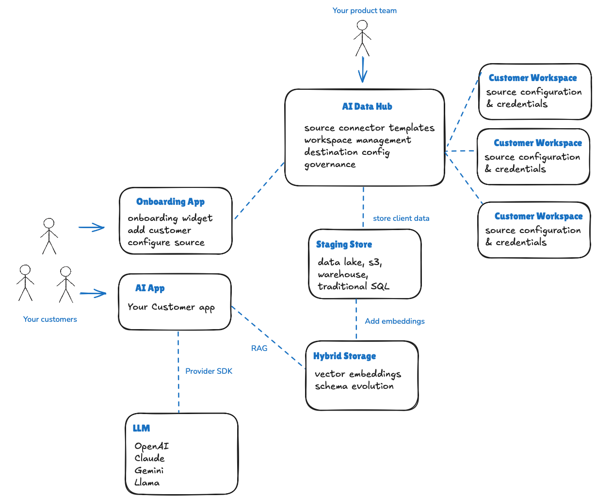

# Data Hub Blueprint

To be successful, AI data hubs must support the following:

- Access to connectors' data source: structured, unstructured, business app, or custom API
- Centralized management console to create, configure, and manage connectors available to customers
- End customer self-service ability to connect their data sources
- Reliable, scalable, and governable data movement to a data lake or data warehouse to enable modern AI apps to built atop using the latest tools, frameworks, and technologies.
- Customer data privacy - no data is stored in the hub, only moved, and transformed, if required, to destination

The following blueprint depicts a typical AI data hub architecture.

## AI Data Hub

The AI Data hub is a centralized environment where your product teams can define which sources are supported and available to customers to connect to their data. Product teams can manage customer workspaces, and define an end destination for all customer data. This is typically an AI-ready system such as an S3 bucket, data lake, or data warehouse. Product teams can also hash, transform, or rename customer data prior to being written to the destination.

## Onboarding App

A customer facing web app that provides a widget or component that allows customers to register with the AI data hub and configure sources they wish to sync data into the hub and AI Context Destination. Which sources are available to the customer will be controlled via the AI data hub.

## Customer Workspace

Upon registration and configuration of sources via the Onboarding app, some form of workspace is created which centralizes configurations per registered customer. This workspace can be utilized for reporting, monitoring, etc. for product teams. In the AI data hub model, these workspaces are typically not visible to the end user directly as all source configuration is managed within the Onboarding app. The goal is to federate connector configuration to customers, but simplify maintenance through a centralize hub model.

## AI  Destination Store

The AI data hub writes all customer sources to a modern, centralized data store such as S3, a data lake, or lake house. The important criteria here is that the destination store should support schema evolution. Schema evolution allows product teams to add new source connectors without having to worry about breaking underlying data structures and schemas in a table.

## Hybrid Storage

At the core of all major AI applications is the ability to add private, contextual data to augment what a public LLM knows. This process, generally called RAG, requires embeddings to be data in order for LLM provider SDKs such as OpenAI to query data as part of natural language searches. In addition,  the flexibility to access data via traditional SQL can be used in addition to vector embeddings for particular customer use cases.

## AI App

The AI app is the product developed by your team and provided to customers. It utilizes their data, along with LLM capabilities, and your custom implementation to deliver a unique, contextual experience for your customer. These apps can be written in any language or framework with most popular languages supported by LLM providers in the form of APIs or Developer SDKs.

## LLM

Public LLM providers such as OpenAI, Anthropic, Google, and Meta are available via SDKs, and APIs to allow product teams to create intelligent application interfaces across different modalities such as text, voice, images, and traditional form-based approaches.
