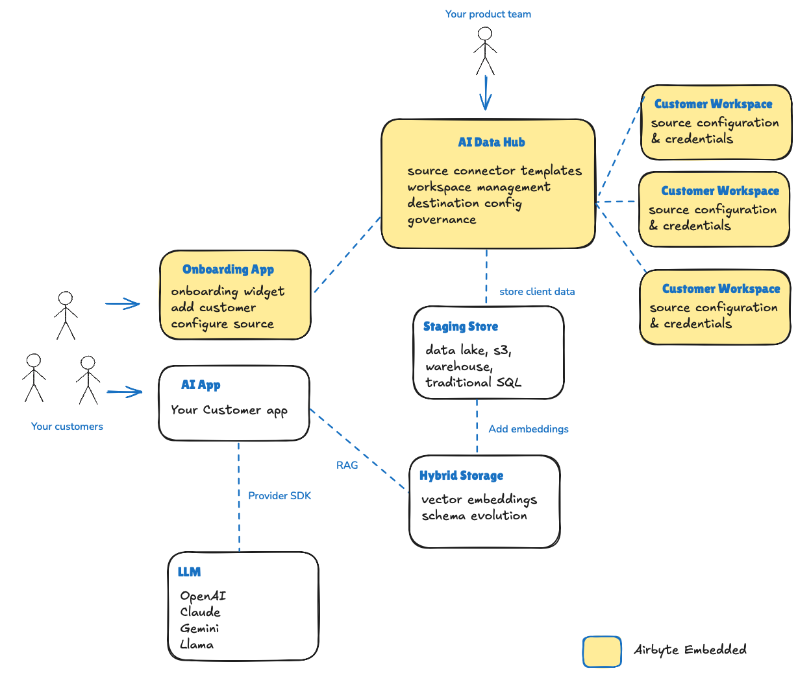

---
products: embedded
---

# Getting Started with Airbyte Embedded

The following getting started steps utilize a React.js serverless app for the onboarding app with an Airbyte Embedded enabled instance of Airbyte Cloud for the AI Data Hub and Customer Workspaces. You can download the code for the onboarding app [via GitHub](https://github.com/airbytehq/embedded-sampleweb-reactjs). If you prefer to develop in Node.js, please use [this sample app](https://github.com/airbytehq/embedded-sampleweb-nodejs) instead. Regardless of web framework you choose, the pre-requisites required for initial set up are the same.

The diagram below depicts the portions of the AI data hub blueprint that  Airbyte Embedded delivers out-of-the-box. The goal is to solve the data movement requirements of product teams building AI apps, and ensure freedom and flexibility for product teams to implement their AI app using the frameworks, data stores and LLMs that best suit their individual needs.

