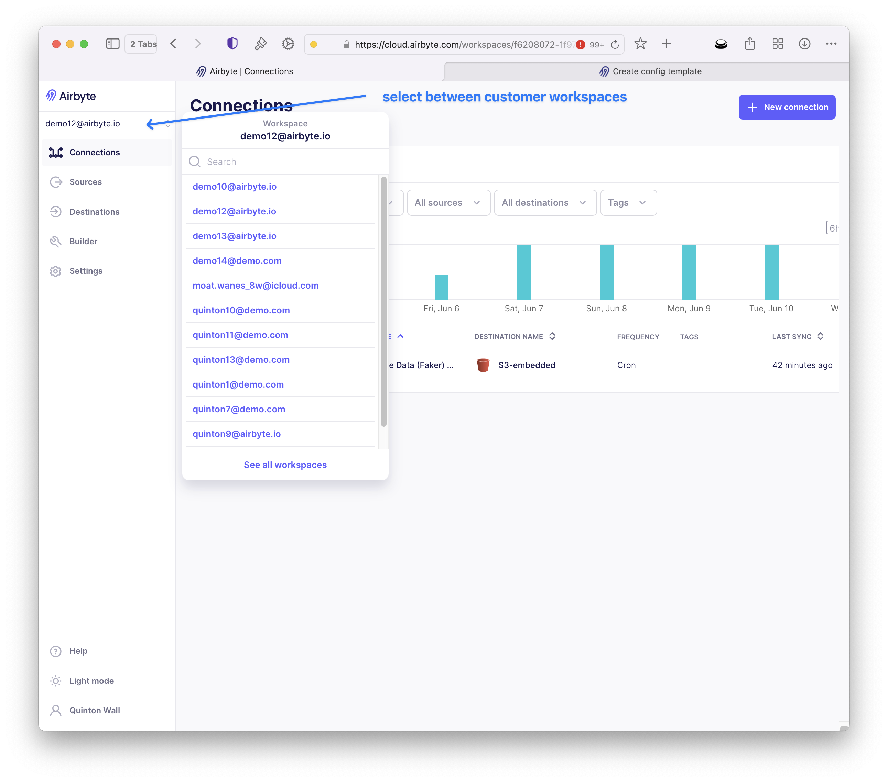

# Managing Airbyte Embedded

## Customer Workspaces

Airbyte Embedded is built upon the Airbyte Platform. As the owner of your embedded instance, you access Airbyte via the standard sign-in. Each customer who configures a source via the Embedded Widget is automatically assigned a workspace. Within this workspace, data pipelines are created between the source and staging store, which you configured in the pre-requisite section of this guide. In this example, the staging store is S3.




## Enabling Connectors within the Widget

Source connectors can be configured to appear in the Embedded widget by creating a configuration template via the [`config_templates/sources` API endpoint.](https://reference.airbyte.com/reference/createconfigtemplate#/)

The following example demonstrates how to use the API to create a new configuration template for the Faker connector, with a required “*count*” field.  To obtain the `source_connector_definition_id`, you can access this via the [Airbyte Connector Registry](https://connectors.airbyte.com/files/generated_reports/connector_registry_report.html).

```bash
curl --request POST \
  --url https://api.airbyte.ai/api/v1/embedded/config_templates/sources/ \
  --header 'Content-Type: application/json' \
  --header 'Authorization: Bearer <bearer id>' \
  --data '{
    "organization_id": "<organization id>",
    "partial_default_config": {},
    "partialUserConfigSpec": {
      "connectionSpecification": {
        "$schema": "http://json-schema.org/draft-07/schema#",
        "title": "Faker Source Spec2",
        "type": "object",
        "required": ["count"],
        "properties": {
          "count": {
            "title": "Count",
            "description": "How many users should be generated in total. The purchases table will be scaled to match, with 10 purchases created per 10 users. This setting does not apply to the products stream.",
            "type": "integer",
            "minimum": 1,
            "default": 5005,
            "order": 0
          }
        }
      }
    },
    "actor_definition_id": "<actor id>"
  }'
```

:::note
This endpoint is only available to Embedded customers. You can only create new configuration templates, not update, modify, or delete existing ones.
:::
