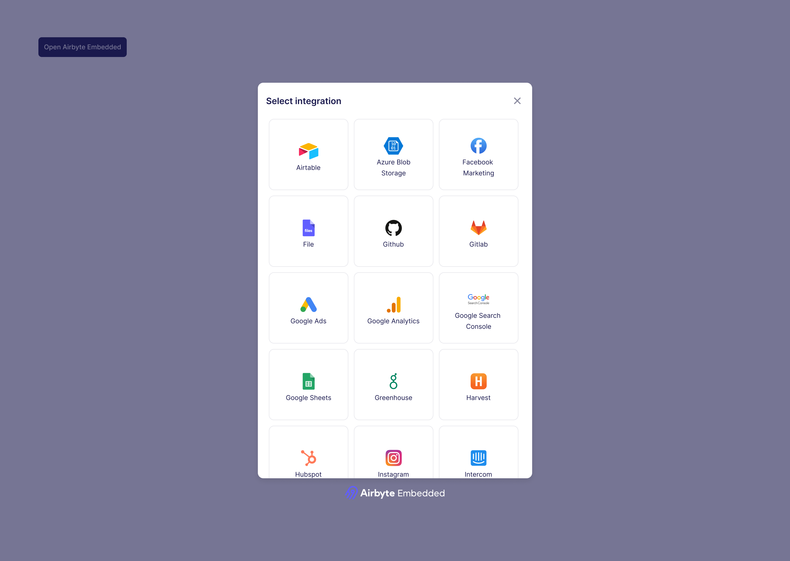

# Use Airbyte Embedded

<head>
  <!-- HIDE PAGE FROM SEARCH ENGINES FOR NOW -->
  <meta name="robots" content="noindex, nofollow" />
</head>

Once in your app, open Airbyte’s integration widget to see a catalog of available integrations. Choose one, and authenticate. Don't worry - if you want to show your own integration tiles, Embedded supports this flow as well.

:::tip
If you don't have a source system available to you at this time, use the source `Faker`.
:::

Once you’ve configured your source, wait a few minutes, and you should see loaded data in a new file in your S3 destination. You are all done! If you’d like to see your pipelines from the Airbyte Operator UI, feel free to do so by logging in to [Airbyte Cloud](https://cloud.airbyte.com).
