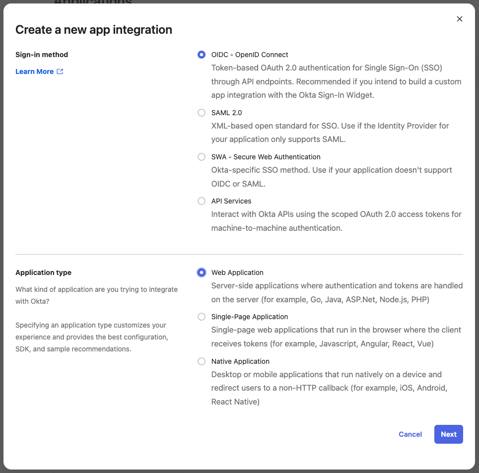
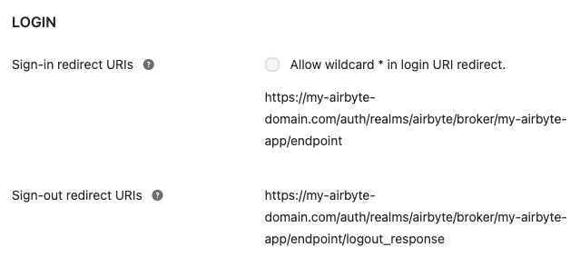

# Using Single Sign-On (SSO)

Leverage your existing identity provider to enable employees to access your Airbyte instance using their corporate credentials, simplifying user provisioning. Enabling Single Sign-On extends Airbyte Self Managed to support multiple users, and multiple teams all on one instance.

Airbyte Self Managed currently supports SSO via OIDC with [Okta](https://www.okta.com/) as an IdP. Support for Azure Active Directory and connecting via SAML are both coming soon. Please talk to us to learn more about upcoming [enterprise features](https://airbyte.com/company/talk-to-sales). 

The following instructions walk you through:
1. [Setting up the Okta OIDC App Integration to be used by your Airbyte instance](#setting-up-okta-for-sso)
2. [Configuring Airbyte Self-Managed to use SSO](#deploying-airbyte-enterprise-with-okta)

### Setting up Okta for SSO

You will need to create a new Okta OIDC App Integration for your Airbyte instance. Documentation on how to do this in Okta can be found [here](https://help.okta.com/en-us/Content/Topics/Apps/Apps_App_Integration_Wizard_OIDC.htm).

You should create an app integration with **OIDC - OpenID Connect** as the sign-in method and **Web Application** as the application type:



#### App integration name

Please choose a URL-friendly app integraiton name without spaces or special characters, such as `my-airbyte-app`:


Spaces or special characters in this field could result in invalid redirect URIs.

#### Redirect URIs

In the **Login** section, set the following fields, substituting `<your-airbyte-domain>` and `<app-integration-name>` for your own values:

Sign-in redirect URIs:

```
<your-airbyte-domain>/auth/realms/airbyte/broker/<app-integration-name>/endpoint
```

Sign-out redirect URIs

```
<your-airbyte-domain>/auth/realms/airbyte/broker/<app-integration-name>/endpoint/logout_response
```



_Example values_

`<your-airbyte-domain>` should point to where your Airbyte instance will be available, including the http/https protocol.

## Deploying Airbyte Self-Managed with Okta

Once your Okta app is set up, you're ready to deploy Airbyte with SSO. Take note of the following configuration values, as you will need them to configure Airbyte to use your new Okta SSO app integration:

- Okta domain ([how to find your Okta domain](https://developer.okta.com/docs/guides/find-your-domain/main/))
- App integration name
- Client ID
- Client Secret

Visit the [implementation guide](./implementation-guide.md) for instructions on how to deploy Airbyte Enterprise using `kubernetes`, `kubectl` and `helm`.
