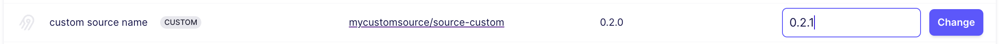

# Custom or New Connector

If you'd like to **ask for a new connector,** you can request it directly [here](https://github.com/airbytehq/airbyte/discussions/new?category=new-connector-request).

If you'd like to build new connectors and **make them part of the pool of pre-built connectors on Airbyte,** first a big thank you. We invite you to check our [contributing guide on building connectors](../contributing-to-airbyte/README.md).

If you'd like to build new connectors, or update existing ones, **for your own usage,** without contributing to the Airbyte codebase, read along.

## Developing your own connector

### You should probably use Connector Builder

If you need a connector for a data source that has an HTTP API, in 99% cases you should use the [Connector Builder](https://docs.airbyte.com/connector-development/connector-builder-ui/overview) to build a connector. You can choose to publish it to your workspace or contribute it to the Airbyte connector catalog.

You should only build and deploy your own connector in code (using Python or Java CDKs or any other language) when Builder does not support your data source or destination.

### Really need to build your own connector from scratch?

It's easy to build your own connectors for Airbyte. You can learn how to build new connectors using either our Connector Builder or our connector CDKs [here](../connector-development/README.md).

While the guides in the link above are specific to the languages used most frequently to write integrations, **Airbyte connectors can be written in any language**. Please reach out to us if you'd like help developing connectors in other languages.

:::caution
If you don't use one of the official development options, remember to set the `AIRBYTE_ENTRYPOINT` environment variable to your Docker image's entrypoint!
Otherwise, your connector will not run correctly.
:::

Learn how to upload Docker-based custom connectors [here](../../operator-guides/using-custom-connectors/)

## Upgrading a connector

To upgrade your connector version, go to the Settings in the left hand side of the UI and navigate to either Sources or Destinations. Find your connector in the list, and input the latest connector version.

