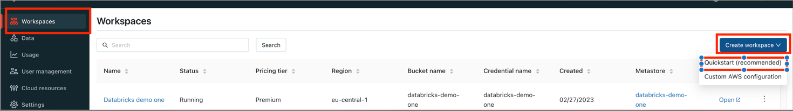
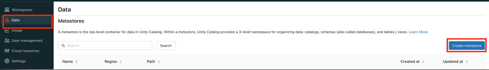
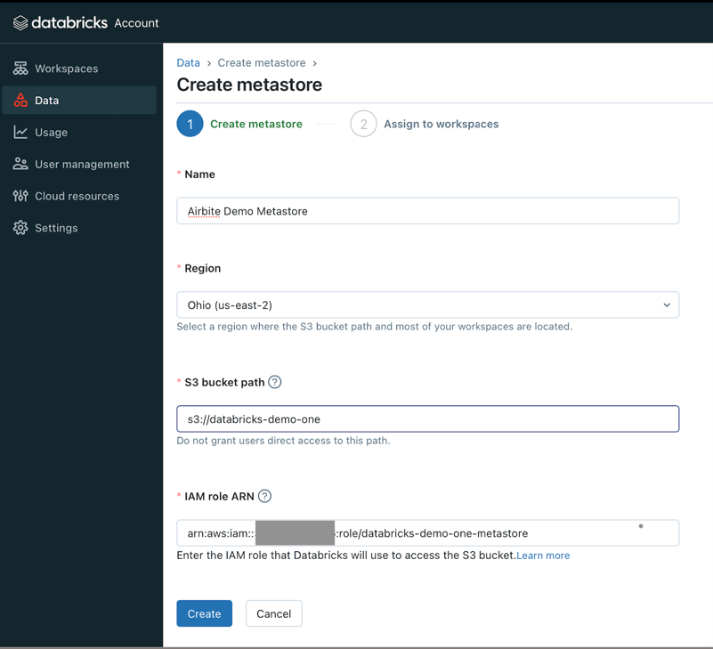
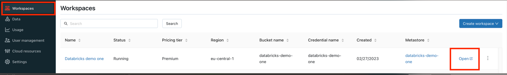
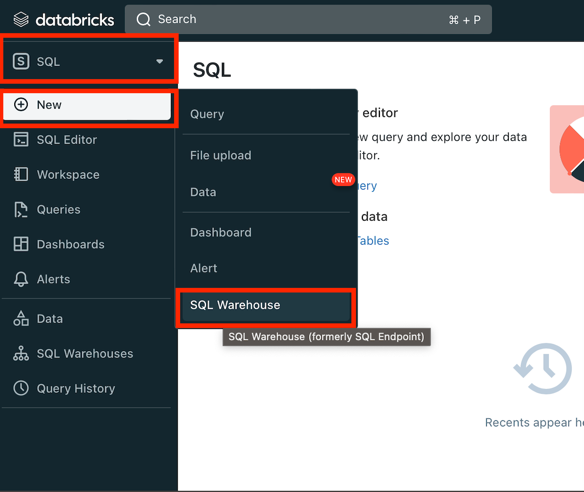
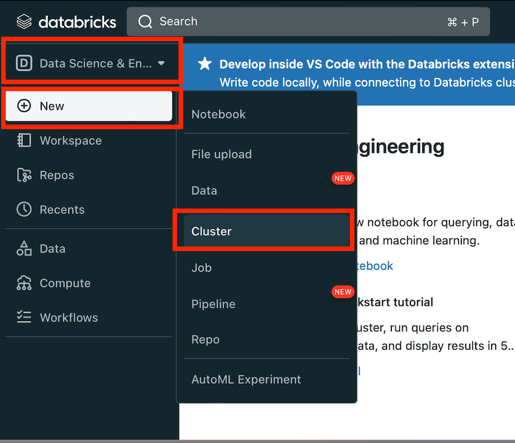
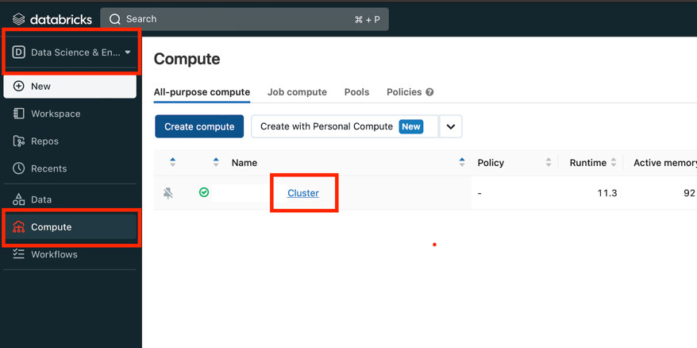
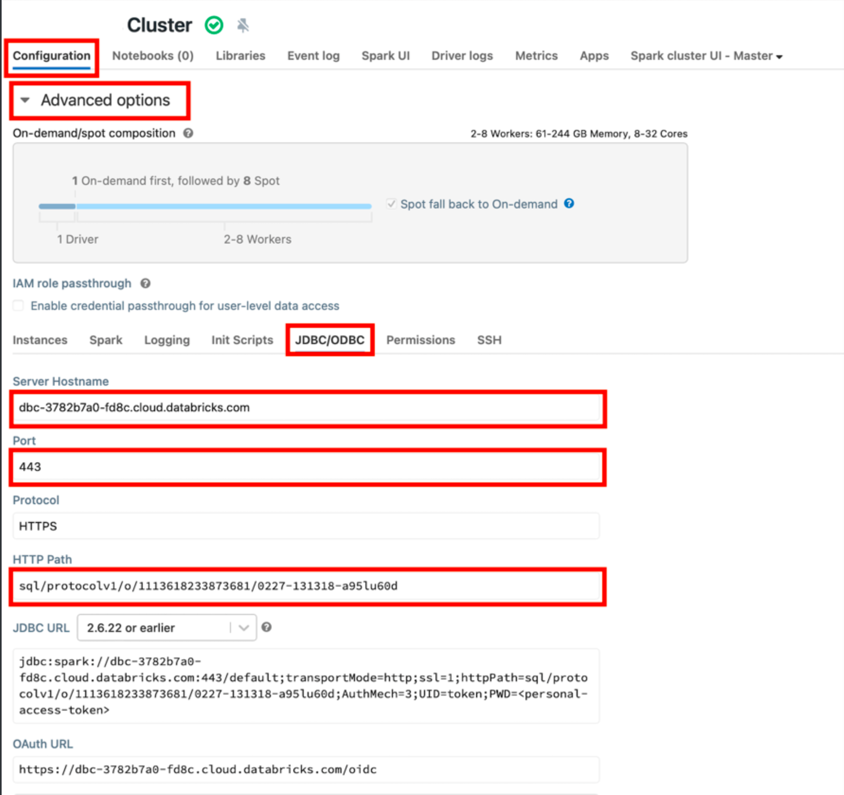
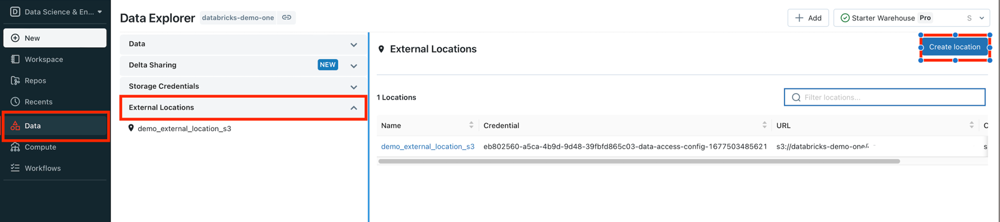
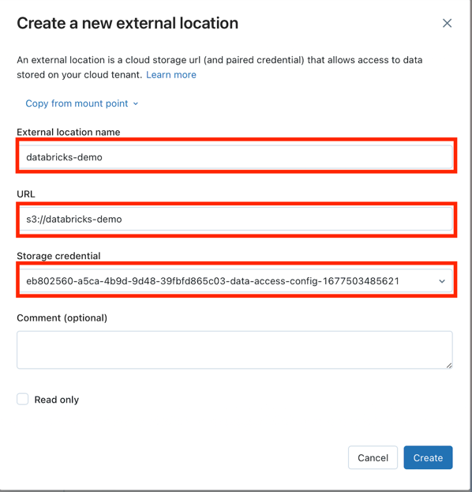

# Databricks Lakehouse

## Overview

This destination syncs data to Delta Lake on Databricks Lakehouse. Each stream is written to its own
[delta-table](https://delta.io/).

This connector requires a JDBC driver to connect to the Databricks cluster. By using the driver and
the connector, you must agree to the
[JDBC ODBC driver license](https://databricks.com/jdbc-odbc-driver-license). This means that you can
only use this connector to connect third party applications to Apache Spark SQL within a Databricks
offering using the ODBC and/or JDBC protocols.

Currently, this connector requires 30+MB of memory for each stream. When syncing multiple streams,
it may run into an out-of-memory error if the allocated memory is too small. This performance
bottleneck is tracked in [this issue](https://github.com/airbytehq/airbyte/issues/11424). Once this
issue is resolved, the connector should be able to sync an almost infinite number of streams with
less than 500MB of memory.

## Getting started

## Databricks AWS Setup

### 1. Create a Databricks Workspace

- Follow Databricks guide
  [Create a workspace using the account console](https://docs.databricks.com/administration-guide/workspace/create-workspace.html#create-a-workspace-using-the-account-console).
  > **_IMPORTANT:_** Don't forget to create a
  > [cross-account IAM role](https://docs.databricks.com/administration-guide/cloud-configurations/aws/iam-role.html#create-a-cross-account-iam-role)
  > for workspaces

> **_TIP:_** Alternatively use Databricks quickstart for new workspace
> 

### 2. Create a metastore and attach it to workspace

> **_IMPORTANT:_** The metastore should be in the same region as the workspaces you want to use to
> access the data. Make sure that this matches the region of the cloud storage bucket you created
> earlier.

#### Setup storage bucket and IAM role in AWS

Follow
[Configure a storage bucket and IAM role in AWS](https://docs.databricks.com/data-governance/unity-catalog/get-started.html#configure-a-storage-bucket-and-iam-role-in-aws)
to setup AWS bucket with necessary permissions.

#### Create metastore

- Login into Databricks [account console](https://accounts.cloud.databricks.com/login) with admin
  permissions.
- Go to Data tab and hit Create metastore button:

  

- Provide all necessary data and click Create:

  

  - `Name`
  - `Region` The metastore should be in same region as the workspace.
  - `S3 bucket path` created at
    [Setup storage bucket and IAM role in AWS](#setup-storage-bucket-and-iam-role-in-aws) step.
  - `IAM role ARN` created at
    [Setup storage bucket and IAM role in AWS](#setup-storage-bucket-and-iam-role-in-aws) step.
    Example: `arn:aws:iam::<AWS_ACCOUNT_ID>:role/<AWS_IAM_ROLE_NAME>`

- Select the workspaces in `Assign to workspaces` tab and click Assign.

### 3. Create Databricks SQL Warehouse

> **_TIP:_** If you use Databricks cluster skip this step

- Open the workspace tab and click on created workspace console:

  

- Create SQL warehouse:

- 
  - Switch to SQL tab
  - Click New button
  - Choose SQL Warehouse
- After SQL warehouse was created we can it's Connection details to con

### 4. Databricks SQL Warehouse connection details

> **_TIP:_** If you use Databricks cluster skip this step

- Open workspace console.
- Go to SQL Warehouse section and open it

  

- Open Connection Details tab:

  

> **_IMPORTANT:_** `Server hostname`, `Port`, `HTTP path` are used for Airbyte connection

### 5. Create Databricks Cluster

> **_TIP:_** If you use Databricks SQL Warehouse skip this step

- Open the workspace tab and click on created workspace console:

  

- Create Cluster:

  

  - Switch to Data science & Engineering
  - Click New button
  - Choose Cluster

### 6. Databricks Cluster connection details

> **_TIP:_** If you use Databricks SQL Warehouse skip this step

- Open workspace console.
- Go to Compute section under Data science & Engineering and click on cluster link:

  

- Open Advanced options under Configuration, choose JDBC/ODBC tab:

  

  > **_IMPORTANT:_** `Server hostname`, `Port`, `HTTP path` are used for Airbyte connection

### 7. Create Databricks Token

- Open workspace console.
- Open User Settings, go to Access tokens tab and click Generate new token:

  

- In the new window put a comment (Optional) and lifetime:

  

> **_TIP:_** `Lifetime` can be set to `0`

### 8. Adding External Locations (Optional)

> **_TIP:_** Skip this step if no external data source is used.

- Open workspace console.
- Go to `Data` section, expand on `External Location` and click `Create Location` button:

  

- Fill in the fields and click Create button:

  

> **_TIP:_** The new `Storage credential` can be added in the `Storage Credentials` tab or use same
> as for Metastore.

## Airbyte Setup

### Databricks fields

- `Agree to the Databricks JDBC Driver Terms & Conditions` -
  [Databricks JDBC ODBC driver license](https://www.databricks.com/legal/jdbc-odbc-driver-license).
- `Server Hostname` - can be taken from
  [4. Databricks SQL Warehouse connection details](#4-databricks-sql-warehouse-connection-details)
  or [6. Databricks Cluster connection details](#6-databricks-cluster-connection-details) steps.
- `HTTP Path` - can be taken from
  [4. Databricks SQL Warehouse connection details](#4-databricks-sql-warehouse-connection-details)
  or [6. Databricks Cluster connection details](#6-databricks-cluster-connection-details) steps.
- `Port` - can be taken from
  [4. Databricks SQL Warehouse connection details](#4-databricks-sql-warehouse-connection-details)
  or [6. Databricks Cluster connection details](#6-databricks-cluster-connection-details) steps.
- `Access Token` - can be taken from [7. Create Databricks Token](#7-create-databricks-token) step.

### Data Source

You could choose a data source type

- Managed tables
- Amazon S3 (External storage)
- Azure Blob Storage (External storage)

#### Managed tables data source type

Please check Databricks documentation about
[What is managed tables](https://docs.databricks.com/lakehouse/data-objects.html#what-is-a-managed-table)

> **_TIP:_** There is no addition setup should be done for this type.

#### Amazon S3 data source type (External storage)

> **_IMPORTANT:_** Make sure the `External Locations` has been added to the workspace. Check
> [Adding External Locations](#8-adding-external-locations-optional) step.

Provide your Amazon S3 data:

- `S3 Bucket Name` - The bucket name
- `S3 Bucket Path` - Subdirectory under the above bucket to sync the data into
- `S3 Bucket Region` - See
  [here](https://docs.aws.amazon.com/AWSEC2/latest/UserGuide/using-regions-availability-zones.html#concepts-available-regions)
  for all region codes.
  > **_IMPORTANT:_** The metastore should be in the same region as the workspaces you want to use to
  > access the data. Make sure that this matches the region of the cloud storage bucket you created
  > earlier.
- `S3 Access Key ID` - Corresponding key to the above key id
- `S3 Secret Access Key` -
  - See
    [this](https://docs.aws.amazon.com/general/latest/gr/aws-sec-cred-types.html#access-keys-and-secret-access-keys)
    on how to generate an access key.
  - We recommend creating an Airbyte-specific user. This user will require
    [read and write permissions](https://docs.aws.amazon.com/IAM/latest/UserGuide/reference_policies_examples_s3_rw-bucket.html)
    to objects in the bucket.
- `S3 Filename pattern` - The pattern allows you to set the file-name format for the S3 staging
  file(s), next placeholders combinations are currently supported: `{date}`, `{date:yyyy_MM}`,
  `{timestamp}`, `{timestamp:millis}`, `{timestamp:micros}`, `{part_number}`, `{sync_id}`,
  `{format_extension}`. Please, don't use empty space and not supportable placeholders, as they
  won't be recognized

#### Azure Blob Storage data source type (External storage)

> **_IMPORTANT:_** The work in progress.

## Sync Mode

| Feature                        | Support | Notes                                                                                |
| :----------------------------- | :-----: | :----------------------------------------------------------------------------------- |
| Full Refresh Sync              |   ✅    | Warning: this mode deletes all previously synced data in the configured bucket path. |
| Incremental - Append Sync      |   ✅    |                                                                                      |
| Incremental - Append + Deduped |   ❌    |                                                                                      |
| Namespaces                     |   ✅    |                                                                                      |

## Configuration

| Category            | Parameter             |  Type   | Notes                                                                                                                                                                                                                                                                                                                                                                       |
| :------------------ | :-------------------- | :-----: | :-------------------------------------------------------------------------------------------------------------------------------------------------------------------------------------------------------------------------------------------------------------------------------------------------------------------------------------------------------------------------- |
| Databricks          | Server Hostname       | string  | Required. Example: `abc-12345678-wxyz.cloud.databricks.com`. See [documentation](https://docs.databricks.com/integrations/bi/jdbc-odbc-bi.html#get-server-hostname-port-http-path-and-jdbc-url). Please note that this is the server for the Databricks Cluster. It is different from the SQL Endpoint Cluster.                                                             |
|                     | HTTP Path             | string  | Required. Example: `sql/protocolvx/o/1234567489/0000-1111111-abcd90`. See [documentation](https://docs.databricks.com/integrations/bi/jdbc-odbc-bi.html#get-server-hostname-port-http-path-and-jdbc-url).                                                                                                                                                                   |
|                     | Port                  | string  | Optional. Default to "443". See [documentation](https://docs.databricks.com/integrations/bi/jdbc-odbc-bi.html#get-server-hostname-port-http-path-and-jdbc-url).                                                                                                                                                                                                             |
|                     | Personal Access Token | string  | Required. Example: `dapi0123456789abcdefghij0123456789AB`. See [documentation](https://docs.databricks.com/sql/user/security/personal-access-tokens.html).                                                                                                                                                                                                                  |
| General             | Databricks catalog    | string  | Optional. The name of the catalog. If not specified otherwise, the "hive_metastore" will be used.                                                                                                                                                                                                                                                                           |
|                     | Database schema       | string  | Optional. The default schema tables are written. If not specified otherwise, the "default" will be used.                                                                                                                                                                                                                                                                    |
|                     | Schema evolution      | boolean | Optional. The connector enables automatic schema evolution in the destination tables.                                                                                                                                                                                                                                                                                       |
|                     | Purge Staging Data    | boolean | The connector creates staging files and tables on S3 or Azure. By default, they will be purged when the data sync is complete. Set it to `false` for debugging purposes.                                                                                                                                                                                                    |
| Data Source - S3    | Bucket Name           | string  | Name of the bucket to sync data into.                                                                                                                                                                                                                                                                                                                                       |
|                     | Bucket Path           | string  | Subdirectory under the above bucket to sync the data into.                                                                                                                                                                                                                                                                                                                  |
|                     | Region                | string  | See [documentation](https://docs.aws.amazon.com/AWSEC2/latest/UserGuide/using-regions-availability-zones.html#concepts-available-regions) for all region codes.                                                                                                                                                                                                             |
|                     | Access Key ID         | string  | AWS/Minio credential.                                                                                                                                                                                                                                                                                                                                                       |
|                     | Secret Access Key     | string  | AWS/Minio credential.                                                                                                                                                                                                                                                                                                                                                       |
|                     | S3 Filename pattern   | string  | The pattern allows you to set the file-name format for the S3 staging file(s), next placeholders combinations are currently supported: `{date}`, `{date:yyyy_MM}`, `{timestamp}`, `{timestamp:millis}`, `{timestamp:micros}`, `{part_number}`, `{sync_id}`, `{format_extension}`. Please, don't use empty space and not supportable placeholders, as they won't recognized. |
| Data Source - Azure | Account Name          | string  | Name of the account to sync data into.                                                                                                                                                                                                                                                                                                                                      |
|                     | Container Name        | string  | Container under the above account to sync the data into.                                                                                                                                                                                                                                                                                                                    |
|                     | SAS token             | string  | Shared-access signature token for the above account.                                                                                                                                                                                                                                                                                                                        |
|                     | Endpoint domain name  | string  | Usually blob.core.windows.net.                                                                                                                                                                                                                                                                                                                                              |

⚠️ Please note that under "Full Refresh Sync" mode, data in the configured bucket and path will be
wiped out before each sync. We recommend you provision a dedicated S3 or Azure resource for this
sync to prevent unexpected data deletion from misconfiguration. ⚠️

## Staging Files (Delta Format)

### S3

Data streams are first written as staging delta-table ([Parquet](https://parquet.apache.org/) +
[Transaction Log](https://databricks.com/blog/2019/08/21/diving-into-delta-lake-unpacking-the-transaction-log.html))
files on S3, and then loaded into Databricks delta-tables. All the staging files will be deleted
after the sync is done. For debugging purposes, here is the full path for a staging file:

```text
s3://<bucket-name>/<bucket-path>/<uuid>/<stream-name>
```

For example:

```text
s3://testing_bucket/data_output_path/98c450be-5b1c-422d-b8b5-6ca9903727d9/users/_delta_log
     ↑              ↑                ↑                                    ↑     ↑
     |              |                |                                    |     transaction log
     |              |                |                                    stream name
     |              |                database schema
     |              bucket path
     bucket name
```

### Azure

Similarly, streams are first written to a staging location, but the Azure option uses CSV format. A
staging table is created from the CSV files.

## Unmanaged Spark SQL Table

Currently, all streams are synced into unmanaged Spark SQL tables. See
[documentation](https://docs.databricks.com/data/tables.html#managed-and-unmanaged-tables) for
details. In summary, you have full control of the location of the data underlying an unmanaged
table. In S3, the full path of each data stream is:

```text
s3://<bucket-name>/<bucket-path>/<database-schema>/<stream-name>
```

For example:

```text
s3://testing_bucket/data_output_path/public/users
     ↑              ↑                ↑      ↑
     |              |                |      stream name
     |              |                database schema
     |              bucket path
     bucket name
```

In Azure, the full path of each data stream is:

```text
abfss://<container-name>@<account-name>.dfs.core.windows.net/<database-schema>/<stream-name>
```

Please keep these data directories on S3/Azure. Otherwise, the corresponding tables will have no
data in Databricks.

## Output Schema

Each table will have the following columns:

| Column                |   Type    | Notes                                            |
| :-------------------- | :-------: | :----------------------------------------------- |
| `_airbyte_ab_id`      |  string   | UUID.                                            |
| `_airbyte_emitted_at` | timestamp | Data emission timestamp.                         |
| `_airbyte_data`       |   JSON    | The data from your source will be in this column |

Under the hood, an Airbyte data stream in Json schema is first converted to an Avro schema, then the
Json object is converted to an Avro record, and finally the Avro record is outputted to the Parquet
format. Because the data stream can come from any data source, the Json to Avro conversion process
has arbitrary rules and limitations. Learn more about how source data is converted to Avro and the
current limitations [here](https://docs.airbyte.com/understanding-airbyte/json-avro-conversion).

## Related tutorial

Suppose you are interested in learning more about the Databricks connector or details on how the
Delta Lake tables are created. You may want to consult the tutorial on
[How to Load Data into Delta Lake on Databricks Lakehouse](https://airbyte.com/tutorials/load-data-into-delta-lake-on-databricks-lakehouse).

## CHANGELOG

| Version | Date       | Pull Request                                                                                                        | Subject                                                                                                                  |
|:--------|:-----------|:--------------------------------------------------------------------------------------------------------------------|:-------------------------------------------------------------------------------------------------------------------------|
| 2.0.0   | 2024-05-17 | [#37613](https://github.com/airbytehq/airbyte/pull/37613)                                                           | (Private release, not to be used for production) Alpha release of the connector to use Unity Catalog                     |
| 1.1.2   | 2024-04-04 | [#36846](https://github.com/airbytehq/airbyte/pull/36846)                                                           | (incompatible with CDK, do not use) Remove duplicate S3 Region                                                           |
| 1.1.1   | 2024-01-03 | [#33924](https://github.com/airbytehq/airbyte/pull/33924)                                                           | (incompatible with CDK, do not use) Add new ap-southeast-3 AWS region                                                    |
| 1.1.0   | 2023-06-02 | [\#26942](https://github.com/airbytehq/airbyte/pull/26942)                                                          | Support schema evolution                                                                                                 |
| 1.0.2   | 2023-04-20 | [\#25366](https://github.com/airbytehq/airbyte/pull/25366)                                                          | Fix default catalog to be `hive_metastore`                                                                               |
| 1.0.1   | 2023-03-30 | [\#24657](https://github.com/airbytehq/airbyte/pull/24657)                                                          | Fix support for external tables on S3                                                                                    |
| 1.0.0   | 2023-03-21 | [\#23965](https://github.com/airbytehq/airbyte/pull/23965)                                                          | Added: Managed table storage type, Databricks Catalog field                                                              |
| 0.3.1   | 2022-10-15 | [\#18032](https://github.com/airbytehq/airbyte/pull/18032)                                                          | Add `SSL=1` to the JDBC URL to ensure SSL connection.                                                                    |
| 0.3.0   | 2022-10-14 | [\#15329](https://github.com/airbytehq/airbyte/pull/15329)                                                          | Add support for Azure storage.                                                                                           |
|         | 2022-09-01 | [\#16243](https://github.com/airbytehq/airbyte/pull/16243)                                                          | Fix Json to Avro conversion when there is field name clash from combined restrictions (`anyOf`, `oneOf`, `allOf` fields) |
| 0.2.6   | 2022-08-05 | [\#14801](https://github.com/airbytehq/airbyte/pull/14801)                                                          | Fix multiply log bindings                                                                                                |
| 0.2.5   | 2022-07-15 | [\#14494](https://github.com/airbytehq/airbyte/pull/14494)                                                          | Make S3 output filename configurable.                                                                                    |
| 0.2.4   | 2022-07-14 | [\#14618](https://github.com/airbytehq/airbyte/pull/14618)                                                          | Removed additionalProperties: false from JDBC destination connectors                                                     |
| 0.2.3   | 2022-06-16 | [\#13852](https://github.com/airbytehq/airbyte/pull/13852)                                                          | Updated stacktrace format for any trace message errors                                                                   |
| 0.2.2   | 2022-06-13 | [\#13722](https://github.com/airbytehq/airbyte/pull/13722)                                                          | Rename to "Databricks Lakehouse".                                                                                        |
| 0.2.1   | 2022-06-08 | [\#13630](https://github.com/airbytehq/airbyte/pull/13630)                                                          | Rename to "Databricks Delta Lake" and add field orders in the spec.                                                      |
| 0.2.0   | 2022-05-15 | [\#12861](https://github.com/airbytehq/airbyte/pull/12861)                                                          | Use new public Databricks JDBC driver, and open source the connector.                                                    |
| 0.1.5   | 2022-05-04 | [\#12578](https://github.com/airbytehq/airbyte/pull/12578)                                                          | In JSON to Avro conversion, log JSON field values that do not follow Avro schema for debugging.                          |
| 0.1.4   | 2022-02-14 | [\#10256](https://github.com/airbytehq/airbyte/pull/10256)                                                          | Add `-XX:+ExitOnOutOfMemoryError` JVM option                                                                             |
| 0.1.3   | 2022-01-06 | [\#7622](https://github.com/airbytehq/airbyte/pull/7622) [\#9153](https://github.com/airbytehq/airbyte/issues/9153) | Upgrade Spark JDBC driver to `2.6.21` to patch Log4j vulnerability; update connector fields title/description.           |
| 0.1.2   | 2021-11-03 | [\#7288](https://github.com/airbytehq/airbyte/issues/7288)                                                          | Support Json `additionalProperties`.                                                                                     |
| 0.1.1   | 2021-10-05 | [\#6792](https://github.com/airbytehq/airbyte/pull/6792)                                                            | Require users to accept Databricks JDBC Driver [Terms & Conditions](https://databricks.com/jdbc-odbc-driver-license).    |
| 0.1.0   | 2021-09-14 | [\#5998](https://github.com/airbytehq/airbyte/pull/5998)                                                            | Initial private release.                                                                                                 |
