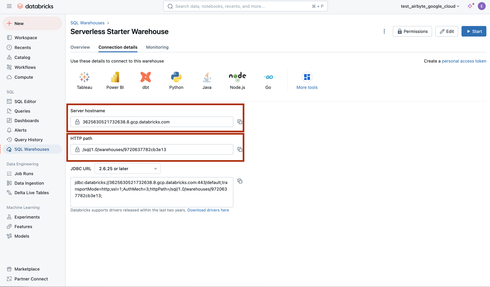
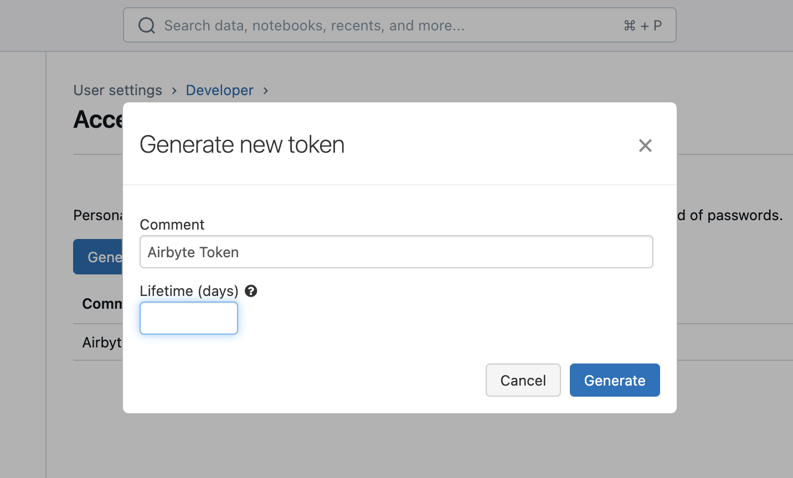

# Databricks Lakehouse

## Overview

This destination syncs data to Delta Lake on Databricks Lakehouse. Each stream is written to its own
[delta-table](https://delta.io/).

:::caution
You **must** be using Unity Catalog to use this connector.
:::

:::info
Please note, at this time OAuth2 authentication is only supported in AWS
deployments. If you are running Databricks in GCP, you **must** use an access
token.
:::

This connector requires a JDBC driver to connect to the Databricks cluster. By using the driver and
the connector, you must agree to the
[JDBC ODBC driver license](https://databricks.com/jdbc-odbc-driver-license). This means that you can
only use this connector to connect third party applications to Apache Spark SQL within a Databricks
offering using the ODBC and/or JDBC protocols.

## Airbyte Setup

When setting up a Databricks destination, you need these pieces of information:

### Server Hostname / HTTP Path / Port

1. Open the workspace console.
2. Open your SQL warehouse:

   

3. Open the Connection Details tab:

   

4. Finally, you'll need to provide the `Databricks Unity Catalog Path`, which is the path to the database you wish to use within the Unity Catalog. This is often the same as the workspace name.

### Authentication

#### OAuth (Recommended for AWS deployments of Databricks)

Follow the instructions in [Databricks documentation](https://docs.databricks.com/en/dev-tools/auth/oauth-m2m.html)
to generate a client ID and secret.

#### Access Token (Recommended for Google Cloud deployments of Databricks)

1. Open your workspace console.
2. Click on your icon in the top-right corner, and head to `settings`, then `developer`, then `manage` under `access tokens`

   

3. Enter a description for the token and how long it will be valid for (or leave blank for a permanent token):

   

### Other Options

- `Default Schema` - The schema that will contain your data. You can later override this on a per-connection basis.
- `Purge Staging Files and Tables` - Whether Airbyte should delete files after loading them into tables. Note: if deselected, Databricks will still delete your files after your retention period has passed (default - 7 days).

## Sync Mode

| Feature                        | Support | Notes                                                                                |
| :----------------------------- | :-----: | :----------------------------------------------------------------------------------- |
| Full Refresh Sync              |   ✅    | Warning: this mode deletes all previously synced data in the configured bucket path. |
| Incremental - Append Sync      |   ✅    |                                                                                      |
| Incremental - Append + Deduped |   ✅    |                                                                                      |
| Namespaces                     |   ✅    |                                                                                      |

## Output Schema

Each table will have the following columns, in addition to your whatever columns were in your data:

| Column                   |   Type    | Notes                                                                  |
| :----------------------- | :-------: | :--------------------------------------------------------------------- |
| `_airbyte_raw_id`        |  string   | A random UUID.                                                         |
| `_airbyte_extracted_at`  | timestamp | Timestamp when the source read the record.                             |
| `_airbyte_loaded_at`     | timestamp | Timestamp when the record was written to the destination               |
| `_airbyte_generation_id` |  bigint   | See the [refreshes](../../operator-guides/refreshes.md) documentation. |

Airbyte will also produce "raw tables" (by default in the `airbyte_internal` schema). We do not recommend directly interacting
with the raw tables, and their format is subject to change without notice.

## Changelog

  
Expand to review

| Version | Date       | Pull Request                                                                                                        | Subject                                                                                                                                                                          |
|:--------|:-----------|:--------------------------------------------------------------------------------------------------------------------|:---------------------------------------------------------------------------------------------------------------------------------------------------------------------------------|
| 3.3.3 | 2025-01-10 | [51506](https://github.com/airbytehq/airbyte/pull/51506) | Use a non root base image |
| 3.3.2 | 2024-12-18 | [49898](https://github.com/airbytehq/airbyte/pull/49898) | Use a base image: airbyte/java-connector-base:1.0.0 |
| 3.3.1   | 2024-12-02 | [#48779](https://github.com/airbytehq/airbyte/pull/48779)                                                           | bump resource reqs for `check`                                                                                                                                                   |
| 3.3.0   | 2024-09-18 | [#45438](https://github.com/airbytehq/airbyte/pull/45438)                                                           | upgrade all dependencies.                                                                                                                                                        |
| 3.2.5   | 2024-09-12 | [#45439](https://github.com/airbytehq/airbyte/pull/45439)                                                           | Move to integrations section.                                                                                                                                                    |
| 3.2.4   | 2024-09-09 | [#45208](https://github.com/airbytehq/airbyte/pull/45208)                                                           | Fix CHECK to create missing namespace if not exists.                                                                                                                             |
| 3.2.3   | 2024-09-03 | [#45115](https://github.com/airbytehq/airbyte/pull/45115)                                                           | Clarify Unity Catalog Name option.                                                                                                                                               |
| 3.2.2   | 2024-08-22 | [#44941](https://github.com/airbytehq/airbyte/pull/44941)                                                           | Clarify Unity Catalog Path option.                                                                                                                                               |
| 3.2.1   | 2024-08-22 | [#44506](https://github.com/airbytehq/airbyte/pull/44506)                                                           | Handle uppercase/mixed-case stream name/namespaces                                                                                                                               |
| 3.2.0   | 2024-08-12 | [#40712](https://github.com/airbytehq/airbyte/pull/40712)                                                           | Rely solely on PAT, instead of also needing a user/pass                                                                                                                          |
| 3.1.0   | 2024-07-22 | [#40692](https://github.com/airbytehq/airbyte/pull/40692)                                                           | Support for [refreshes](../../operator-guides/refreshes.md) and resumable full refresh. WARNING: You must upgrade to platform 0.63.7 before upgrading to this connector version. |
| 3.0.0   | 2024-07-12 | [#40689](https://github.com/airbytehq/airbyte/pull/40689)                                                           | (Private release, not to be used for production) Add `_airbyte_generation_id` column, and `sync_id` entry in `_airbyte_meta`                                                     |
| 2.0.0   | 2024-05-17 | [#37613](https://github.com/airbytehq/airbyte/pull/37613)                                                           | (Private release, not to be used for production) Alpha release of the connector to use Unity Catalog                                                                             |
| 1.1.2   | 2024-04-04 | [#36846](https://github.com/airbytehq/airbyte/pull/36846)                                                           | (incompatible with CDK, do not use) Remove duplicate S3 Region                                                                                                                   |
| 1.1.1   | 2024-01-03 | [#33924](https://github.com/airbytehq/airbyte/pull/33924)                                                           | (incompatible with CDK, do not use) Add new ap-southeast-3 AWS region                                                                                                            |
| 1.1.0   | 2023-06-02 | [\#26942](https://github.com/airbytehq/airbyte/pull/26942)                                                          | Support schema evolution                                                                                                                                                         |
| 1.0.2   | 2023-04-20 | [\#25366](https://github.com/airbytehq/airbyte/pull/25366)                                                          | Fix default catalog to be `hive_metastore`                                                                                                                                       |
| 1.0.1   | 2023-03-30 | [\#24657](https://github.com/airbytehq/airbyte/pull/24657)                                                          | Fix support for external tables on S3                                                                                                                                            |
| 1.0.0   | 2023-03-21 | [\#23965](https://github.com/airbytehq/airbyte/pull/23965)                                                          | Added: Managed table storage type, Databricks Catalog field                                                                                                                      |
| 0.3.1   | 2022-10-15 | [\#18032](https://github.com/airbytehq/airbyte/pull/18032)                                                          | Add `SSL=1` to the JDBC URL to ensure SSL connection.                                                                                                                            |
| 0.3.0   | 2022-10-14 | [\#15329](https://github.com/airbytehq/airbyte/pull/15329)                                                          | Add support for Azure storage.                                                                                                                                                   |
|         | 2022-09-01 | [\#16243](https://github.com/airbytehq/airbyte/pull/16243)                                                          | Fix Json to Avro conversion when there is field name clash from combined restrictions (`anyOf`, `oneOf`, `allOf` fields)                                                         |
| 0.2.6   | 2022-08-05 | [\#14801](https://github.com/airbytehq/airbyte/pull/14801)                                                          | Fix multiply log bindings                                                                                                                                                        |
| 0.2.5   | 2022-07-15 | [\#14494](https://github.com/airbytehq/airbyte/pull/14494)                                                          | Make S3 output filename configurable.                                                                                                                                            |
| 0.2.4   | 2022-07-14 | [\#14618](https://github.com/airbytehq/airbyte/pull/14618)                                                          | Removed additionalProperties: false from JDBC destination connectors                                                                                                             |
| 0.2.3   | 2022-06-16 | [\#13852](https://github.com/airbytehq/airbyte/pull/13852)                                                          | Updated stacktrace format for any trace message errors                                                                                                                           |
| 0.2.2   | 2022-06-13 | [\#13722](https://github.com/airbytehq/airbyte/pull/13722)                                                          | Rename to "Databricks Lakehouse".                                                                                                                                                |
| 0.2.1   | 2022-06-08 | [\#13630](https://github.com/airbytehq/airbyte/pull/13630)                                                          | Rename to "Databricks Delta Lake" and add field orders in the spec.                                                                                                              |
| 0.2.0   | 2022-05-15 | [\#12861](https://github.com/airbytehq/airbyte/pull/12861)                                                          | Use new public Databricks JDBC driver, and open source the connector.                                                                                                            |
| 0.1.5   | 2022-05-04 | [\#12578](https://github.com/airbytehq/airbyte/pull/12578)                                                          | In JSON to Avro conversion, log JSON field values that do not follow Avro schema for debugging.                                                                                  |
| 0.1.4   | 2022-02-14 | [\#10256](https://github.com/airbytehq/airbyte/pull/10256)                                                          | Add `-XX:+ExitOnOutOfMemoryError` JVM option                                                                                                                                     |
| 0.1.3   | 2022-01-06 | [\#7622](https://github.com/airbytehq/airbyte/pull/7622) [\#9153](https://github.com/airbytehq/airbyte/issues/9153) | Upgrade Spark JDBC driver to `2.6.21` to patch Log4j vulnerability; update connector fields title/description.                                                                   |
| 0.1.2   | 2021-11-03 | [\#7288](https://github.com/airbytehq/airbyte/issues/7288)                                                          | Support Json `additionalProperties`.                                                                                                                                             |
| 0.1.1   | 2021-10-05 | [\#6792](https://github.com/airbytehq/airbyte/pull/6792)                                                            | Require users to accept Databricks JDBC Driver [Terms & Conditions](https://databricks.com/jdbc-odbc-driver-license).                                                            |
| 0.1.0   | 2021-09-14 | [\#5998](https://github.com/airbytehq/airbyte/pull/5998)                                                            | Initial private release.                                                                                                                                                         |

