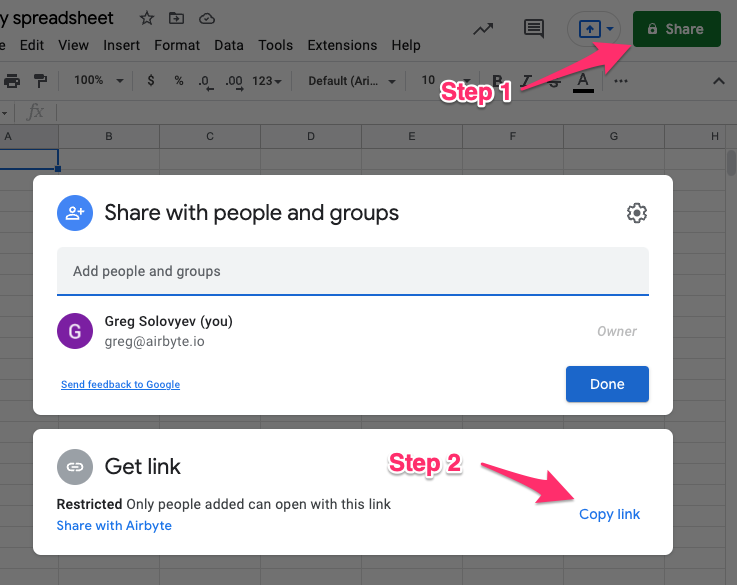

# Google Sheets

The Google Sheets Destination is configured to push data to a single Google Sheets spreadsheet with multiple Worksheets as streams. To replicate data to multiple spreadsheets, you can create multiple instances of the Google Sheets Destination in your Airbyte instance.
This page guides you through the process of setting up the Google Sheets destination connector.

## Prerequisites

- Google Account
- Google Spreadsheet URL

## Step 1: Set up Google Sheets

### Google Account

#### If you don't have a Google Account

Visit the [Google Support](https://support.google.com/accounts/answer/27441?hl=en) and create your Google Account.

### Google Sheets (Google Spreadsheets)

1. Once you acquire your Google Account, simply open the [Google Support](https://support.google.com/docs/answer/6000292?hl=en&co=GENIE.Platform%3DDesktop) to create the fresh empty Google to be used as a destination for your data replication, or if already have one - follow the next step.
2. You will need the link of the Spreadsheet you'd like to sync. To get it, click Share button in the top right corner of Google Sheets interface, and then click Copy Link in the dialog that pops up.
   These two steps are highlighted in the screenshot below:



## Step 2: Set up the Google Sheets destination connector in Airbyte

**For Airbyte Cloud:**

1. [Log into your Airbyte Cloud](https://cloud.airbyte.com/workspaces) account.
2. In the left navigation bar, click **Destinations**. In the top-right corner, click **+ new destination**.
3. On the source setup page, select **Google Sheets** from the Source type dropdown and enter a name for this connector.
4. Select `Sign in with Google`.
5. Log in and Authorize to the Google account and click `Set up source`.

**For Airbyte Open Source:**

At this moment the `Google Sheets Destination` works only with Airbyte Cloud.

### Output schema

Each worksheet in the selected spreadsheet will be the output as a separate source-connector stream. The data is coerced to string before the output to the spreadsheet. The nested data inside of the source connector data is normalized to the `first-level-nesting` and represented as string, this produces nested lists and objects to be a string rather than normal lists and objects, the further data processing is required if you need to analyze the data.

Airbyte only supports replicating `Grid Sheets`, which means the text raw data only could be replicated to the target spreadsheet. See the [Google Sheets API docs](https://developers.google.com/sheets/api/reference/rest/v4/spreadsheets/sheets#SheetType) for more info on all available sheet types.

#### Note:

- The output columns are ordered alphabetically. The output columns should not be reordered manually after the sync, this could cause the data corruption for all next syncs.
- The underlying process of record normalization is applied to avoid data corruption during the write process. This handles two scenarios:

1. UnderSetting - when record has less keys (columns) than catalog declares
2. OverSetting - when record has more keys (columns) than catalog declares

```
EXAMPLE:

- UnderSetting:
    * Catalog:
        - has 3 entities:
            [ 'id', 'key1', 'key2' ]
                        ^
    * Input record:
        - missing 1 entity, compare to catalog
            { 'id': 123,    'key2': 'value' }
                            ^
    * Result:
        - 'key1' has been added to the record, because it was declared in catalog, to keep the data structure.
            {'id': 123, 'key1': '', {'key2': 'value'} }
                            ^
- OverSetting:
    * Catalog:
        - has 3 entities:
            [ 'id', 'key1', 'key2',   ]
                                    ^
    * Input record:
        - doesn't have entity 'key1'
        - has 1 more enitity, compare to catalog 'key3'
            { 'id': 123,     ,'key2': 'value', 'key3': 'value' }
                            ^                      ^
    * Result:
        - 'key1' was added, because it expected be the part of the record, to keep the data structure
        - 'key3' was dropped, because it was not declared in catalog, to keep the data structure
            { 'id': 123, 'key1': '', 'key2': 'value',   }
                            ^                          ^
```

### Data type mapping

| Integration Type | Airbyte Type |
| :--------------- | :----------- |
| Any Type         | `string`     |

### Features & Supported sync modes

| Feature                        | Supported?\(Yes/No\) |
| :----------------------------- | :------------------- |
| Ful-Refresh Overwrite          | Yes                  |
| Ful-Refresh Append             | Yes                  |
| Incremental Append             | Yes                  |
| Incremental Append-Deduplicate | Yes                  |

### Rate Limiting & Performance Considerations

At the time of writing, the [Google API rate limit](https://developers.google.com/sheets/api/limits) is 100 requests per 100 seconds per user and 500 requests per 100 seconds per project. Airbyte batches requests to the API in order to efficiently pull data and respects these rate limits. It is recommended that you use the same service user \(see the "Creating a service user" section below for more information on how to create one\) for no more than 3 instances of the Google Sheets Destination to ensure high transfer speeds.
Please be aware of the [Google Spreadsheet limitations](#limitations) before you configure your airbyte data replication using Destination Google Sheets

### <a name="limitations"></a>Google Sheets Limitations

During the upload process and from the data storage perspective there are some limitations that should be considered beforehand as [determined by Google here](https://support.google.com/drive/answer/37603):

- **Maximum of 10 Million Cells**

A Google Sheets document can have a maximum of 10 million cells. These can be in a single worksheet or in multiple sheets.
In case you already have the 10 million limit reached in fewer columns, it will not allow you to add more columns (and vice versa, i.e., if 10 million cells limit is reached with a certain number of rows, it will not allow more rows).

- **Maximum of 18,278 Columns**

At max, you can have 18,278 columns in Google Sheets in a worksheet.

- **Up to 200 Worksheets in a Spreadsheet**

You cannot create more than 200 worksheets within single spreadsheet.

#### Future improvements:

- Handle multiple spreadsheets to split big amount of data into parts, once the main spreadsheet is full and cannot be extended more, due to [limitations](#limitations).

## Changelog

| Version | Date       | Pull Request                                             | Subject                             |
| ------- | ---------- | -------------------------------------------------------- | ----------------------------------- |
| 0.2.0   | 2023-06-26 | [27780](https://github.com/airbytehq/airbyte/pull/27780) | License Update: Elv2                |
| 0.1.2   | 2022-10-31 | [18729](https://github.com/airbytehq/airbyte/pull/18729) | Fix empty headers list              |
| 0.1.1   | 2022-06-15 | [14751](https://github.com/airbytehq/airbyte/pull/14751) | Yield state only when records saved |
| 0.1.0   | 2022-04-26 | [12135](https://github.com/airbytehq/airbyte/pull/12135) | Initial Release                     |
