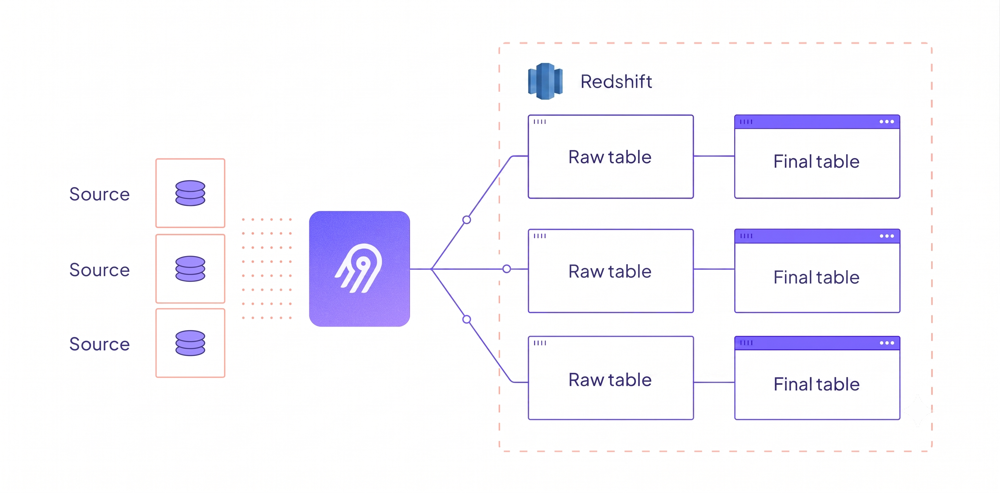
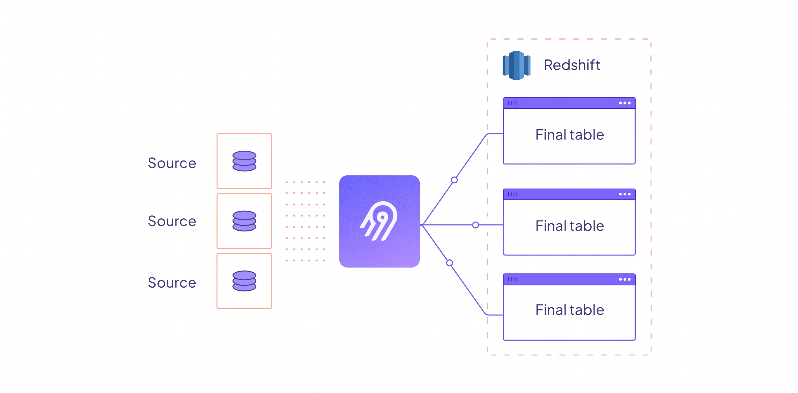
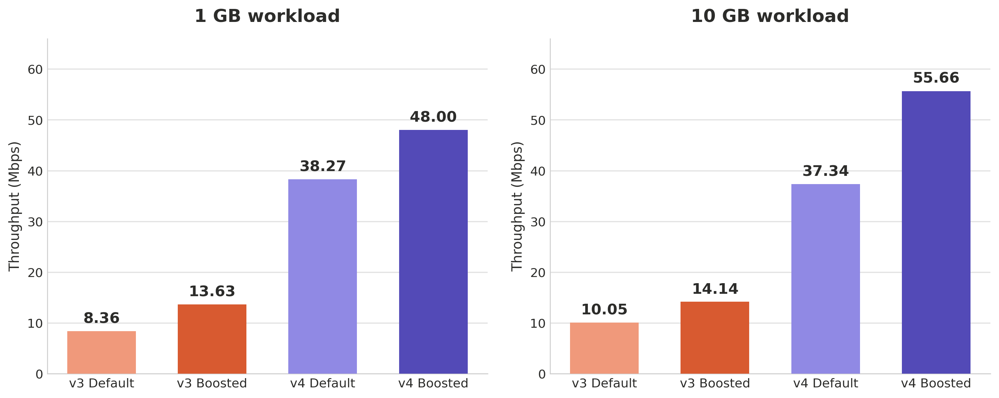

# Destination Redshift 4.0: 4x Faster with Direct Loading and Speed Mode

ENGINEERING

Authors: Sunil Kuruba

---

Redshift syncs just got 4x faster. With Destination Redshift 4.0.0, we're shipping three major improvements in a single release: [Speed Mode](https://airbyte.com/blog/speed-improvements), [Direct Loading](https://airbyte.com/blog/introducing-direct-loading), and a full migration to the new Bulk CDK architecture. Together, they deliver up to a **4.6x throughput increase** while reducing warehouse costs.

Redshift is one of Airbyte's most widely used destinations. As we rolled out Speed Mode and Direct Loading across our certified connectors — starting with [Snowflake](https://airbyte.com/blog/snowflake-destination-enhancements) and [BigQuery](https://airbyte.com/blog/introducing-direct-loading) — Redshift was next on the list. This post covers what changed, what stayed the same, and what the benchmarks look like.

## What Changed in 4.0.0

Three things happened at once in this release:

1. **Speed Mode** — The new socket-based data transfer architecture replaces JSON-over-stdio with Protobuf-over-Unix-domain-sockets, enabling parallel data channels between the source and destination containers.
2. **Direct Loading** — The connector now writes typed data directly to final tables, eliminating the intermediate raw tables and the Typing and Deduping SQL overhead that came with them.
3. **Bulk CDK Migration** — The connector has been rebuilt on Airbyte's new Bulk CDK framework, which standardizes the loading pipeline, improves parallelism, and simplifies the codebase.

Each of these has been covered in depth in separate blog posts. Here, we'll focus on how they come together for Redshift specifically.

## Speed Mode: What It Means for Redshift

[Speed Mode](https://airbyte.com/blog/speed-improvements) redesigned how data moves between containers in Airbyte's architecture. The details are covered extensively in Rodi and Subodh's [engineering deep-dive](https://airbyte.com/blog/speed-improvements), but here's the short version of what changed for Redshift syncs.

**Before (v3.x):** Data flowed from source to orchestrator to destination through standard I/O pipes. Every record was serialized as JSON, parsed by the orchestrator, re-serialized, and parsed again by the destination. The orchestrator sat in the middle of every byte of data.

**After (v4.0.0):** Records flow directly from source to destination over multiple Unix domain sockets, serialized as Protocol Buffers. A lightweight Bookkeeper replaces the orchestrator, handling only control messages (logs, state, metadata). The data channel never touches the Bookkeeper.

For Redshift specifically, this matters because:

- **Parallel S3 uploads** — Multiple data channels feed into the S3 staging layer simultaneously, keeping the upload pipeline saturated.
- **Optimized batch sizing** — Files are batched according to Redshift's recommended sizes for `COPY` operations, maximizing throughput during the load phase.
- **Reduced serialization overhead** — Protobuf's binary format with column-value arrays (instead of repeated key-value JSON) reduces both CPU usage and bytes on the wire.

The net effect is that the connector spends less time waiting on serialization and more time loading data into Redshift.

## Direct Loading: No More Raw Tables

[Direct Loading](https://airbyte.com/blog/introducing-direct-loading) is the second major change. In previous versions, Destination Redshift used a two-step process called Typing and Deduping:

1. Write untyped records to a "raw" table (`_airbyte_raw_{stream}`) in Redshift.
2. Run SQL queries to cast types and deduplicate records into the "final" table.

The raw tables never stopped growing. Each sync appended to previous data. Warehouse compute costs increased because Redshift was running transformation SQL on every sync. Syncs were slower than they needed to be.

With Direct Loading, the connector handles type-casting before data reaches Redshift. Typed records are written directly to final tables. No persistent raw tables, no transformation SQL running in your warehouse.

The loading path still uses S3 staging with Redshift's `COPY` command — that part is proven and unchanged. What changed is what gets loaded: fully typed records instead of raw JSON blobs. For the final table swap, the connector uses Redshift's `ALTER TABLE ... APPEND` command, which moves underlying data blocks rather than copying rows — a Redshift-specific optimization that avoids the overhead of row-by-row transfers.

The result is faster syncs and lower Redshift compute bills. Depending on your workload, projected cost savings are between **50–70%**.

## What Stayed the Same

Upgrading from v3.x to v4.0.0 is designed to be straightforward. Several core behaviors are unchanged:

- **Same configuration** — No configuration changes are required. Your existing connector setup works as-is.
- **S3 staging with COPY** — Data is still staged as compressed CSV files in S3 and loaded via Redshift's `COPY` command using a manifest file. This is the proven, high-throughput loading path.
- **SSH tunnel support** — Connections through SSH tunnels continue to work.
- **Encryption** — AES-CBC envelope encryption for S3 staging data is still supported, with both ephemeral and static key options.

## What Else Improved

Beyond Speed Mode and Direct Loading, v4.0.0 includes several additional improvements:

### Robust Configuration Checker
The pre-flight check now validates all necessary access and permissions end-to-end before the sync starts — S3 bucket access, Redshift schema permissions, and credential validity. No more surprising failures mid-sync when a permission was missing.

### SDK and Driver Upgrades
- **AWS S3 SDK** upgraded from v1 to v2, bringing improved performance, connection pooling, and long-term support.
- **Redshift JDBC driver** upgraded to the latest version, with better connection stability and compatibility.

### SUPER Type Limitation Handling
Redshift's `SUPER` data type has specific limits: 64KB for individual varchar fields and 16MB for the entire record. The connector now handles these gracefully — varchar fields exceeding 64KB are NULLed with metadata recorded in `_airbyte_meta.changes`, and records exceeding 16MB are reduced to primary keys and cursor fields only. No silent data corruption, no sync failures.

### Higher Parallelism
The connector uses a multi-threaded flush pipeline with parallel stream initialization, maximizing throughput when syncing multiple streams simultaneously.

### Improved Test Suite
The release includes expanded unit, integration, and regression test coverage. Connector behavior is validated against live Redshift clusters across multiple scenarios — schema evolution, large records, CDC streams, and edge cases around the SUPER type limits.

### Updated Configuration Guide
The destination setup documentation has been refreshed to simplify onboarding for new users.

## Benchmarks

We benchmarked v3 (latest) against v4.0.0 using 1GB and 10GB datasets on both default and boosted Redshift node configurations.

| Scenario | v3 (MB/s) | v4 (MB/s) | Improvement |
|---|---|---|---|
| Default — 1 GB | 8.36 | 38.27 | **+358%** |
| Boosted — 1 GB | 13.63 | 48.00 | **+252%** |
| Default — 10 GB | 10.05 | 37.34 | **+272%** |
| Boosted — 10 GB | 14.14 | 55.66 | **+294%** |

On default nodes with 1GB of data, throughput jumped from 8.36 MB/s to 38.27 MB/s — a **4.6x improvement**. On boosted nodes with 10GB, the connector sustained 55.66 MB/s, nearly **4x the previous throughput**.

The gains come from every layer working together: faster data transfer (Speed Mode), less work in the warehouse (Direct Loading), and a more efficient loading pipeline (Bulk CDK).

## Migration Guide

### Upgrading to 4.0.0

This version upgrades Destination Redshift to the Direct Loading paradigm. If you have specific requirements around record visibility or schema evolution, review the [Direct Loading documentation](https://docs.airbyte.com/platform/next/using-airbyte/core-concepts/direct-load-tables) for details on how it differs from Typing and Deduping.

**If you do not interact with raw tables**, you can upgrade safely. There is no breakage for this use case.

**If you interact with raw tables** (downstream dbt models, SQL queries, or dashboards that reference `_airbyte_raw_*` tables), follow these steps:

1. Update any downstream dbt models or SQL queries to reference the final tables instead of raw tables.
2. Upgrade the destination to version 4.0.0.
3. Verify data in the final tables after the first successful sync.
4. *(Optional)* Drop old raw tables (`_airbyte_raw_*`) after verifying the new tables contain the expected data.

Alternatively, if you're not ready to move off raw tables, enable the **"Legacy raw tables"** option in the connector's advanced configuration. This preserves the old behavior while still benefiting from Speed Mode and the SDK upgrades.

## What's Next

The same optimizations powering Redshift 4.0.0 are being rolled out across more destinations in our certified catalog. Our goal is to make data movement so fast and affordable that speed and cost stop being concerns — you should be thinking about what to build, not how long your syncs take.

If you're running Redshift with Airbyte, you'll get these improvements automatically when you upgrade to v4.0.0. If you're not yet on Airbyte, [try it free](https://cloud.airbyte.com/signup) and see the difference.
