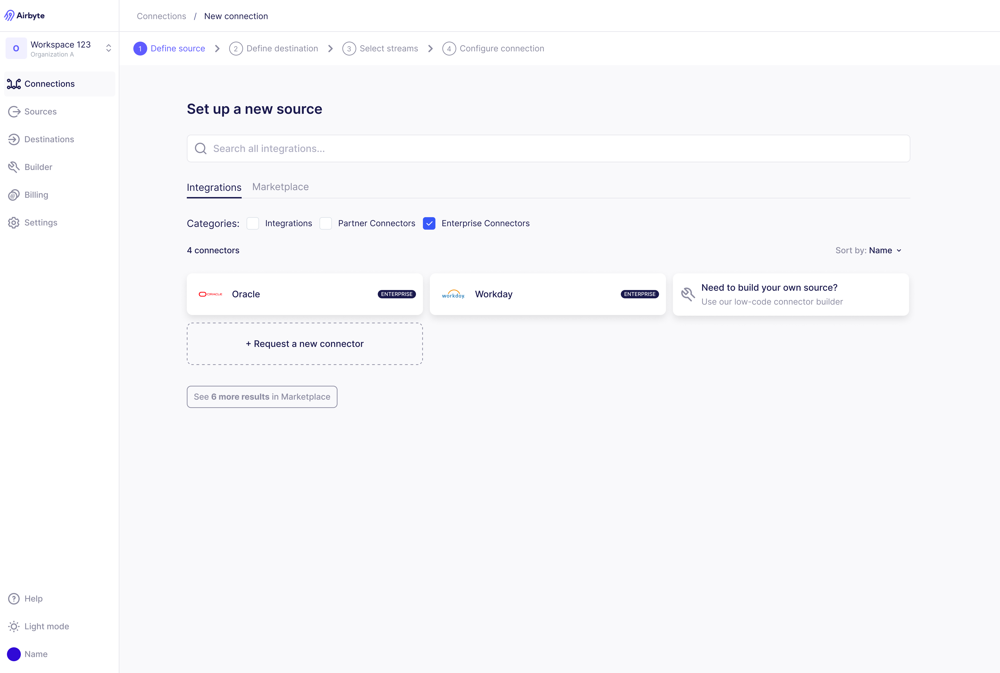

# Enterprise Connectors

Airbyte Enterprise Connectors are a selection of premium connectors available exclusively for Airbyte Self-Managed Enterprise and Airbyte Teams customers. These connectors, built and maintained by the Airbyte team, provide enhanced capabilities and support for critical enterprise systems that are not available to users of Airbyte Open Source and Airbyte Cloud. Key benefits of these connectors include support for larger data sets, parallelism for faster data transfers, and that they are covered under Airbyte Support SLAs. 

To learn more about enterprise connectors, please [talk to our sales team](https://airbyte.com/company/talk-to-sales).
