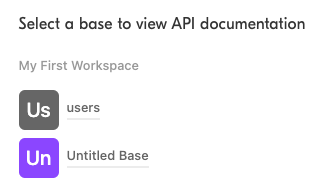

# Airtable

## Features

| Feature           | Supported?\(Yes/No\) | Notes |
| :---------------- | :------------------- | :---- |
| Full Refresh Sync | Yes                  |       |
| Incremental Sync  | No                   |       |

This source syncs data from the [Airtable API](https://airtable.com/api).

## Supported Tables

This source allows you to configure any table in your Airtable base. In case you you rename or add a column to any existing table, you will need to recreate the source to update the Airbyte catalog. 

## Getting started

### Requirements

* An Airtable account & API key
* Base ID
* Tables you'd like to replicate

### Setup guide
1. To find your API key, navigate to your [account page](https://airtable.com/account). On your account overview page, under the API heading, there's a button that says "Generate API key."

2. Generate an API key by clicking the button. If one already exists, click the key to reveal it and copy it. . See [here](https://support.airtable.com/hc/en-us/articles/219046777-How-do-I-get-my-API-key-) for more information on managing your API keys. 
3. Find the Airtable base containing the tables you'd like to replicate by visiting https://airtable.com/api and logging in. Once you're logged in, you'll see a list of available bases: . Click the base whose tables you want to replicate. You'll find the base ID on the next page: . Copy this ID for use when configuring the connector. 

### Performance Considerations (Airbyte Open-Source)

See information about rate limits [here](https://support.airtable.com/hc/en-us/articles/203313985-Public-REST-API).

## Changelog

| Version | Date       | Pull Request                                             | Subject                                  |
| :------ | :--------- | :------------------------------------------------------- | :--------------------------------------- |
| 0.1.3   | 2022-10-26 | [18491](https://github.com/airbytehq/airbyte/pull/18491) | Improve schema discovery logic           |
| 0.1.2   | 2022-04-30 | [12500](https://github.com/airbytehq/airbyte/pull/12500) | Improve input configuration copy         |
| 0.1.1   | 2021-12-06 | [8425](https://github.com/airbytehq/airbyte/pull/8425)   | Update title, description fields in spec |
