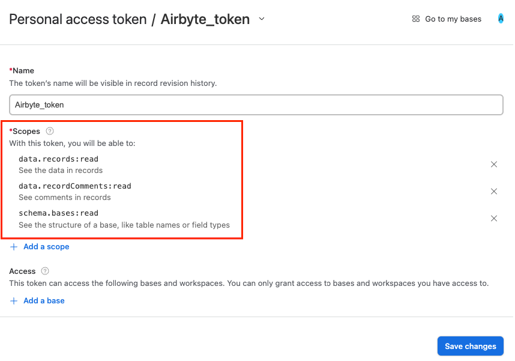

# Airtable

<HideInUI>

This page contains the setup guide and reference information for the [Airtable](https://airtable.com/api) source connector.

</HideInUI>

## Prerequisites

- An active Airtable account
- [Personal Access Token](https://airtable.com/developers/web/guides/personal-access-tokens) with the following scopes:
  - `data.records:read`
  - `data.recordComments:read`
  - `schema.bases:read`

## Setup guide

### Step 1: Set up Airtable

<!-- env:oss -->

#### For Airbyte Open Source:

1. Go to https://airtable.com/create/tokens to create new token.
   
2. Add following scopes:

   - `data.records:read`
   - `data.recordComments:read`
   - `schema.bases:read`

   

3. Select required bases or allow access to all available and press the `Create Token` button.
   
4. Save token from the popup window.
<!-- /env:oss -->

### Step 2: Set up Airtable connector in Airbyte

<!-- env:cloud -->

### For Airbyte Cloud:

1. [Log into your Airbyte Cloud](https://cloud.airbyte.com/workspaces) account.
2. Click Sources and then click + New source.
3. On the Set up the source page, select Airtable from the Source type dropdown.
4. Enter a name for the Airtable connector.
5. You can use OAuth or a Personal Access Token to authenticate your Airtable account. We recommend using OAuth for Airbyte Cloud.

   - To authenticate using OAuth, select **OAuth2.0** from the Authentication dropdown click **Authenticate your Airtable account** to sign in with Airtable, select required workspaces you want to sync and authorize your account.
   - To authenticate using a Personal Access Token, select **Personal Access Token** from the Authentication dropdown and enter the Access Token for your Airtable account.
     :::info
     When using OAuth, you may see a `400` or `401` error causing a failed sync. You can re-authenticate your Airtable connector to solve the issue temporarily. We are working on a permanent fix that you can follow [here](https://github.com/airbytehq/airbyte/issues/25278).
     :::

6. Click **Set up source**.
<!-- /env:cloud -->

<!-- env:oss -->

### For Airbyte Open Source:

1. Navigate to the Airbyte Open Source dashboard.
2. In the left navigation bar, click **Sources**. In the top-right corner, click **+new source**.
3. On the Set up the source page, enter the name for the Airtable connector and select **Airtable** from the Source type dropdown.
4. Select **Personal Access Token** from the Authentication dropdown and enter the Access Token for your Airtable account.
5. Click **Set up source**.
<!-- /env:oss -->

### Note on changed table names and deleted tables

Please keep in mind that if you start syncing a table via Airbyte, then rename it in your Airtable account, the connector will not continue syncing that table until you reset your connection schema and select it again. At that point, the table will begin syncing to a table with the new name in the destination. This is because there is no way for Airtable to tell Airbyte which tables have been renamed. Similarly, if you delete a table that was previously syncing, the connector will stop syncing it.

## Supported sync modes

The Airtable source connector supports the following [sync modes](https://docs.airbyte.com/cloud/core-concepts/#connection-sync-modes):

- [Full Refresh - Overwrite](https://docs.airbyte.com/understanding-airbyte/glossary#full-refresh-sync)
- [Full Refresh - Append](https://docs.airbyte.com/understanding-airbyte/connections/full-refresh-append)

## Supported Streams

This source allows you to pull all available tables and bases using `Metadata API` for a given authenticated user. In case you rename or add a column to any existing table, you will need to recreate the source to update the Airbyte catalog.

### Performance Considerations

See information about rate limits [here](https://airtable.com/developers/web/api/rate-limits).

## Data type map

| Integration Type        | Airbyte Type                           | Nullable |
| :---------------------- | :------------------------------------- | -------- |
| `multipleAttachments`   | `string`                               | Yes      |
| `autoNumber`            | `string`                               | Yes      |
| `barcode`               | `string`                               | Yes      |
| `button`                | `string`                               | Yes      |
| `checkbox`              | `boolean`                              | Yes      |
| `singleCollaborator`    | `string`                               | Yes      |
| `count`                 | `number`                               | Yes      |
| `createdBy`             | `string`                               | Yes      |
| `createdTime`           | `datetime`, `format: date-time`        | Yes      |
| `currency`              | `number`                               | Yes      |
| `email`                 | `string`                               | Yes      |
| `date`                  | `string`, `format: date`               | Yes      |
| `duration`              | `number`                               | Yes      |
| `lastModifiedBy`        | `string`                               | Yes      |
| `lastModifiedTime`      | `datetime`, `format: date-time`        | Yes      |
| `multipleRecordLinks`   | `array with strings`                   | Yes      |
| `multilineText`         | `string`                               | Yes      |
| `multipleCollaborators` | `array with strings`                   | Yes      |
| `multipleSelects`       | `array with strings`                   | Yes      |
| `number`                | `number`                               | Yes      |
| `percent`               | `number`                               | Yes      |
| `phoneNumber`           | `string`                               | Yes      |
| `rating`                | `number`                               | Yes      |
| `richText`              | `string`                               | Yes      |
| `singleLineText`        | `string`                               | Yes      |
| `externalSyncSource`    | `string`                               | Yes      |
| `url`                   | `string`                               | Yes      |
| `formula`               | `string`, `number` or `array with any` | Yes      |
| `lookup`                | `array with any`                       | Yes      |
| `multipleLookupValues`  | `array with any`                       | Yes      |
| `rollup`                | `array with any`                       | Yes      |

- All the fields are `nullable` by default, meaning that the field could be empty.
- The `array with any` - represents the classic array with one of the other Airtable data types inside, such as:
  - string
  - number/integer
  - nested lists/objects

## Changelog

  
Expand to review

| Version    | Date       | Pull Request                                             | Subject                                                                                |
|:-----------|:-----------|:---------------------------------------------------------|:---------------------------------------------------------------------------------------|
| 4.5.0-rc.1 | 2025-01-27 | [49813](https://github.com/airbytehq/airbyte/pull/49813) | Update to low-code                                                                     |
| 4.4.0      | 2024-07-16 | [41160](https://github.com/airbytehq/airbyte/pull/41160) | Update CDK version to v3.5.2                                                           |
| 4.3.1      | 2024-07-16 | [41536](https://github.com/airbytehq/airbyte/pull/41536) | Update dependencies                                                                    |
| 4.3.0      | 2024-07-16 | [41072](https://github.com/airbytehq/airbyte/pull/41072) | Update CDK version to v2.4.0                                                           |
| 4.2.6      | 2024-07-09 | [41080](https://github.com/airbytehq/airbyte/pull/41080) | Update dependencies                                                                    |
| 4.2.5      | 2024-07-06 | [40789](https://github.com/airbytehq/airbyte/pull/40789) | Update dependencies                                                                    |
| 4.2.4      | 2024-06-25 | [40290](https://github.com/airbytehq/airbyte/pull/40290) | Update dependencies                                                                    |
| 4.2.3      | 2024-06-22 | [40085](https://github.com/airbytehq/airbyte/pull/40085) | Update dependencies                                                                    |
| 4.2.2      | 2024-06-04 | [39089](https://github.com/airbytehq/airbyte/pull/39089) | [autopull] Upgrade base image to v1.2.1                                                |
| 4.2.1      | 2024-05-29 | [38765](https://github.com/airbytehq/airbyte/pull/38765) | Fix next_page_token() to correctly adhere to HttpStream interface                      |
| 4.2.0      | 2024-03-19 | [36267](https://github.com/airbytehq/airbyte/pull/36267) | Pin airbyte-cdk version to `^0`                                                        |
| 4.1.6      | 2024-02-12 | [35149](https://github.com/airbytehq/airbyte/pull/35149) | Manage dependencies with Poetry.                                                       |
| 4.1.5      | 2023-10-19 | [31599](https://github.com/airbytehq/airbyte/pull/31599) | Base image migration: remove Dockerfile and use the python-connector-base image        |
| 4.1.4      | 2023-10-19 | [31360](https://github.com/airbytehq/airbyte/pull/31360) | Update docstings                                                                       |
| 4.1.3      | 2023-10-13 | [31360](https://github.com/airbytehq/airbyte/pull/31360) | Update error message for invalid permissions                                           |
| 4.1.2      | 2023-10-10 | [31215](https://github.com/airbytehq/airbyte/pull/31215) | Exclude bases without permission                                                       |
| 4.1.1      | 2023-10-10 | [31119](https://github.com/airbytehq/airbyte/pull/31119) | Add user-friendly error message when refresh token has expired                         |
| 4.1.0      | 2023-10-10 | [31044](https://github.com/airbytehq/airbyte/pull/31044) | Add source table name to output records                                                |
| 4.0.0      | 2023-10-09 | [31181](https://github.com/airbytehq/airbyte/pull/31181) | Additional schema processing for the FORMULA schema type: Convert to simple data types |
| 3.0.1      | 2023-05-10 | [25946](https://github.com/airbytehq/airbyte/pull/25946) | Skip stream if it does not appear in catalog                                           |
| 3.0.0      | 2023-03-20 | [22704](https://github.com/airbytehq/airbyte/pull/22704) | Fix for stream name uniqueness                                                         |
| 2.0.4      | 2023-03-15 | [24093](https://github.com/airbytehq/airbyte/pull/24093) | Update spec and doc                                                                    |
| 2.0.3      | 2023-02-02 | [22311](https://github.com/airbytehq/airbyte/pull/22311) | Fix for `singleSelect` types when discovering the schema                               |
| 2.0.2      | 2023-02-01 | [22245](https://github.com/airbytehq/airbyte/pull/22245) | Fix for empty `result` object when discovering the schema                              |
| 2.0.1      | 2023-02-01 | [22224](https://github.com/airbytehq/airbyte/pull/22224) | Fixed broken `API Key` authentication                                                  |
| 2.0.0      | 2023-01-27 | [21962](https://github.com/airbytehq/airbyte/pull/21962) | Added casting of native Airtable data types to JsonSchema types                        |
| 1.0.2      | 2023-01-25 | [20934](https://github.com/airbytehq/airbyte/pull/20934) | Added `OAuth2.0` authentication support                                                |
| 1.0.1      | 2023-01-10 | [21215](https://github.com/airbytehq/airbyte/pull/21215) | Fix field names                                                                        |
| 1.0.0      | 2022-12-22 | [20846](https://github.com/airbytehq/airbyte/pull/20846) | Migrated to Metadata API for dynamic schema generation                                 |
| 0.1.3      | 2022-10-26 | [18491](https://github.com/airbytehq/airbyte/pull/18491) | Improve schema discovery logic                                                         |
| 0.1.2      | 2022-04-30 | [12500](https://github.com/airbytehq/airbyte/pull/12500) | Improve input configuration copy                                                       |
| 0.1.1      | 2021-12-06 | [8425](https://github.com/airbytehq/airbyte/pull/8425)   | Update title, description fields in spec                                               |

