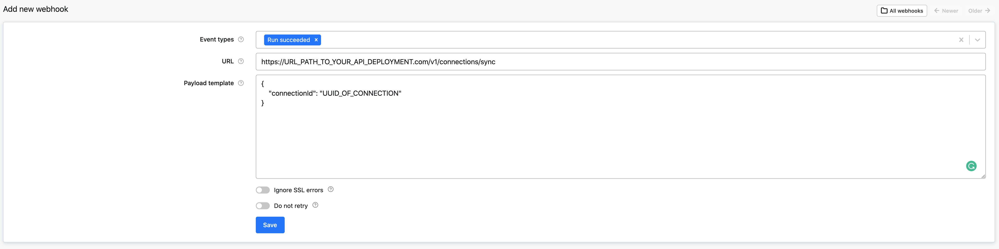

# Apify Dataset

## Overview

[Apify](https://apify.com/) is a web scraping and web automation platform providing both ready-made and custom solutions, an open-source [JavaScript SDK](https://docs.apify.com/sdk/js/) and [Python SDK](https://docs.apify.com/sdk/python/) for web scraping, proxies, and many other tools to help you build and run web automation jobs at scale.

<FieldAnchor field="dataset_id">
The results of a scraping job are usually stored in the [Apify Dataset](https://docs.apify.com/storage/dataset). This Airbyte connector provides streams to work with the datasets, including syncing their content to your chosen destination using Airbyte.
</FieldAnchor>

To sync data from a dataset, all you need to know is your API token and dataset ID.

<FieldAnchor field="token">
You can find your personal API token in the Apify Console in the [Settings -> Integrations](https://console.apify.com/account/integrations) and the dataset ID in the [Storage -> Datasets](https://console.apify.com/storage/datasets).
</FieldAnchor>

### Running Airbyte sync from Apify webhook

When your Apify job (aka [Actor run](https://docs.apify.com/platform/actors/running)) finishes, it can trigger an Airbyte sync by calling the Airbyte [API](https://airbyte-public-api-docs.s3.us-east-2.amazonaws.com/rapidoc-api-docs.html#post-/v1/connections/sync) manual connection trigger (`POST /v1/connections/sync`). The API can be called from Apify [webhook](https://docs.apify.com/platform/integrations/webhooks) which is executed when your Apify run finishes.

### Features

| Feature           | Supported? |
| :---------------- | :--------- |
| Full Refresh Sync | Yes        |
| Incremental Sync  | Yes        |

### Performance considerations

The Apify dataset connector uses [Apify Python Client](https://docs.apify.com/apify-client-python) under the hood and should handle any API limitations under normal usage.

## Streams

### `dataset_collection`

- Calls `api.apify.com/v2/datasets` ([docs](https://docs.apify.com/api/v2#/reference/datasets/dataset-collection/get-list-of-datasets))
- Properties:
  - Apify Personal API token (you can find it [here](https://console.apify.com/account/integrations))

### `dataset`

- Calls `https://api.apify.com/v2/datasets/{datasetId}` ([docs](https://docs.apify.com/api/v2#/reference/datasets/dataset/get-dataset))
- Properties:
  - Apify Personal API token (you can find it [here](https://console.apify.com/account/integrations))
  - Dataset ID (check the [docs](https://docs.apify.com/platform/storage/dataset))

### `item_collection`

- Calls `api.apify.com/v2/datasets/{datasetId}/items` ([docs](https://docs.apify.com/api/v2#/reference/datasets/item-collection/get-items))
- Properties:
  - Apify Personal API token (you can find it [here](https://console.apify.com/account/integrations))
  - Dataset ID (check the [docs](https://docs.apify.com/platform/storage/dataset))
- Limitations:
  - The stream uses a dynamic schema (all the data are stored under the `"data"` key), so it should support all the Apify Datasets (produced by whatever Actor).

### `item_collection_website_content_crawler`

- Calls the same endpoint and uses the same properties as the `item_collection` stream.
- Limitations:
  - The stream uses a static schema which corresponds to the datasets produced by [Website Content Crawler](https://apify.com/apify/website-content-crawler) Actor. So only datasets produced by this Actor are supported.

## Changelog

  
Expand to review

| Version | Date       | Pull Request                                                 | Subject                                                                         |
| :------ | :--------- | :----------------------------------------------------------- | :------------------------------------------------------------------------------ |
| 2.1.5   | 2024-04-19 | [37115](https://github.com/airbytehq/airbyte/pull/37115)     | Updating to 0.80.0 CDK                                                          |
| 2.1.4   | 2024-04-18 | [37115](https://github.com/airbytehq/airbyte/pull/37115)     | Manage dependencies with Poetry.                                                |
| 2.1.3   | 2024-04-15 | [37115](https://github.com/airbytehq/airbyte/pull/37115)     | Base image migration: remove Dockerfile and use the python-connector-base image |
| 2.1.2   | 2024-04-12 | [37115](https://github.com/airbytehq/airbyte/pull/37115)     | schema descriptions                                                             |
| 2.1.1   | 2023-12-14 | [33414](https://github.com/airbytehq/airbyte/pull/33414)     | Prepare for airbyte-lib                                                         |
| 2.1.0   | 2023-10-13 | [31333](https://github.com/airbytehq/airbyte/pull/31333)     | Add stream for arbitrary datasets                                               |
| 2.0.0   | 2023-09-18 | [30428](https://github.com/airbytehq/airbyte/pull/30428)     | Fix broken stream, manifest refactor                                            |
| 1.0.0   | 2023-08-25 | [29859](https://github.com/airbytehq/airbyte/pull/29859)     | Migrate to lowcode                                                              |
| 0.2.0   | 2022-06-20 | [28290](https://github.com/airbytehq/airbyte/pull/28290)     | Make connector work with platform changes not syncing empty stream schemas.     |
| 0.1.11  | 2022-04-27 | [12397](https://github.com/airbytehq/airbyte/pull/12397)     | No changes. Used connector to test publish workflow changes.                    |
| 0.1.9   | 2022-04-05 | [PR\#11712](https://github.com/airbytehq/airbyte/pull/11712) | No changes from 0.1.4. Used connector to test publish workflow changes.         |
| 0.1.4   | 2021-12-23 | [PR\#8434](https://github.com/airbytehq/airbyte/pull/8434)   | Update fields in source-connectors specifications                               |
| 0.1.2   | 2021-11-08 | [PR\#7499](https://github.com/airbytehq/airbyte/pull/7499)   | Remove base-python dependencies                                                 |
| 0.1.0   | 2021-07-29 | [PR\#5069](https://github.com/airbytehq/airbyte/pull/5069)   | Initial version of the connector                                                |

