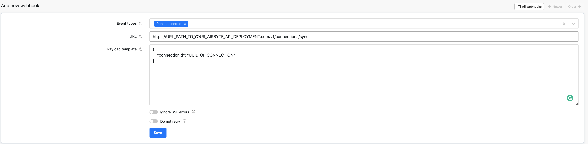

# Apify Dataset

## Overview

[Apify](https://www.apify.com) is a web scraping and web automation platform providing both ready-made and custom solutions, an open-source [SDK](https://sdk.apify.com/) for web scraping, proxies, and many other tools to help you build and run web automation jobs at scale.

The results of a scraping job are usually stored in [Apify Dataset](https://docs.apify.com/storage/dataset). This Airbyte connector allows you to automatically sync the contents of a dataset to your chosen destination using Airbyte.

To sync data from a dataset, all you need to know is its ID. You will find it in [Apify console](https://my.apify.com/) under storages.

### Running Airbyte sync from Apify webhook

When your Apify job \(aka [actor run](https://docs.apify.com/actors/running)\) finishes, it can trigger an Airbyte sync by calling the Airbyte [API](https://airbyte-public-api-docs.s3.us-east-2.amazonaws.com/rapidoc-api-docs.html#post-/v1/connections/sync) manual connection trigger \(`POST /v1/connections/sync`\). The API can be called from Apify [webhook](https://docs.apify.com/webhooks) which is executed when your Apify run finishes.

### Output schema

Since the dataset items do not have strongly typed schema, they are synced as objects, without any assumption on their content.

### Features

| Feature | Supported? |
| :--- | :--- |
| Full Refresh Sync | Yes |
| Incremental Sync | No |

### Performance considerations

The Apify dataset connector uses [Apify Python Client](https://docs.apify.com/apify-client-python) under the hood and should handle any API limitations under normal usage.

## Getting started

### Requirements

* Apify [dataset](https://docs.apify.com/storage/dataset) ID

### Changelog

| Version | Date | Pull Request | Subject |
| :--- | :--- | :--- | :--- |
| 0.1.11 | 2022-04-27 | [12397](https://github.com/airbytehq/airbyte/pull/12397) | No changes. Used connector to test publish workflow changes. |
| 0.1.9 | 2022-04-05 | [PR\#11712](https://github.com/airbytehq/airbyte/pull/11712) | No changes from 0.1.4. Used connector to test publish workflow changes. |
| 0.1.4 | 2021-12-23 | [PR\#8434](https://github.com/airbytehq/airbyte/pull/8434) | Update fields in source-connectors specifications |
| 0.1.2 | 2021-11-08 | [PR\#7499](https://github.com/airbytehq/airbyte/pull/7499) | Remove base-python dependencies |
| 0.1.0 | 2021-07-29 | [PR\#5069](https://github.com/airbytehq/airbyte/pull/5069) | Initial version of the connector |

