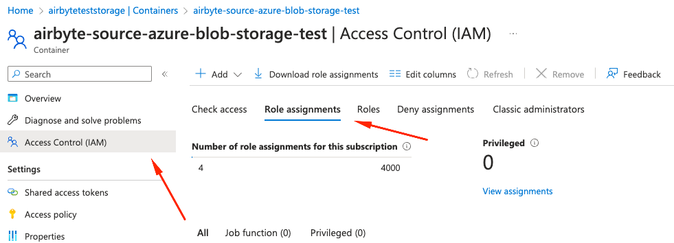
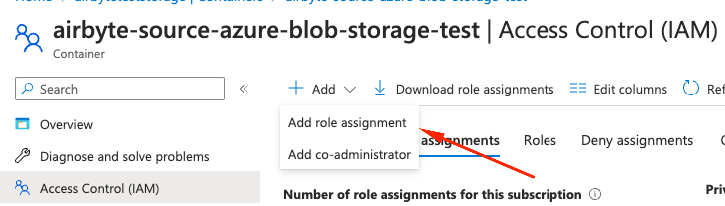
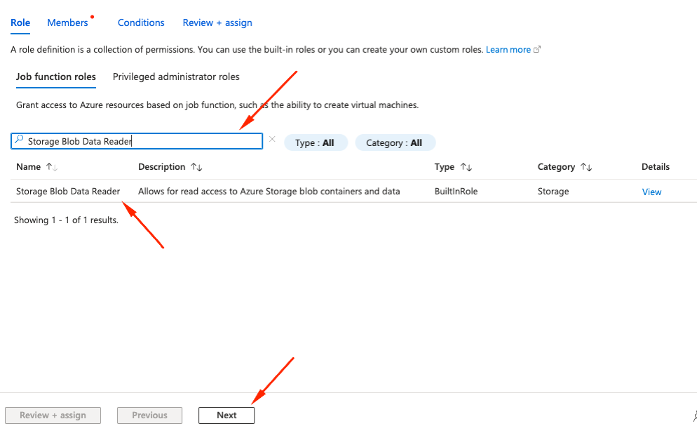
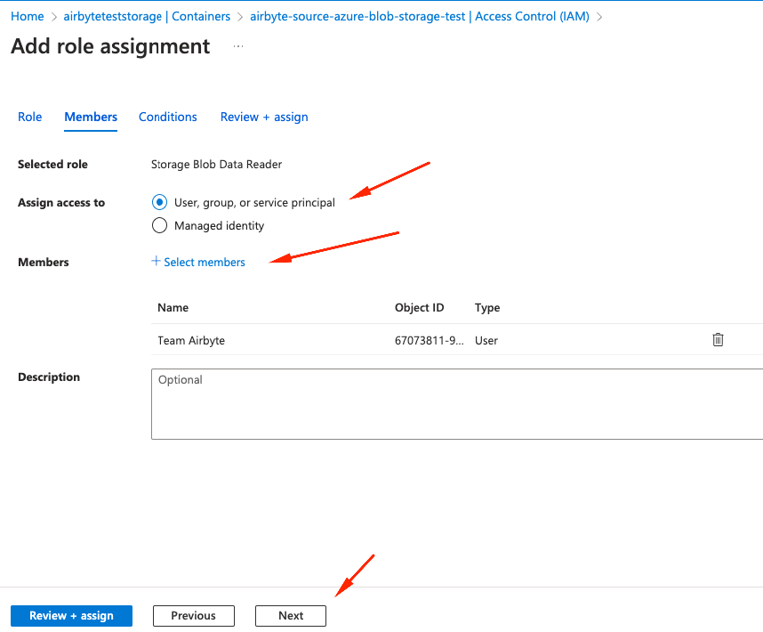

# Azure Blob Storage

<HideInUI>

This page contains the setup guide and reference information for the [Azure Blob Storage](https://azure.microsoft.com/en-us/products/storage/blobs/) source connector.

</HideInUI>

:::info
Cloud storage may incur egress costs. Egress refers to data that is transferred out of the cloud storage system, such as when you download files or access them from a different location. For more information, see the [Azure Blob Storage pricing guide](https://azure.microsoft.com/en-us/pricing/details/storage/blobs/).
:::

## Prerequisites

- [Tenant ID of the Microsoft Azure Application user](https://www.youtube.com/watch?v=WECmqC-MylA)
- [Azure Blob Storage account name](https://learn.microsoft.com/en-us/azure/storage/common/storage-account-overview#storage-account-name)
- [Azure blob storage container (Bucket) Name](https://learn.microsoft.com/en-us/azure/storage/blobs/blob-containers-portal#container-properties)

<details>
<summary>
Minimum permissions (role [Storage Blob Data Reader](https://learn.microsoft.com/en-us/azure/role-based-access-control/built-in-roles/storage#storage-blob-data-reader) ):
</summary>
```json
[
   {
      "actions": [
         "Microsoft.Storage/storageAccounts/blobServices/containers/read",
         "Microsoft.Storage/storageAccounts/blobServices/generateUserDelegationKey/action"
      ],
      "notActions": [],
      "dataActions": [
         "Microsoft.Storage/storageAccounts/blobServices/containers/blobs/read"
      ],
      "notDataActions": []
   }
]
```
</details>

## Setup guide

### Step 1: Set up Azure Blob Storage

- Create a storage account and grant roles [details](https://learn.microsoft.com/en-us/azure/storage/common/storage-account-create?tabs=azure-portal)

:::warning
To use Oauth2 or Client Credentials Authentication methods, Access Control (IAM) should be setup.
It is recommended
to use role [Storage Blob Data Reader](https://learn.microsoft.com/en-gb/azure/storage/blobs/assign-azure-role-data-access?tabs=portal)

<details>
<summary>
Follow these steps to set up an IAM role:
</summary>

1. Go to Azure portal, select the Storage (or Container) you'd like to sync from and get to Access Control(IAM) -> Role Assignment 
2. Click on `Add` and select `Add role assignment` from the dropdown list 
3. Search by role name `Storage Blob Data Reader` in search box, Select role from the list and click `Next` 
4. Select `User, Group, or service principal`, click on `members` and select member(s) so they appear in table and click `Next` 
5. (Optional) Add Conditions to restrict the role assignments a user can create.
6. Click `Review + Assign`
</details>
:::

<details>
<summary>
Follow these steps to set up a Service Principal to use the Client Credentials authentication method.
</summary>

In the Azure portal, navigate to your Service Principal's App Registration.

Note the `Directory (tenant) ID` and `Application (client) ID` in the Overview panel.

In the `Manage / Certificates & secrets` panel, click `Client Secrets` and create a new secret. Note the `Value` of the secret.

</details>


### Step 2: Set up the Azure Blob Storage connector in Airbyte

<!-- env:cloud -->

### For Airbyte Cloud:

1. [Log into your Airbyte Cloud](https://cloud.airbyte.com/workspaces) account.
2. Click Sources and then click + New source.
3. On the Set up the source page, select Azure Blob Storage from the Source type dropdown.
4. Enter a name for the Azure Blob Storage connector.
5. Enter the name of your Azure **Account**.
6. Enter your Tenant ID and Click **Authenticate your Azure Blob Storage account**.
7. Log in and authorize the Azure Blob Storage account.
8. Enter the name of the **Container** containing your files to replicate.
9. Add a stream
   1. Write the **File Type**
   2. In the **Format** box, use the dropdown menu to select the format of the files you'd like to replicate. The supported formats are **CSV**, **Parquet**, **Avro** and **JSONL**. Toggling the **Optional fields** button within the **Format** box will allow you to enter additional configurations based on the selected format. For a detailed breakdown of these settings, refer to the [File Format section](#file-format-settings) below.
   3. Give a **Name** to the stream
   4. (Optional)—If you want to enforce a specific schema, you can enter a **Input schema**. By default, this value is set to `{}` and will automatically infer the schema from the file\(s\) you are replicating. For details on providing a custom schema, refer to the [User Schema section](#user-schema).
   5. Optionally, enter the **Globs** which dictates which files to be synced. This is a regular expression that allows Airbyte to pattern match the specific files to replicate. If you are replicating all the files within your bucket, use `**` as the pattern. For more precise pattern matching options, refer to the [Path Patterns section](#path-patterns) below.
10. (Optional) Enter the endpoint to use for the data replication.
11. (Optional) Enter the desired start date from which to begin replicating data.
<!-- /env:cloud -->

<!-- env:oss -->
### For Airbyte Open Source:

1. Navigate to the Airbyte Open Source dashboard.
2. Click Sources and then click + New source.
3. On the Set up the source page, select Azure Blob Storage from the Source type dropdown.
4. Enter a name for the Azure Blob Storage connector.
5. Enter the name of your Azure **Storage Account** and **container**.
6. Choose the Authentication method.
   1. If you are accessing through a Storage Account Key, choose `Authenticate via Storage Account Key` and enter the key.
   1. If you are accessing through a Service Principal, choose the `Authenticate via Client Credentials`.
     0. See [above](#step-1-set-up-azure-blob-storage) regarding setting IAM role bindings for the Service Principal and getting detail of the app registration
     1. Enter the `Directory (tenant) ID` value from app registration in Azure Portal into the `Tenant ID` field.
     2. Enter the `Application (client) ID` from Azure Portal into the `Tenant ID` field. Note this is **not** the secret ID
     3. Enter the Secret `Value` from Azure Portal into the `Client Secret` field.
9. Add a stream
   1. Write the **File Type**
   2. In the **Format** box, use the dropdown menu to select the format of the files you'd like to replicate. The supported formats are **CSV**, **Parquet**, **Avro** and **JSONL**. Toggling the **Optional fields** button within the **Format** box will allow you to enter additional configurations based on the selected format. For a detailed breakdown of these settings, refer to the [File Format section](#file-format-settings) below.
   3. Give a **Name** to the stream
   4. (Optional)—If you want to enforce a specific schema, you can enter a **Input schema**. By default, this value is set to `{}` and will automatically infer the schema from the file\(s\) you are replicating. For details on providing a custom schema, refer to the [User Schema section](#user-schema).
   5. Optionally, enter the **Globs** which dictates which files to be synced. This is a regular expression that allows Airbyte to pattern match the specific files to replicate. If you are replicating all the files within your bucket, use `**` as the pattern. For more precise pattern matching options, refer to the [Path Patterns section](#path-patterns) below.
10. (Optional) Enter the endpoint to use for the data replication.
11. (Optional) Enter the desired start date from which to begin replicating data.
<!-- /env:oss -->

## Supported sync modes

The Azure Blob Storage source connector supports the following [sync modes](https://docs.airbyte.com/cloud/core-concepts/#connection-sync-modes):

| Feature                                        | Supported? |
| :--------------------------------------------- | :--------- |
| Full Refresh Sync                              | Yes        |
| Incremental Sync                               | Yes        |
| Replicate Incremental Deletes                  | No         |
| Replicate Multiple Files \(pattern matching\)  | Yes        |
| Replicate Multiple Streams \(distinct tables\) | Yes        |
| Namespaces                                     | No         |

## Supported Streams

### File Compressions

| Compression | Supported? |
| :---------- | :--------- |
| Gzip        | Yes        |
| Zip         | No         |
| Bzip2       | Yes        |
| Lzma        | No         |
| Xz          | No         |
| Snappy      | No         |

Please let us know any specific compressions you'd like to see support for next!

### Path Patterns

\(tl;dr -&gt; path pattern syntax using [wcmatch.glob](https://facelessuser.github.io/wcmatch/glob/). GLOBSTAR and SPLIT flags are enabled.\)

This connector can sync multiple files by using glob-style patterns, rather than requiring a specific path for every file. This enables:

- Referencing many files with just one pattern, e.g. `**` would indicate every file in the bucket.
- Referencing future files that don't exist yet \(and therefore don't have a specific path\).

You must provide a path pattern. You can also provide many patterns split with \| for more complex directory layouts.

Each path pattern is a reference from the _root_ of the bucket, so don't include the bucket name in the pattern\(s\).

Some example patterns:

- `**` : match everything.
- `**/*.csv` : match all files with specific extension.
- `myFolder/**/*.csv` : match all csv files anywhere under myFolder.
- `*/**` : match everything at least one folder deep.
- `*/*/*/**` : match everything at least three folders deep.
- `**/file.*|**/file` : match every file called "file" with any extension \(or no extension\).
- `x/*/y/*` : match all files that sit in folder x -&gt; any folder -&gt; folder y.
- `**/prefix*.csv` : match all csv files with specific prefix.
- `**/prefix*.parquet` : match all parquet files with specific prefix.

Let's look at a specific example, matching the following bucket layout:

```text
myBucket
    -> log_files
    -> some_table_files
        -> part1.csv
        -> part2.csv
    -> images
    -> more_table_files
        -> part3.csv
    -> extras
        -> misc
            -> another_part1.csv
```

We want to pick up part1.csv, part2.csv and part3.csv \(excluding another_part1.csv for now\). We could do this a few different ways:

- We could pick up every csv file called "partX" with the single pattern `**/part*.csv`.
- To be a bit more robust, we could use the dual pattern `some_table_files/*.csv|more_table_files/*.csv` to pick up relevant files only from those exact folders.
- We could achieve the above in a single pattern by using the pattern `*table_files/*.csv`. This could however cause problems in the future if new unexpected folders started being created.
- We can also recursively wildcard, so adding the pattern `extras/**/*.csv` would pick up any csv files nested in folders below "extras", such as "extras/misc/another_part1.csv".

As you can probably tell, there are many ways to achieve the same goal with path patterns. We recommend using a pattern that ensures clarity and is robust against future additions to the directory structure.

### User Schema

Providing a schema allows for more control over the output of this stream. Without a provided schema, columns and datatypes will be inferred from the first created file in the bucket matching your path pattern and suffix. This will probably be fine in most cases but there may be situations you want to enforce a schema instead, e.g.:

- You only care about a specific known subset of the columns. The other columns would all still be included, but packed into the `_ab_additional_properties` map.
- Your initial dataset is quite small \(in terms of number of records\), and you think the automatic type inference from this sample might not be representative of the data in the future.
- You want to purposely define types for every column.
- You know the names of columns that will be added to future data and want to include these in the core schema as columns rather than have them appear in the `_ab_additional_properties` map.

Or any other reason! The schema must be provided as valid JSON as a map of `{"column": "datatype"}` where each datatype is one of:

- string
- number
- integer
- object
- array
- boolean
- null

For example:

- `{"id": "integer", "location": "string", "longitude": "number", "latitude": "number"}`
- `{"username": "string", "friends": "array", "information": "object"}`

### File Format Settings

#### CSV

Since CSV files are effectively plain text, providing specific reader options is often required for correct parsing of the files. These settings are applied when a CSV is created or exported so please ensure that this process happens consistently over time.

- **Header Definition**: How headers will be defined. `User Provided` assumes the CSV does not have a header row and uses the headers provided and `Autogenerated` assumes the CSV does not have a header row and the CDK will generate headers using for `f{i}` where `i` is the index starting from 0. Else, the default behavior is to use the header from the CSV file. If a user wants to autogenerate or provide column names for a CSV having headers, they can set a value for the "Skip rows before header" option to ignore the header row.
- **Delimiter**: Even though CSV is an acronym for Comma Separated Values, it is used more generally as a term for flat file data that may or may not be comma separated. The delimiter field lets you specify which character acts as the separator. To use [tab-delimiters](https://en.wikipedia.org/wiki/Tab-separated_values), you can set this value to `\t`. By default, this value is set to `,`.
- **Double Quote**: This option determines whether two quotes in a quoted CSV value denote a single quote in the data. Set to True by default.
- **Encoding**: Some data may use a different character set \(typically when different alphabets are involved\). See the [list of allowable encodings here](https://docs.python.org/3/library/codecs.html#standard-encodings). By default, this is set to `utf8`.
- **Escape Character**: An escape character can be used to prefix a reserved character and ensure correct parsing. A commonly used character is the backslash (`\`). For example, given the following data:

```
Product,Description,Price
Jeans,"Navy Blue, Bootcut, 34\"",49.99
```

The backslash (`\`) is used directly before the second double quote (`"`) to indicate that it is _not_ the closing quote for the field, but rather a literal double quote character that should be included in the value (in this example, denoting the size of the jeans in inches: `34"` ).

Leaving this field blank (default option) will disallow escaping.

- **False Values**: A set of case-sensitive strings that should be interpreted as false values.
- **Null Values**: A set of case-sensitive strings that should be interpreted as null values. For example, if the value 'NA' should be interpreted as null, enter 'NA' in this field.
- **Quote Character**: In some cases, data values may contain instances of reserved characters \(like a comma, if that's the delimiter\). CSVs can handle this by wrapping a value in defined quote characters so that on read it can parse it correctly. By default, this is set to `"`.
- **Skip Rows After Header**: The number of rows to skip after the header row.
- **Skip Rows Before Header**: The number of rows to skip before the header row.
- **Strings Can Be Null**: Whether strings can be interpreted as null values. If true, strings that match the null_values set will be interpreted as null. If false, strings that match the null_values set will be interpreted as the string itself.
- **True Values**: A set of case-sensitive strings that should be interpreted as true values.

#### Parquet

Apache Parquet is a column-oriented data storage format of the Apache Hadoop ecosystem. It provides efficient data compression and encoding schemes with enhanced performance to handle complex data in bulk. At the moment, partitioned parquet datasets are unsupported. The following settings are available:

- **Convert Decimal Fields to Floats**: Whether to convert decimal fields to floats. There is a loss of precision when converting decimals to floats, so this is not recommended.

#### Avro

The Avro parser uses the [Fastavro library](https://fastavro.readthedocs.io/en/latest/). The following settings are available:

- **Convert Double Fields to Strings**: Whether to convert double fields to strings. This is recommended if you have decimal numbers with a high degree of precision because there can be a loss precision when handling floating point numbers.

#### JSONL

There are currently no options for JSONL parsing.

<FieldAnchor field="streams.0.format[unstructured],streams.1.format[unstructured],streams.2.format[unstructured]">

#### Document File Type Format (Experimental)

:::warning
The Document File Type Format is currently an experimental feature and not subject to SLAs. Use at your own risk.
:::

The Document File Type Format is a special format that allows you to extract text from Markdown, TXT, PDF, Word and Powerpoint documents. If selected, the connector will extract text from the documents and output it as a single field named `content`. The `document_key` field will hold a unique identifier for the processed file which can be used as a primary key. The content of the document will contain markdown formatting converted from the original file format. Each file matching the defined glob pattern needs to either be a markdown (`md`), PDF (`pdf`), Word (`docx`) or Powerpoint (`.pptx`) file.

One record will be emitted for each document. Keep in mind that large files can emit large records that might not fit into every destination as each destination has different limitations for string fields.

#### Parsing via Unstructured.io Python Library

This connector utilizes the open source [Unstructured](https://unstructured-io.github.io/unstructured/introduction.html#product-offerings) library to perform OCR and text extraction from PDFs and MS Word files, as well as from embedded tables and images. You can read more about the parsing logic in the [Unstructured docs](https://unstructured-io.github.io/unstructured/core/partition.html) and you can learn about other Unstructured tools and services at [www.unstructured.io](https://www.unstructured.io).

</FieldAnchor>

## Performance considerations

The Azure Blob Storage connector should not encounter any [Microsoft API limitations](https://learn.microsoft.com/en-us/azure/storage/blobs/scalability-targets#scale-targets-for-blob-storage) under normal usage.

## Changelog

<details>
  <summary>Expand to review</summary>

| Version | Date       | Pull Request                                             | Subject                                                                                      |
|:--------|:-----------|:---------------------------------------------------------|:---------------------------------------------------------------------------------------------|
| 0.5.0 | 2025-01-02 | [50398](https://github.com/airbytehq/airbyte/pull/50398) | Add client_credentials auth for Azure Service Principals |
| 0.4.4 | 2024-06-06 | [39275](https://github.com/airbytehq/airbyte/pull/39275) | [autopull] Upgrade base image to v1.2.2 |
| 0.4.3 | 2024-05-29 | [38701](https://github.com/airbytehq/airbyte/pull/38701) | Avoid error on empty stream when running discover |
| 0.4.2 | 2024-04-23 | [37504](https://github.com/airbytehq/airbyte/pull/37504) | Update specification |
| 0.4.1 | 2024-04-22 | [37467](https://github.com/airbytehq/airbyte/pull/37467) | Fix start date filter |
| 0.4.0 | 2024-04-05 | [36825](https://github.com/airbytehq/airbyte/pull/36825) | Add oauth 2.0 support |
| 0.3.6 | 2024-04-03 | [36542](https://github.com/airbytehq/airbyte/pull/36542) | Use Latest CDK; add integration tests |
| 0.3.5 | 2024-03-26 | [36487](https://github.com/airbytehq/airbyte/pull/36487) | Manage dependencies with Poetry. |
| 0.3.4 | 2024-02-06 | [34936](https://github.com/airbytehq/airbyte/pull/34936) | Bump CDK version to avoid missing SyncMode errors |
| 0.3.3 | 2024-01-30 | [34681](https://github.com/airbytehq/airbyte/pull/34681) | Unpin CDK version to make compatible with the Concurrent CDK |
| 0.3.2 | 2024-01-30 | [34661](https://github.com/airbytehq/airbyte/pull/34661) | Pin CDK version until upgrade for compatibility with the Concurrent CDK |
| 0.3.1 | 2024-01-10 | [34084](https://github.com/airbytehq/airbyte/pull/34084) | Fix bug for running check with document file format |
| 0.3.0 | 2023-12-14 | [33411](https://github.com/airbytehq/airbyte/pull/33411) | Bump CDK version to auto-set primary key for document file streams and support raw txt files |
| 0.2.5 | 2023-12-06 | [33187](https://github.com/airbytehq/airbyte/pull/33187) | Bump CDK version to hide source-defined primary key |
| 0.2.4 | 2023-11-16 | [32608](https://github.com/airbytehq/airbyte/pull/32608) | Improve document file type parser |
| 0.2.3 | 2023-11-13 | [32357](https://github.com/airbytehq/airbyte/pull/32357) | Improve spec schema |
| 0.2.2 | 2023-10-30 | [31904](https://github.com/airbytehq/airbyte/pull/31904) | Update CDK to support document file types |
| 0.2.1 | 2023-10-18 | [31543](https://github.com/airbytehq/airbyte/pull/31543) | Base image migration: remove Dockerfile and use the python-connector-base image |
| 0.2.0 | 2023-10-10 | [31336](https://github.com/airbytehq/airbyte/pull/31336) | Migrate to File-based CDK. Add support of CSV, Parquet and Avro files |
| 0.1.0 | 2023-02-17 | [23222](https://github.com/airbytehq/airbyte/pull/23222) | Initial release with full-refresh and incremental sync with JSONL files |

</details>
