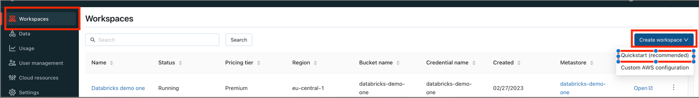
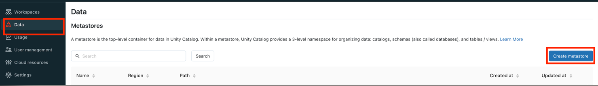
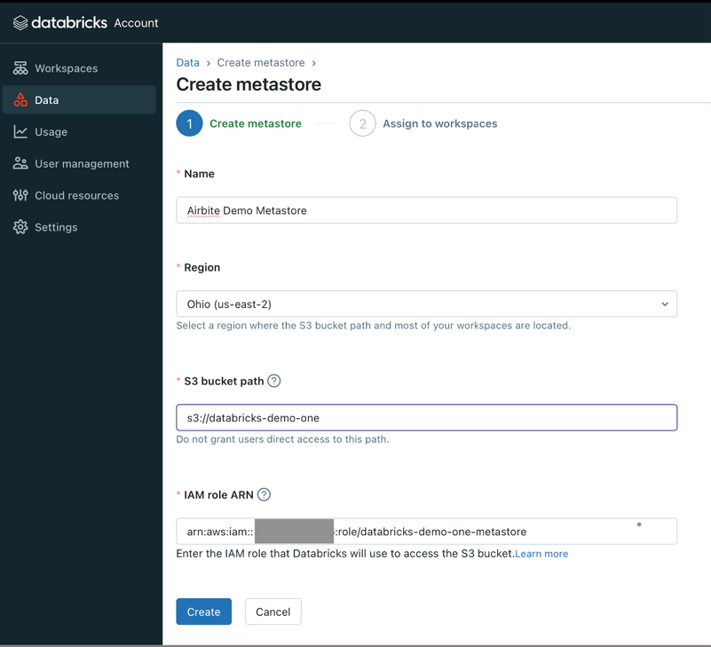
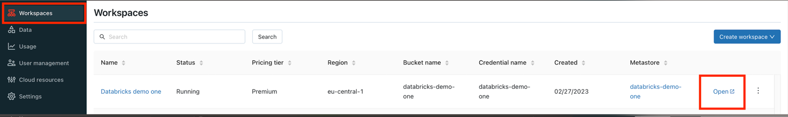
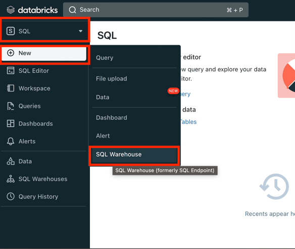
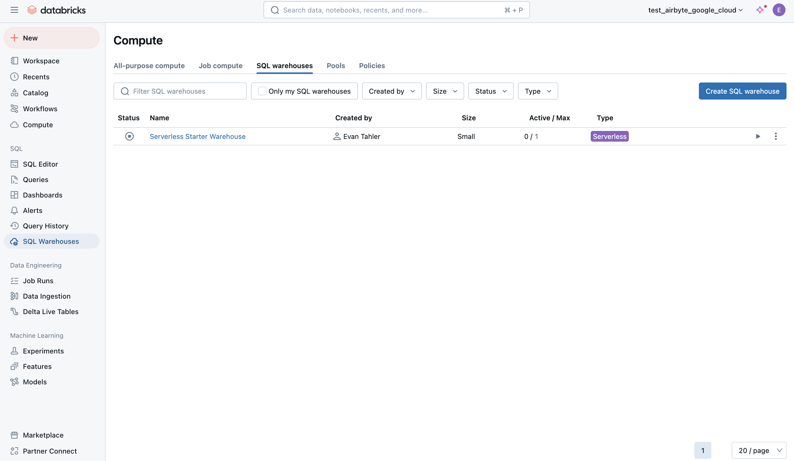
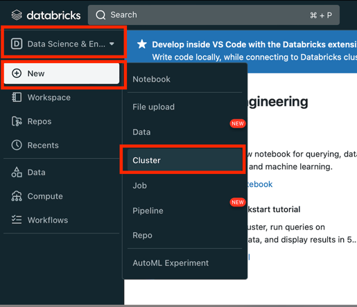

# Databricks Lakehouse

## Overview

The Databricks Lakehouse source allows you to sync data from Databricks Catalog Tables. It supports both Full Refresh and Incremental syncs. 

This connector requires a JDBC driver to connect to the Databricks cluster. By using the driver and the connector, you must agree to the [JDBC ODBC driver license](https://databricks.com/jdbc-odbc-driver-license). This means that you can only use this connector to connect third party applications to Apache Spark SQL within a Databricks offering using the ODBC and/or JDBC protocols.

## Getting started

## Databricks AWS Setup
### 1. Create a Databricks Workspace
- Follow Databricks guide [Create a workspace using the account console](https://docs.databricks.com/administration-guide/workspace/create-workspace.html#create-a-workspace-using-the-account-console).
> **_IMPORTANT:_** Don't forget to create a [cross-account IAM role](https://docs.databricks.com/administration-guide/cloud-configurations/aws/iam-role.html#create-a-cross-account-iam-role) for workspaces

> **_TIP:_** Alternatively use Databricks quickstart for new workspace
> 

### 2. Create a metastore and attach it to workspace
> **_IMPORTANT:_** The metastore should be in the same region as the workspaces you want to use to access the data. Make sure that this matches the region of the cloud storage bucket you created earlier.

#### Setup storage bucket and IAM role in AWS
Follow [Configure a storage bucket and IAM role in AWS](https://docs.databricks.com/data-governance/unity-catalog/get-started.html#configure-a-storage-bucket-and-iam-role-in-aws) to setup AWS bucket with necessary permissions.

#### Create metastore
- Login into Databricks [account console](https://accounts.cloud.databricks.com/login) with admin permissions.
- Go to Data tab and hit Create metastore button:

  

- Provide all necessary data and click Create:

  
    - `Name`
    - `Region` The metastore should be in same region as the workspace.
    - `S3 bucket path` created at [Setup storage bucket and IAM role in AWS](#setup-storage-bucket-and-iam-role-in-aws) step.
    - `IAM role ARN` created at [Setup storage bucket and IAM role in AWS](#setup-storage-bucket-and-iam-role-in-aws) step. Example: `arn:aws:iam::<AWS_ACCOUNT_ID>:role/<AWS_IAM_ROLE_NAME>`
- Select the workspaces in `Assign to workspaces` tab and click Assign.

### 3. Create Databricks SQL Warehouse
> **_TIP:_** If you use Databricks cluster skip this step

- Open the workspace tab and click on created workspace console:

  

- Create SQL warehouse:

- 
    - Switch to SQL tab
    - Click New button
    - Choose SQL Warehouse
- After SQL warehouse was created we can it's Connection details to con

### 4. Databricks SQL Warehouse connection details
> **_TIP:_** If you use Databricks cluster skip this step

- Open workspace console.
- Go to SQL Warehouse section and open it

  

- Open Connection Details tab:

  

> **_IMPORTANT:_** `Server hostname`, `Port`, `HTTP path` are used for Airbyte connection

### 5. Create Databricks Cluster
> **_TIP:_** If you use Databricks SQL Warehouse skip this step

- Open the workspace tab and click on created workspace console:

  

- Create Cluster:

  

    - Switch to Data science & Engineering
    - Click New button
    - Choose Cluster

### 6. Databricks Cluster connection details
> **_TIP:_** If you use Databricks SQL Warehouse skip this step

- Open workspace console.
- Go to Compute section under Data science & Engineering and click on cluster link:

  

- Open Advanced options under Configuration, choose JDBC/ODBC tab:

  
> **_IMPORTANT:_** `Server hostname`, `Port`, `HTTP path` are used for Airbyte connection

### 7. Create Databricks Token
- Open workspace console.
- Open User Settings, go to Access tokens tab and click Generate new token:

  

- In the new window put a comment (Optional) and lifetime:

  

> **_TIP:_** `Lifetime` can be set to `0`

## Airbyte Setup
### Databricks fields
- `Server Hostname` - can be taken from [4. Databricks SQL Warehouse connection details](#4-databricks-sql-warehouse-connection-details)  or [6. Databricks Cluster connection details](#6-databricks-cluster-connection-details) steps.
- `HTTP Path` - can be taken from [4. Databricks SQL Warehouse connection details](#4-databricks-sql-warehouse-connection-details)  or [6. Databricks Cluster connection details](#6-databricks-cluster-connection-details) steps.
- `Port` - can be taken from [4. Databricks SQL Warehouse connection details](#4-databricks-sql-warehouse-connection-details)  or [6. Databricks Cluster connection details](#6-databricks-cluster-connection-details) steps.
- `Access Token` - can be taken from [7. Create Databricks Token](#7-create-databricks-token) step.

## Sync Mode

| Feature | Support | Notes                                                                                |
| :--- | :---: |:-------------------------------------------------------------------------------------|
| Full Refresh Sync | ✅ | Warning: this mode deletes all previously synced data in the configured destination. |
| Incremental - Append Sync | ✅ |                                                                                      |
| Incremental - Deduped History | ❌ |                                                                                      |
| Namespaces | ❌ |                                                                                      |

## Configuration

| Category            | Parameter             |  Type   | Notes                                                                                                                                                                                                                                                                                                           |
|:--------------------|:----------------------|:-------:|:----------------------------------------------------------------------------------------------------------------------------------------------------------------------------------------------------------------------------------------------------------------------------------------------------------------|
| Databricks          | Server Hostname       | string  | Required. Example: `abc-12345678-wxyz.cloud.databricks.com`. See [documentation](https://docs.databricks.com/integrations/bi/jdbc-odbc-bi.html#get-server-hostname-port-http-path-and-jdbc-url). Please note that this is the server for the Databricks Cluster. It is different from the SQL Endpoint Cluster. |
|                     | HTTP Path             | string  | Required. Example: `sql/protocolvx/o/1234567489/0000-1111111-abcd90`. See [documentation](https://docs.databricks.com/integrations/bi/jdbc-odbc-bi.html#get-server-hostname-port-http-path-and-jdbc-url).                                                                                                       |
|                     | Port                  | string  | Optional. Default to "443". See [documentation](https://docs.databricks.com/integrations/bi/jdbc-odbc-bi.html#get-server-hostname-port-http-path-and-jdbc-url).                                                                                                                                                 |
|                     | Personal Access Token | string  | Required. Example: `dapi0123456789abcdefghij0123456789AB`. See [documentation](https://docs.databricks.com/sql/user/security/personal-access-tokens.html).                                                                                                                                                      |
| General             | Databricks catalog    | string  | Required. The name of the catalog.  |
|                     | Database schema       | string  | Optional. The name of schema in a catalog. If not specified tables all schemas in catalog are discovered.                                                                                                                                                                                                        
|                     | JDBC URL Params       | boolean | Optional. Additional properties to pass to the JDBC URL string when connecting to the database formatted as key=value pairs separated by the symbol ;. Example: key1=value1;key2=value2;key3=value3                                                                                                             

## CHANGELOG

| Version | Date       | Pull Request                                                                                                                                                             | Subject                                                                                                                 |
|:--------|:-----------|:-------------------------------------------------------------------------------------------------------------------------------------------------------------------------|:------------------------------------------------------------------------------------------------------------------------|
|
| 0.1.0   | 2023-08-01 | [\#28163](https://github.com/airbytehq/airbyte/pull/28163)                                                                                                                 | Initial release.                                                                                                        |
