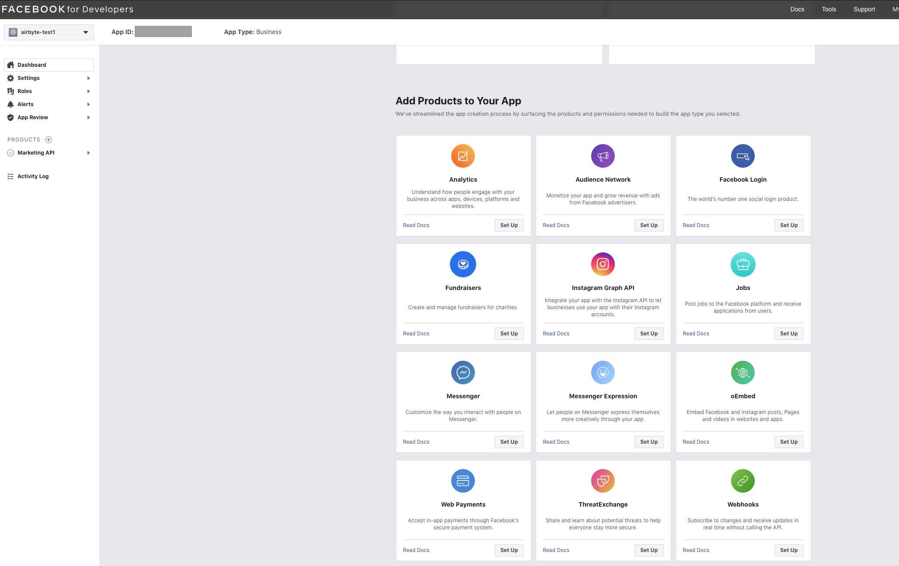
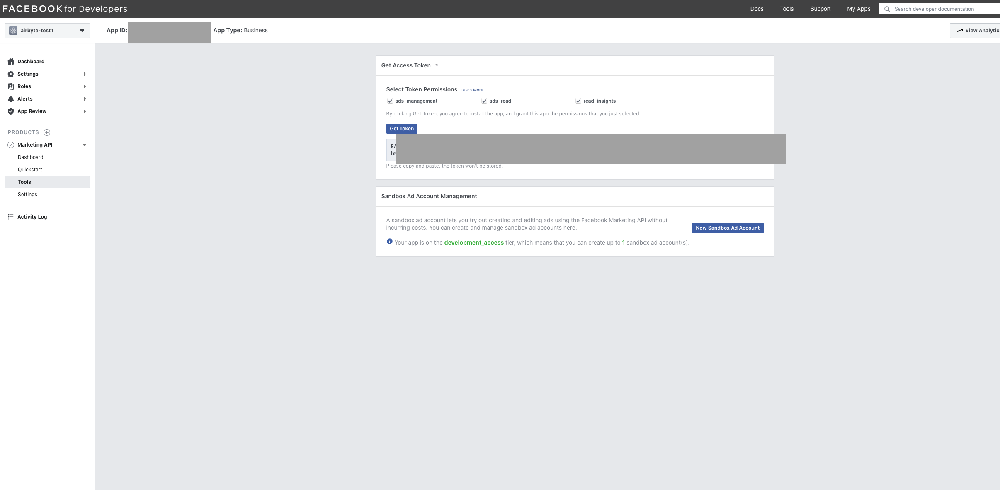

# Facebook Marketing

## Sync overview

This source can sync data for the core Ad Campaign data available in the [Facebook Marketing API](https://developers.facebook.com/docs/marketing-api/campaign-structure): Campaigns, AdSets, Ads, and AdCreatives. It can also sync [Ad Insights from the Reporting API](https://developers.facebook.com/docs/marketing-api/insights).

### Output schema

This Source is capable of syncing the following core Streams:

* AdSets. [Facebook docs](https://developers.facebook.com/docs/marketing-api/reference/ad-campaign#fields)
* Ads. [Facebook docs](https://developers.facebook.com/docs/marketing-api/reference/adgroup#fields)
* AdCreatives. [Facebook docs](https://developers.facebook.com/docs/marketing-api/reference/ad-creative#fields)
* Campaigns. [Facebook docs](https://developers.facebook.com/docs/marketing-api/reference/ad-campaign-group#fields)

The linked Facebook docs go into detail about the fields present on those streams.

In addition, this source is capable of syncing ad insights as a stream. Ad insights can also be segmented by the following categories, where each segment is synced as a separate Airbyte stream:

* Country
* DMA \(Designated Market Area\)
* Gender & Age
* Platform & Device
* Region

The segmented streams contain entries of campaign/adset/ad combinations for each day broken down by the chosen segment.

For more information, see the [Facebook Insights API documentation. ](https://developers.facebook.com/docs/marketing-api/reference/adgroup/insights/)

### Data type mapping

| Integration Type | Airbyte Type | Notes |
| :--- | :--- | :--- |
| `string` | `string` |  |
| `number` | `number` |  |
| `array` | `array` |  |
| `object` | `object` |  |

### Features

| Feature | Supported?\(Yes/No\) | Notes |
| :--- | :--- | :--- |
| Full Refresh Sync | Yes |  |
| Incremental Sync | Yes | except AdCreatives |
| Namespaces | No |  |

### Rate Limiting & Performance Considerations


Facebook heavily throttles API tokens generated from Facebook Apps by default, making it infeasible to use such a token for syncs with Airbyte. To be able to use this connector without your syncs taking days due to rate limiting follow the instructions in the Setup Guide below to access better rate limits.


See Facebook's [documentation on rate limiting](https://developers.facebook.com/docs/marketing-api/overview/authorization/#access-levels) for more information on requesting a quota upgrade.

## Getting started

### Requirements

* A Facebook Ad Account ID
* A Facebook App which has the Marketing API enabled
* A Facebook Marketing API Access Token
* Request a rate limit increase from Facebook

### Setup guide

### Facebook Ad Account ID

Follow the [Facebook documentation for obtaining your Ad Account ID](https://www.facebook.com/business/help/1492627900875762) and keep that on hand. We'll need this ID to configure Facebook as a source in Airbyte.

### Facebook App

#### If you don't have a Facebook App

Visit the [Facebook Developers App hub](https://developers.facebook.com/apps/) and create an App and choose "Manage Business Integrations" as the purpose of the app. Fill out the remaining fields to create your app, then follow along the "Enable the Marketing API for your app" section.

#### Enable the Marketing API for your app

From the App's Dashboard screen \(seen in the screenshot below\) enable the Marketing API for your app if it is not already setup.

### API Access Token

In the App Dashboard screen, click Marketing API --&gt; Tools on the left sidebar. Then highlight all the available token permissions \(`ads_management`, `ads_read`, `read_insights`\) and click "Get token". A long string of characters should appear in front of you; **this is the access token.** Copy this string for use in the Airbyte UI later.

### Request rate limit increase

Facebook [heavily throttles](https://developers.facebook.com/docs/marketing-api/overview/authorization#limits) API tokens generated from Facebook Apps with the "Standard Access" tier \(the default tier for new apps\), making it infeasible to use the token for syncs with Airbyte. You'll need to request an upgrade to Advanced Access for your app on the following permissions:

* Ads Management Standard Access
* ads\_read
* ads\_management

See the Facebook [documentation on Authorization](https://developers.facebook.com/docs/marketing-api/overview/authorization/#access-levels) for information about how to request Advanced Access to the relevant permissions.

With the Ad Account ID and API access token, you should be ready to start pulling data from the Facebook Marketing API. Head to the Airbyte UI to setup your source connector!

## Changelog

| Version | Date       | Pull Request | Subject |
| :------ | :--------  | :-----       | :------ |
| 0.2.17  | 2021-09-14 | [4978](https://github.com/airbytehq/airbyte/pull/4978) | Convert values' types according to schema types |
| 0.2.16  | 2021-09-14 | [6060](https://github.com/airbytehq/airbyte/pull/6060) | Fix schema for `ads_insights` stream |
| 0.2.15  | 2021-09-14 | [5958](https://github.com/airbytehq/airbyte/pull/5958) | Fix url parsing and add report that exposes conversions |
| 0.2.14  | 2021-07-19 | [4820](https://github.com/airbytehq/airbyte/pull/4820) | Improve the rate limit management |
| 0.2.12  | 2021-06-20 | [3743](https://github.com/airbytehq/airbyte/pull/3743) | Refactor connector to use CDK: - Improve error handling. - Improve async job performance (insights). - Add new configuration parameter `insights_days_per_job`. - Rename stream `adsets` to `ad_sets`. - Refactor schema logic for insights, allowing to configure any possible insight stream. |
| 0.2.10  | 2021-06-16 | [3973](https://github.com/airbytehq/airbyte/pull/3973) | Update version of facebook_bussiness to 11.0 |
| 0.2.9   | 2021-06-10 | [3996](https://github.com/airbytehq/airbyte/pull/3996) | Add `AIRBYTE_ENTRYPOINT` for Kubernetes support |
| 0.2.8   | 2021-06-09 | [3973](https://github.com/airbytehq/airbyte/pull/3973) | Add 80000 as a rate-limiting error code |
| 0.2.7   | 2021-06-03 | [3646](https://github.com/airbytehq/airbyte/pull/3646) | Add missing fields to AdInsights streams |
| 0.2.6   | 2021-05-25 | [3525](https://github.com/airbytehq/airbyte/pull/3525) | Fix handling call rate limit |
| 0.2.5   | 2021-05-20 | [3396](https://github.com/airbytehq/airbyte/pull/3396) | Allow configuring insights lookback window |
| 0.2.4   | 2021-05-13 | [3395](https://github.com/airbytehq/airbyte/pull/3395) | Fix an issue that caused losing Insights data from the past 28 days while incremental sync |
| 0.2.3   | 2021-04-28 | [3116](https://github.com/airbytehq/airbyte/pull/3116) | Wait longer (5 min) for async jobs to start |
| 0.2.2   | 2021-04-03 | [2726](https://github.com/airbytehq/airbyte/pull/2726) | Fix base connector versioning |
| 0.2.1   | 2021-03-12 | [2391](https://github.com/airbytehq/airbyte/pull/2391) | Support FB Marketing API v10 |
| 0.2.0   | 2021-03-09 | [2238](https://github.com/airbytehq/airbyte/pull/2238) | Protocol allows future/unknown properties |
| 0.1.4   | 2021-02-24 | [1902](https://github.com/airbytehq/airbyte/pull/1902) | Add `include_deleted` option in params |
| 0.1.3   | 2021-02-15 | [1990](https://github.com/airbytehq/airbyte/pull/1990) | Support Insights stream via async queries |
| 0.1.2   | 2021-01-22 | [1699](https://github.com/airbytehq/airbyte/pull/1699) | Add incremental support |
| 0.1.1   | 2021-01-15 | [1552](https://github.com/airbytehq/airbyte/pull/1552) | Release Native Facebook Marketing Connector |
