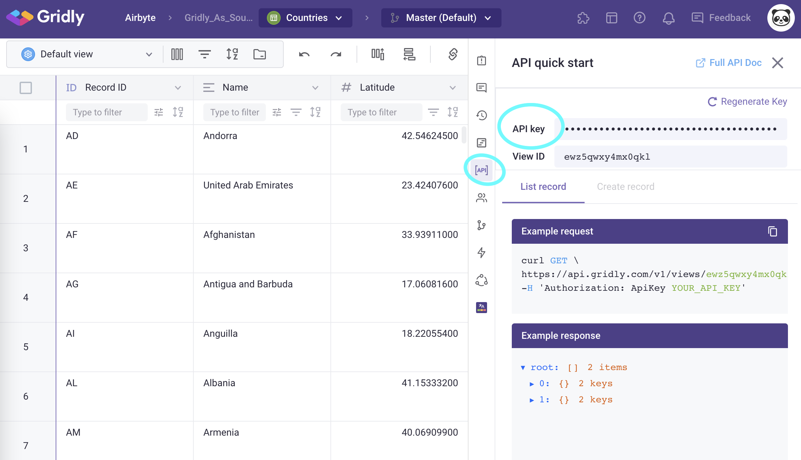
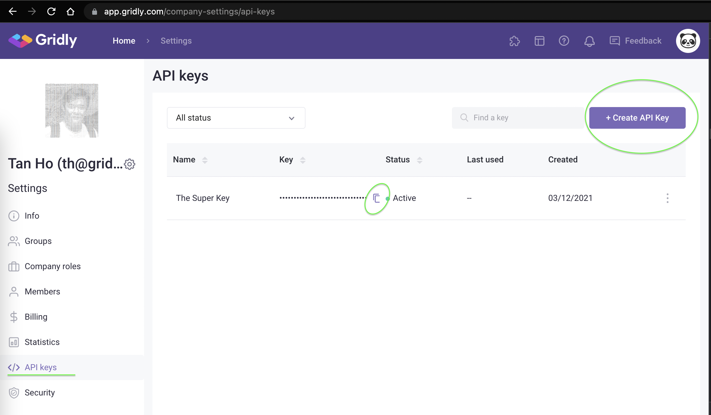
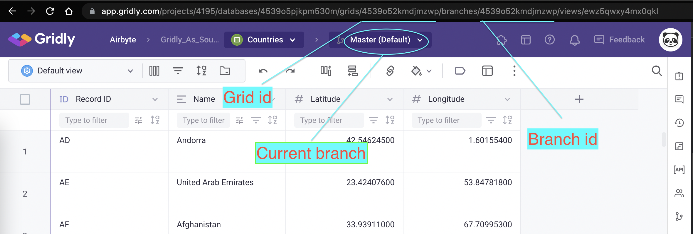

# Gridly

This page contains the setup guide and reference information for the Gridly source connector.

## Prerequisites

A Gridly account.

## Setup guide

### Get api Key

1. To quickly get your API key, access your Gridly Dashboard, then select a Grid View and you can find the key in API quick start right panel.
   
2. Owner and Administrators can go to Settings/API keys to create company-level API keys with scoped privileges and accesses.
   

### Get grid id

The grid id is available in the url.
Gridly support version control, by default the `grid id` is the same to the `branch id` when `Master` branch is selected. For fetching records on other branches, use `branch id` instead.

## Supported sync modes

| Feature           | Supported? |
| :---------------- | :--------- |
| Full Refresh Sync | Yes        |
| Incremental Sync  | No         |

## Supported Streams

- [Records](https://www.gridly.com/docs/api/#record)

## Changelog

| Version | Date       | Pull Request                                             | Subject                                                     |
| :------ | :--------- | :------------------------------------------------------- | :---------------------------------------------------------- |
| 0.1.1   | 2022-12-08 | [20048](https://github.com/airbytehq/airbyte/pull/20048) | Source Gridly: add icon and make grid_id parameter required |
