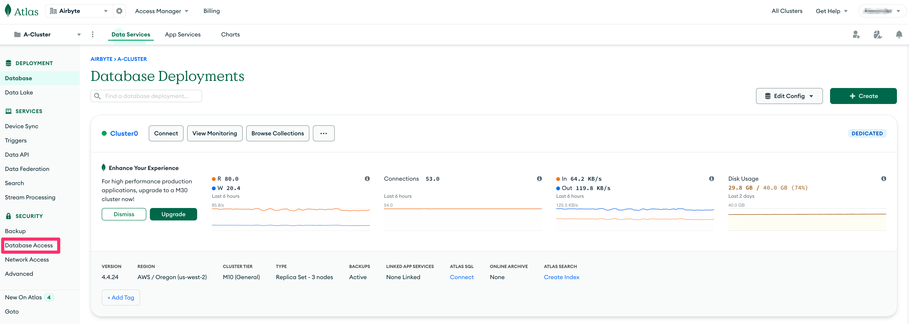
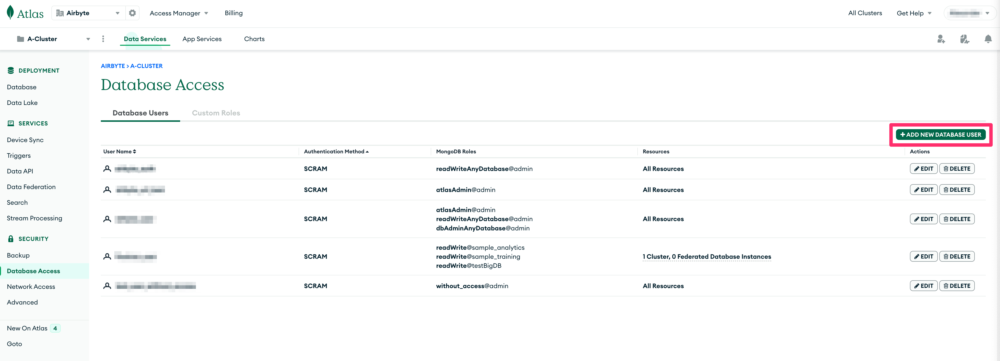
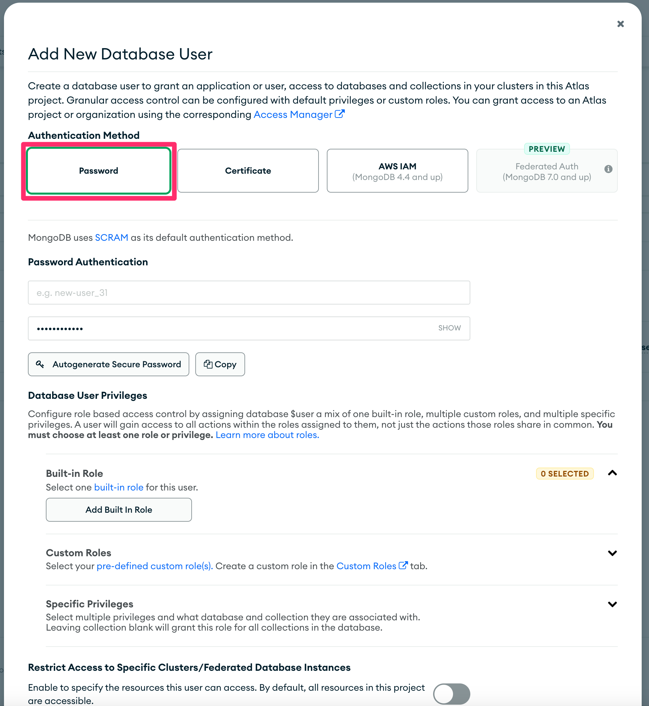
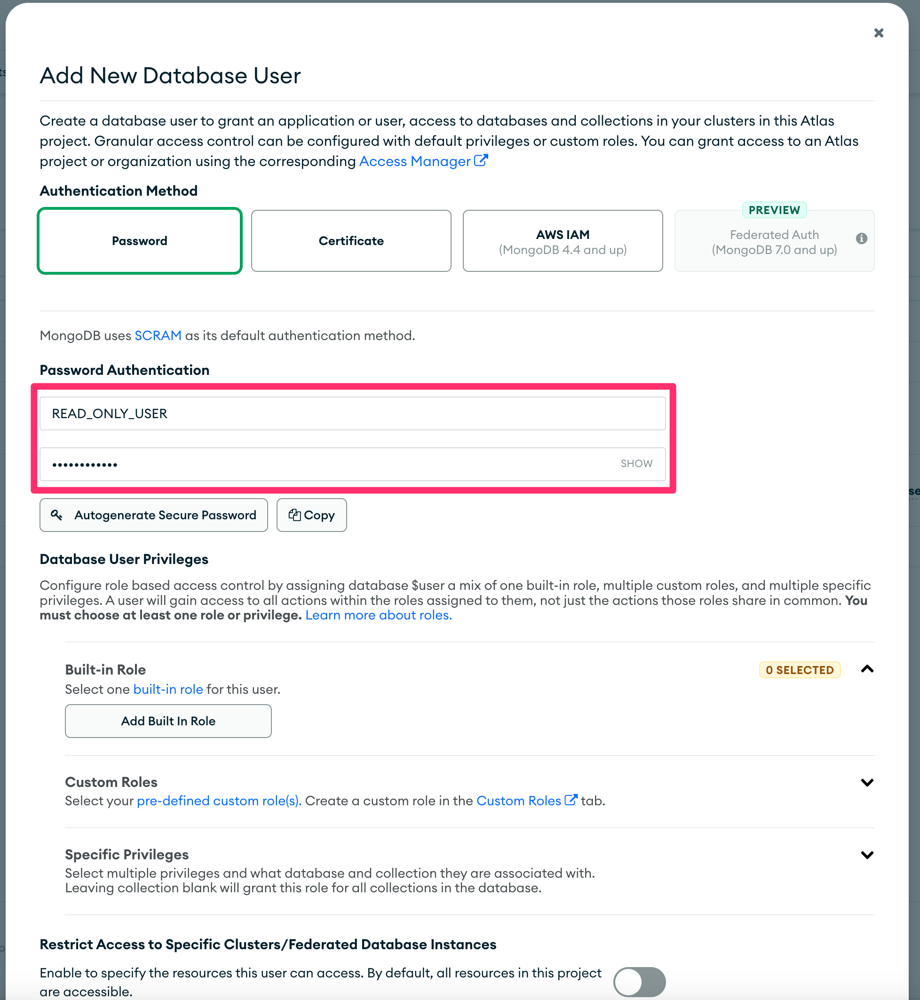
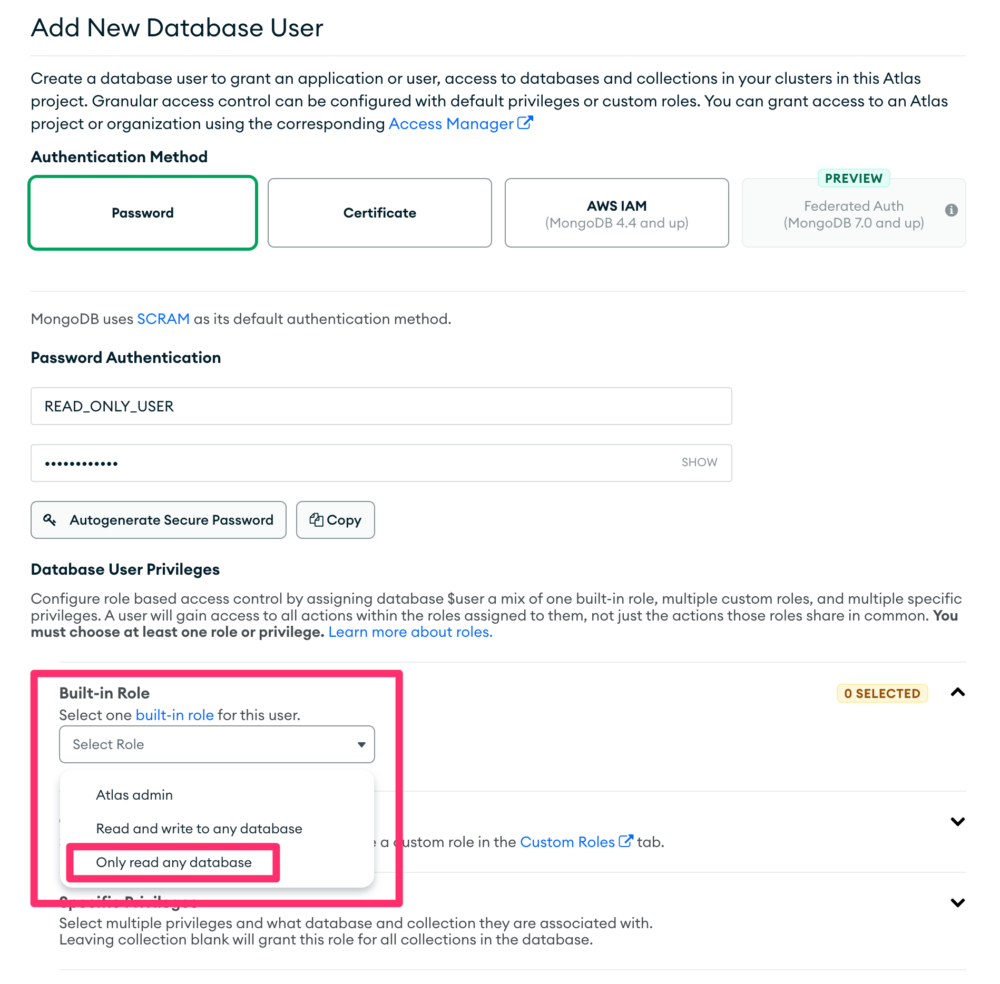
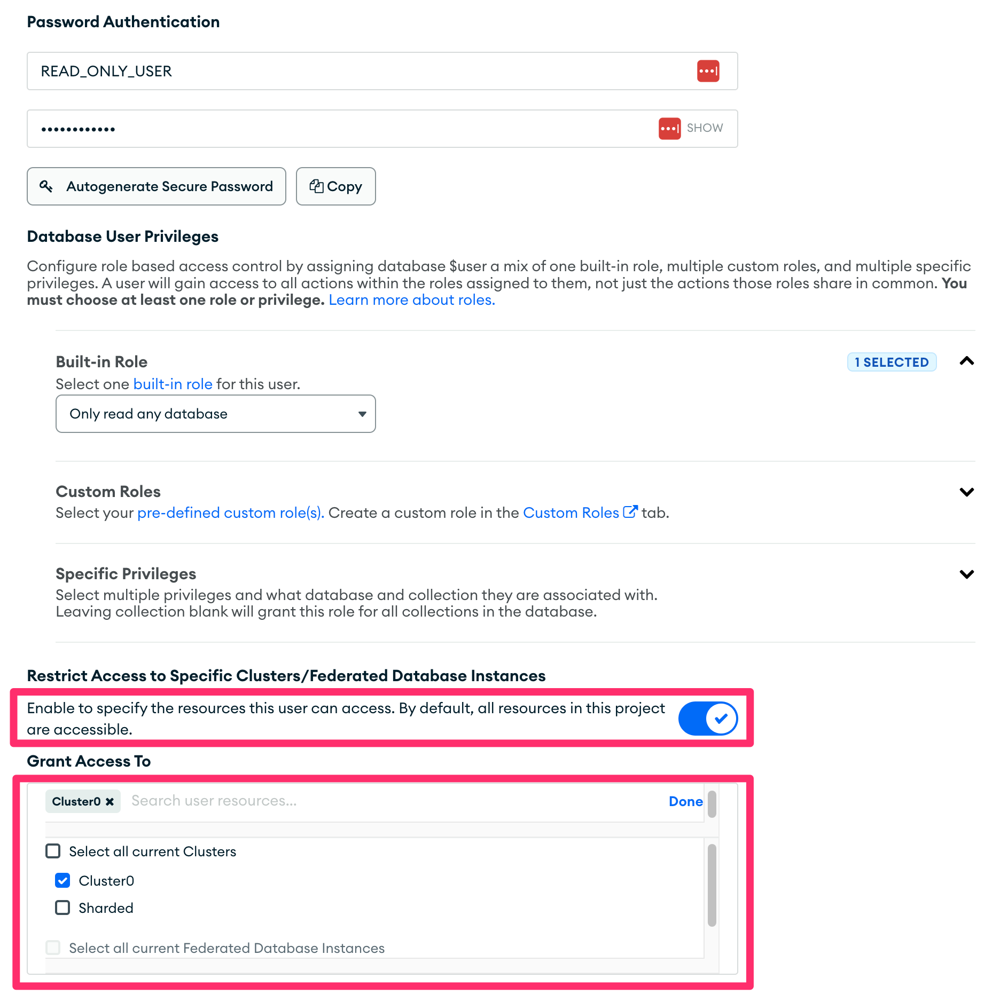
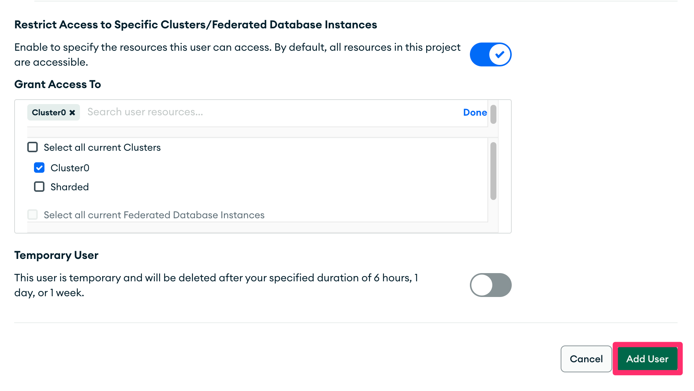
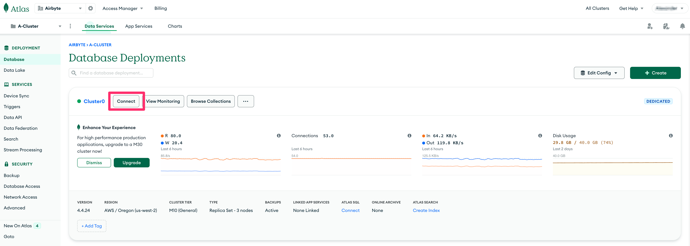
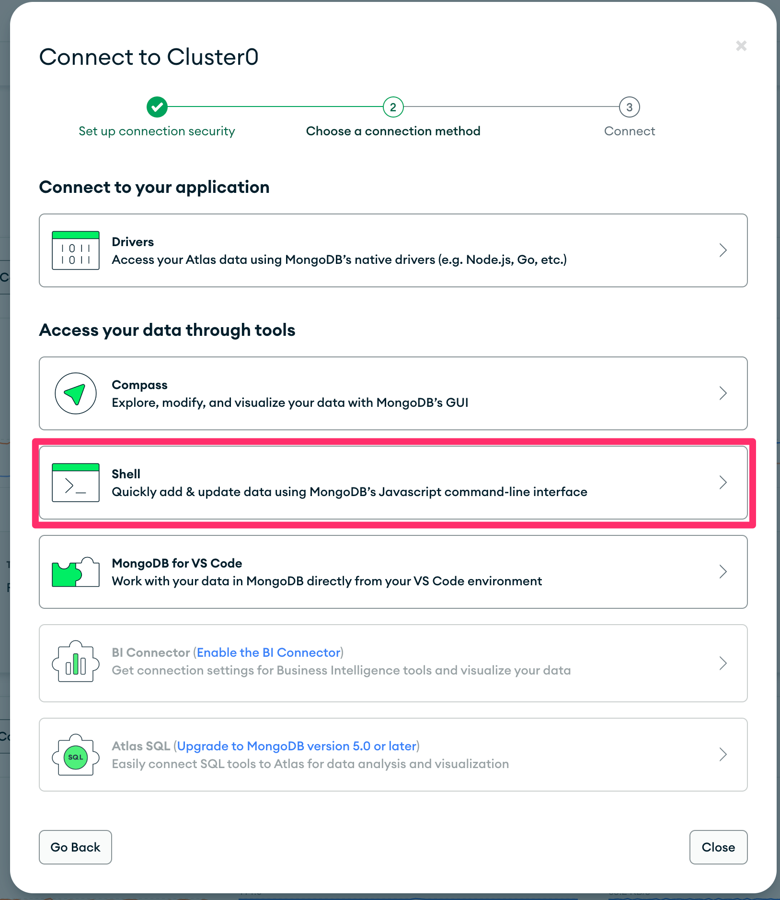
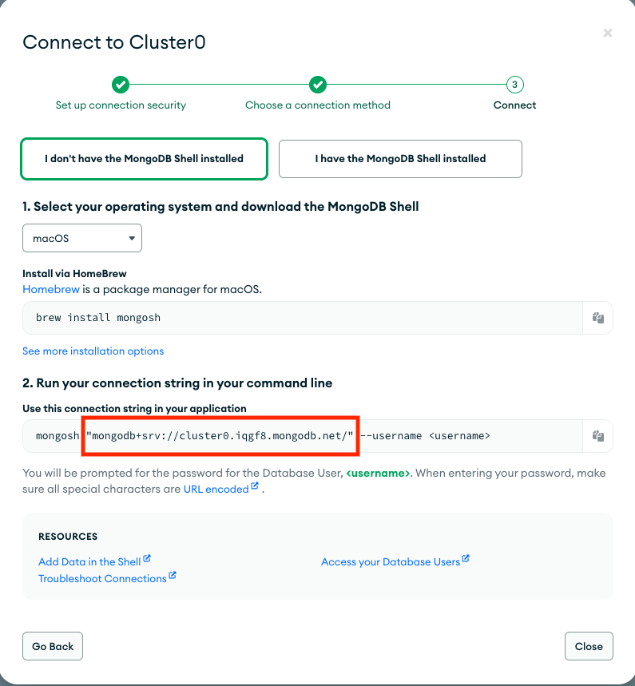

# Mongo DB

Airbyte's certified MongoDB connector offers the following features:

- [Change Data Capture (CDC)](https://docs.airbyte.com/understanding-airbyte/cdc) via [MongoDB's change streams](https://www.mongodb.com/docs/manual/changeStreams/)/[Replica Set Oplog](https://www.mongodb.com/docs/manual/core/replica-set-oplog/).
- Reliable replication of any collection size with [checkpointing](https://docs.airbyte.com/understanding-airbyte/airbyte-protocol/#state--checkpointing) and chunking of data reads.
- **_NEW_** Full refresh syncing of collections.

## Quick Start

This section provides information about configuring the MongoDB V2 source connector. If you are upgrading from a
previous version of the MongoDB V2 source connector, please refer to the [upgrade](#upgrade-from-previous-version) instructions
in this document.

### New Installation/New Source Connector Configuration

Here is an outline of the minimum required steps to configure a new MongoDB V2 source connector:

1. Create or discover the configuration of a [MongoDB replica set](https://www.mongodb.com/docs/manual/replication/), either hosted in [MongoDB Atlas](https://www.mongodb.com/atlas/database) or self-hosted.
2. Create a new MongoDB source in the Airbyte UI
3. (Airbyte Cloud Only) Allow inbound traffic from Airbyte IPs

Once this is complete, you will be able to select MongoDB as a source for replicating data.

#### Step 1: Create a dedicated read-only MongoDB user

These steps create a dedicated, read-only user for replicating data. Alternatively, you can use an existing MongoDB user with
access to the database.

##### MongoDB Atlas

1. Log in to the MongoDB Atlas dashboard.
2. From the dashboard, click on "Database Access" under "Security"



3. Click on the "+ ADD NEW DATABASE USER" button.



4. On the "Add new Database User" modal dialog, choose "Password" for the "Authentication Method".



5. In the "Password Authentication" section, set the username to `READ_ONLY_USER` in the first text box and set a password in the second text box.



6. Under "Database User Privileges", click on "Select one built-in role for this user" under "Built-in Role" and choose "Only read any database".



7. Enable "Restrict Access to Specific Clusters/Federated Database instances" and enable only those clusters/database that you wish to replicate.



8. Click on "Add User" at the bottom to save the user.



##### Self Hosted

These instructions assume that the [MongoDB shell](https://www.mongodb.com/docs/mongodb-shell/) is installed. To
install the MongoDB shell, please follow [these instructions](https://www.mongodb.com/docs/mongodb-shell/install/#std-label-mdb-shell-install).

1. From a terminal window, launch the MongoDB shell:

```shell
> mongosh <connection string to cluster> --username <user with admin permissions>;
```

2. Switch to the `admin` database:

```shell
test> use admin
switched to db admin
```

3. Create the `READ_ONLY_USER` user with the `read` role:

```shell
admin> db.createUser({user: "READ_ONLY_USER", pwd: "READ_ONLY_PASSWORD", roles: [{role: "read", db: "TARGET_DATABASE"}]})
```

:::note
Replace `READ_ONLY_PASSWORD` with a password of your choice and `TARGET_DATABASE` with the name of the database to be replicated.
:::

4. Next, enable authentication, if not already enabled. Start by editing the `/etc/mongodb.conf` by adding/editing these specific keys:

```yaml
net:
  bindIp: 0.0.0.0

security:
  authorization: enabled
```

:::note
Setting the `bindIp` key to `0.0.0.0` will allow connections to database from any IP address. Setting the `security.authorization` key to `enabled` will enable security and only allow authenticated users to access the database.
:::

#### Step 2: Discover the MongoDB cluster connection string

These steps outline how to discover the connection string of your MongoDB instance.

##### MongoDB Atlas

Atlas is MongoDB's [cloud-hosted offering](https://www.mongodb.com/atlas/database). Below are the steps to discover
the connection configuration for a MongoDB Atlas-hosted replica set cluster:

1. Log in to the [MongoDB Atlas dashboard](https://cloud.mongodb.com/).
2. From the dashboard, click on the "Connect" button of the source cluster.



3. On the "Connect to &lt;cluster name&gt;" modal dialog, select "Shell" under the "Access your data through tools" section.



4. Copy the connection string from the entry labeled "2. Run your connection string in your command line" on the modal dialog, removing/avoiding the quotation marks.



##### Self Hosted Cluster

Self-hosted clusters are MongoDB instances that are hosted outside of [MongoDB Atlas](https://www.mongodb.com/atlas/database). Below are the steps to discover
the connection string for a MongoDB self-hosted replica set cluster.

1.  Refer to the [MongoDB connection string documentation](https://www.mongodb.com/docs/manual/reference/connection-string/#find-your-self-hosted-deployment-s-connection-string) for instructions
    on discovering a self-hosted deployment connection string.

#### Step 3: Configure the Airbyte MongoDB Source

To configure the Airbyte MongoDB source, use the database credentials and connection string from steps 1 and 2, respectively.
The source will test the connection to the MongoDB instance upon creation.

## Replication Methods

The MongoDB source utilizes change data capture (CDC) as a reliable way to keep your data up to date.
In addtion MongoDB source now allows for syncing in a full refresh mode.

### CDC

Airbyte utilizes [the change streams feature](https://www.mongodb.com/docs/manual/changeStreams/) of a [MongoDB replica set](https://www.mongodb.com/docs/manual/replication/) to incrementally capture inserts, updates and deletes using a replication plugin. To learn more how Airbyte implements CDC, refer to [Change Data Capture (CDC)](https://docs.airbyte.com/understanding-airbyte/cdc/).

### Full Refresh

The Full refresh sync mode added in v4.0.0 allows for reading a the entire contents of a collection, repeatedly.
The MongoDB source connector is using checkpointing in Full Refresh read so a sync job that failed for netwrok error for example,
Rather than starting over it will continue its full refresh read from a last known point.

### Schema Enforcement

By default the MongoDB V2 source connector enforces a schema. This means that while setting up a connector it will sample a configureable number of docuemnts and will create a set of fields to sync. From that set of fields, an admin can then deselect specific fields from the Replication screen to filter them out from the sync.

When the schema enforced option is disabled, MongoDB collections are read in schema-less mode which doesn't assume documents share the same structure.
This allows for greater flexibility in reading data that is unstructured or vary a lot in between documents in a single collection.
When schema is not enforced, each document will generate a record that only contains the following top-level fields:

```json
{
  "_id": <document id>,
  "data": {<a JSON cotaining the entire set of fields found in document>}
}
```

The contents of `data` will vary according to the contents of each document read from MongoDB.
Unlike in Schema enforced mode, the same field can vary in type between document. For example field `"xyz"` may be a String on one document and a Date on another.
As a result no field will be omitted and no document will be rejected.
When Schema is not enforced there is not way to deselect fields as all fields are read for every document.

## Limitations & Troubleshooting

To see connector limitations, or troubleshoot your MongoDB connector, see more [in our MongoDB troubleshooting guide](/integrations/sources/mongodb-v2/mongodb-v2-troubleshooting).

## Configuration Parameters

| Parameter Name                             | Description                                                                                                                                                                                                                                                                                                                                                                                                                                |
| :----------------------------------------- | :----------------------------------------------------------------------------------------------------------------------------------------------------------------------------------------------------------------------------------------------------------------------------------------------------------------------------------------------------------------------------------------------------------------------------------------- |
| Cluster Type                               | The type of the MongoDB cluster ([MongoDB Atlas](https://www.mongodb.com/atlas/database) replica set or self-hosted replica set).                                                                                                                                                                                                                                                                                                          |
| Connection String                          | The connection string of the source MongoDB cluster. For Atlas hosted clusters, see [the quick start guide](#step-2-discover-the-mongodb-cluster-connection-string) for steps to find the connection string. For self-hosted clusters, refer to the [MongoDB connection string documentation](https://www.mongodb.com/docs/manual/reference/connection-string/#find-your-self-hosted-deployment-s-connection-string) for more information. |
| Database Name                              | The name of the database that contains the source collection(s) to sync.                                                                                                                                                                                                                                                                                                                                                                   |
| Username                                   | The username which is used to access the database. Required for MongoDB Atlas clusters.                                                                                                                                                                                                                                                                                                                                                    |
| Password                                   | The password associated with this username. Required for MongoDB Atlas clusters.                                                                                                                                                                                                                                                                                                                                                           |
| Authentication Source                      | (MongoDB Atlas clusters only) Specifies the database that the supplied credentials should be validated against. Defaults to `admin`. See the [MongoDB documentation](https://www.mongodb.com/docs/manual/reference/connection-string/#mongodb-urioption-urioption.authSource) for more details.                                                                                                                                            |
| Schema Enforced                            | Controls whether schema is discovered and enforced. See discussion in [Schema Enforcement](#Schema-Enforcement).                                                                                                                                                                                                                                                                                                                           |
| Initial Waiting Time in Seconds (Advanced) | The amount of time the connector will wait when it launches to determine if there is new data to sync or not. Defaults to 300 seconds. Valid range: 120 seconds to 1200 seconds.                                                                                                                                                                                                                                                           |
| Size of the queue (Advanced)               | The size of the internal queue. This may interfere with memory consumption and efficiency of the connector, please be careful.                                                                                                                                                                                                                                                                                                             |
| Discovery Sample Size (Advanced)           | The maximum number of documents to sample when attempting to discover the unique fields for a collection. Default is 10,000 with a valid range of 1,000 to 100,000. See the [MongoDB sampling method](https://www.mongodb.com/docs/compass/current/sampling/#sampling-method) for more details.                                                                                                                                            |
| Update Capture Mode (Advanced)             | Determines how Airbyte looks up the value of an updated document. Default is "Lookup". **IMPORTANT** : "Post image" is only supported in MongoDB version 6.0+. In addition, the collections of interest must be setup to [return pre and post images](https://www.mongodb.com/docs/manual/changeStreams/#change-streams-with-document-pre-and-post-images). Failure to do so will lead to data loss.                                       |

For more information regarding configuration parameters, please see [MongoDb Documentation](https://docs.mongodb.com/drivers/java/sync/v4.10/fundamentals/connection/).

## Changelog

<details>
  <summary>Expand to review</summary>

| Version | Date       | Pull Request                                             | Subject                                                                                                   |
|:--------|:-----------|:---------------------------------------------------------|:----------------------------------------------------------------------------------------------------------|
| 1.5.13 | 2024-12-18 | [49868](https://github.com/airbytehq/airbyte/pull/49868) | Use a base image: airbyte/java-connector-base:1.0.0 |
| 1.5.12 | 2024-11-01 | [48115](https://github.com/airbytehq/airbyte/pull/48115) | Remove database name check. |
| 1.5.11 | 2024-09-24 | [45883](https://github.com/airbytehq/airbyte/pull/45883) | Lazy init mongocursor to prevent timeout. |
| 1.5.10 | 2024-09-17 | [45639](https://github.com/airbytehq/airbyte/pull/45639) | Adopt latest CDK to use the latest apache sshd mina to handle tcpkeepalive requests. |
| 1.5.9 | 2024-08-28 | [42927](https://github.com/airbytehq/airbyte/pull/42927) | Support binary subtype. |
| 1.5.8 | 2024-08-27 | [44841](https://github.com/airbytehq/airbyte/pull/44841) | Adopt latest CDK. |
| 1.5.7 | 2024-08-27 | [44846](https://github.com/airbytehq/airbyte/pull/44846) | DBZ filters in related streams only. |
| 1.5.6 | 2024-08-27 | [44839](https://github.com/airbytehq/airbyte/pull/44839) | DBZ filters in related streams only. |
| 1.5.5 | 2024-08-26 | [44779](https://github.com/airbytehq/airbyte/pull/44779) | Revert permission check on oplog.rs. |
| 1.5.4 | 2024-08-20 | [44490](https://github.com/airbytehq/airbyte/pull/44490) | Add read permission check on oplog.rs collection used by CDC. |
| 1.5.3 | 2024-08-08 | [43410](https://github.com/airbytehq/airbyte/pull/43410) | Adopt latest CDK. |
| 1.5.2 | 2024-08-06 | [42869](https://github.com/airbytehq/airbyte/pull/42869) | Adopt latest CDK. |
| 1.5.1 | 2024-08-01 | [42549](https://github.com/airbytehq/airbyte/pull/42549) | Centered the connector icon. |
| 1.5.0 | 2024-07-26 | [42561](https://github.com/airbytehq/airbyte/pull/42561) | Implement WASS algorithm. |
| 1.4.3 | 2024-07-22 | [39145](https://github.com/airbytehq/airbyte/pull/39145) | Warn (vs fail) on different \_id types in collection. |
| 1.4.2 | 2024-07-01 | [40516](https://github.com/airbytehq/airbyte/pull/40516) | Remove dbz hearbeat. |
| 1.4.1 | 2024-06-11 | [39530](https://github.com/airbytehq/airbyte/pull/39530) | Adopt new CDK. |
| 1.4.0 | 2024-06-11 | [38238](https://github.com/airbytehq/airbyte/pull/38238) | Update mongodbv2 to use dbz 2.6.2 |
| 1.3.15 | 2024-05-30 | [38781](https://github.com/airbytehq/airbyte/pull/38781) | Sync sending trace status messages indicating progress. |
| 1.3.14 | 2024-05-29 | [38584](https://github.com/airbytehq/airbyte/pull/38584) | Set is_resumable flag in discover. |
| 1.3.13 | 2024-05-09 | [36851](https://github.com/airbytehq/airbyte/pull/36851) | Support reading collection with a binary \_id type. |
| 1.3.12 | 2024-05-07 | [36851](https://github.com/airbytehq/airbyte/pull/36851) | Upgrade debezium to version 2.5.1. |
| 1.3.11 | 2024-05-02 | [37753](https://github.com/airbytehq/airbyte/pull/37753) | Chunk size(limit) should correspond to ~1GB of data. |
| 1.3.10 | 2024-05-02 | [37781](https://github.com/airbytehq/airbyte/pull/37781) | Adopt latest CDK. |
| 1.3.9 | 2024-05-01 | [37742](https://github.com/airbytehq/airbyte/pull/37742) | Adopt latest CDK. Remove Debezium retries. |
| 1.3.8 | 2024-04-24 | [37559](https://github.com/airbytehq/airbyte/pull/37559) | Implement fixed-size chunking while performing initial load. |
| 1.3.7 | 2024-04-24 | [37557](https://github.com/airbytehq/airbyte/pull/37557) | Change bug in resume token validity check. |
| 1.3.6 | 2024-04-24 | [37525](https://github.com/airbytehq/airbyte/pull/37525) | Internal refactor. |
| 1.3.5 | 2024-04-22 | [37348](https://github.com/airbytehq/airbyte/pull/37348) | Do not send estimate trace if we do not have data. |
| 1.3.4 | 2024-04-16 | [37348](https://github.com/airbytehq/airbyte/pull/37348) | Populate null values in airbyte record messages. |
| 1.3.3 | 2024-04-05 | [36872](https://github.com/airbytehq/airbyte/pull/36872) | Update to connector's metadat definition. |
| 1.3.2 | 2024-04-04 | [36845](https://github.com/airbytehq/airbyte/pull/36845) | Adopt Kotlin CDK. |
| 1.3.1 | 2024-04-04 | [36837](https://github.com/airbytehq/airbyte/pull/36837) | Adopt CDK 0.28.0. |
| 1.3.0 | 2024-03-15 | [35669](https://github.com/airbytehq/airbyte/pull/35669) | Full refresh read of collections. |
| 1.2.16 | 2024-03-06 | [35669](https://github.com/airbytehq/airbyte/pull/35669) | State message will now include record count. |
| 1.2.15 | 2024-02-27 | [35673](https://github.com/airbytehq/airbyte/pull/35673) | Consume user provided connection string. |
| 1.2.14 | 2024-02-27 | [35675](https://github.com/airbytehq/airbyte/pull/35675) | Fix invalid cdc error message. |
| 1.2.13 | 2024-02-22 | [35569](https://github.com/airbytehq/airbyte/pull/35569) | Fix logging bug. |
| 1.2.12 | 2024-02-21 | [35526](https://github.com/airbytehq/airbyte/pull/35526) | Improve error handling. |
| 1.2.11 | 2024-02-20 | [35375](https://github.com/airbytehq/airbyte/pull/35375) | Add config to throw an error on invalid CDC position and enable it by default. |
| 1.2.10  | 2024-02-13 | [35036](https://github.com/airbytehq/airbyte/pull/34751) | Emit analytics message for invalid CDC cursor.                                                            |
| 1.2.9   | 2024-02-13 | [35114](https://github.com/airbytehq/airbyte/pull/35114) | Extend subsequent cdc record wait time to the duration of initial. Bug Fixes                              |
| 1.2.8   | 2024-02-08 | [34748](https://github.com/airbytehq/airbyte/pull/34748) | Adopt CDK 0.19.0                                                                                          |
| 1.2.7   | 2024-02-01 | [34759](https://github.com/airbytehq/airbyte/pull/34759) | Fail sync if initial snapshot for any stream fails.                                                       |
| 1.2.6   | 2024-01-31 | [34594](https://github.com/airbytehq/airbyte/pull/34594) | Scope initial resume token to streams of interest.                                                        |
| 1.2.5   | 2024-01-29 | [34641](https://github.com/airbytehq/airbyte/pull/34641) | Allow resuming an initial snapshot when Id type is not of default ObjectId .                              |
| 1.2.4   | 2024-01-26 | [34573](https://github.com/airbytehq/airbyte/pull/34573) | Adopt CDK v0.16.0.                                                                                        |
| 1.2.3   | 2024-01-18 | [34364](https://github.com/airbytehq/airbyte/pull/34364) | Add additional logging for resume token + reduce discovery size to 10.                                    |
| 1.2.2   | 2024-01-16 | [34314](https://github.com/airbytehq/airbyte/pull/34314) | Reduce minimum document discovery size to 100.                                                            |
| 1.2.1   | 2023-12-18 | [33549](https://github.com/airbytehq/airbyte/pull/33549) | Add logging to understand op log size.                                                                    |
| 1.2.0   | 2023-12-18 | [33438](https://github.com/airbytehq/airbyte/pull/33438) | Remove LEGACY state flag                                                                                  |
| 1.1.0   | 2023-12-14 | [32328](https://github.com/airbytehq/airbyte/pull/32328) | Schema less mode in mongodb.                                                                              |
| 1.0.12  | 2023-12-13 | [33430](https://github.com/airbytehq/airbyte/pull/33430) | Add more verbose logging.                                                                                 |
| 1.0.11  | 2023-11-28 | [33356](https://github.com/airbytehq/airbyte/pull/33356) | Support for better debugging tools.                                                                       |
| 1.0.10  | 2023-11-28 | [32886](https://github.com/airbytehq/airbyte/pull/32886) | Handle discover phase OOMs                                                                                |
| 1.0.9   | 2023-11-08 | [32285](https://github.com/airbytehq/airbyte/pull/32285) | Additional support to read UUIDs                                                                          |
| 1.0.8   | 2023-11-08 | [32125](https://github.com/airbytehq/airbyte/pull/32125) | Fix compilation warnings                                                                                  |
| 1.0.7   | 2023-11-07 | [32250](https://github.com/airbytehq/airbyte/pull/32250) | Add support to read UUIDs.                                                                                |
| 1.0.6   | 2023-11-06 | [32193](https://github.com/airbytehq/airbyte/pull/32193) | Adopt java CDK version 0.4.1.                                                                             |
| 1.0.5   | 2023-10-31 | [32028](https://github.com/airbytehq/airbyte/pull/32028) | url encode username and password.<br/>Handle a case of document update and delete in a single sync.       |
| 1.0.3   | 2023-10-19 | [31629](https://github.com/airbytehq/airbyte/pull/31629) | Allow discover operation use of disk file when an operation goes over max allowed mem                     |
| 1.0.2   | 2023-10-19 | [31596](https://github.com/airbytehq/airbyte/pull/31596) | Allow use of temp disk file when an operation goes over max allowed mem                                   |
| 1.0.1   | 2023-10-03 | [31034](https://github.com/airbytehq/airbyte/pull/31034) | Fix field filtering logic related to nested documents                                                     |
| 1.0.0   | 2023-10-03 | [29969](https://github.com/airbytehq/airbyte/pull/29969) | General availability release using Change Data Capture (CDC)                                              |
| 0.2.5   | 2023-07-27 | [28815](https://github.com/airbytehq/airbyte/pull/28815) | Revert back to version 0.2.0                                                                              |
| 0.2.4   | 2023-07-26 | [28760](https://github.com/airbytehq/airbyte/pull/28760) | Fix bug preventing some syncs from succeeding when collecting stats                                       |
| 0.2.3   | 2023-07-26 | [28733](https://github.com/airbytehq/airbyte/pull/28733) | Fix bug preventing syncs from discovering field types                                                     |
| 0.2.2   | 2023-07-25 | [28692](https://github.com/airbytehq/airbyte/pull/28692) | Fix bug preventing statistics retrieval from views                                                        |
| 0.2.1   | 2023-07-21 | [28527](https://github.com/airbytehq/airbyte/pull/28527) | Log server information                                                                                    |
| 0.2.0   | 2023-06-26 | [27737](https://github.com/airbytehq/airbyte/pull/27737) | License Update: Elv2                                                                                      |
| 0.1.19  | 2022-10-07 | [17614](https://github.com/airbytehq/airbyte/pull/17614) | Increased discover performance                                                                            |
| 0.1.18  | 2022-10-05 | [17590](https://github.com/airbytehq/airbyte/pull/17590) | Add ability to enforce SSL in MongoDB connector and check logic                                           |
| 0.1.17  | 2022-09-08 | [16401](https://github.com/airbytehq/airbyte/pull/16401) | Fixed bug with empty strings in fields with _aibyte_transform_                                            |
| 0.1.16  | 2022-08-18 | [14356](https://github.com/airbytehq/airbyte/pull/14356) | DB Sources: only show a table can sync incrementally if at least one column can be used as a cursor field |
| 0.1.15  | 2022-06-17 | [13864](https://github.com/airbytehq/airbyte/pull/13864) | Updated stacktrace format for any trace message errors                                                    |
| 0.1.14  | 2022-05-05 | [12428](https://github.com/airbytehq/airbyte/pull/12428) | JsonSchema: Add properties to fields with type 'object'                                                   |
| 0.1.13  | 2022-02-21 | [10276](https://github.com/airbytehq/airbyte/pull/10276) | Create a custom codec registry to handle DBRef MongoDB objects                                            |
| 0.1.12  | 2022-02-14 | [10256](https://github.com/airbytehq/airbyte/pull/10256) | (unpublished) Add `-XX:+ExitOnOutOfMemoryError` JVM option                                                |
| 0.1.11  | 2022-01-10 | [9238](https://github.com/airbytehq/airbyte/pull/9238)   | Return only those collections for which the user has privileges                                           |
| 0.1.10  | 2021-12-30 | [9202](https://github.com/airbytehq/airbyte/pull/9202)   | Update connector fields title/description                                                                 |
| 0.1.9   | 2021-12-07 | [8491](https://github.com/airbytehq/airbyte/pull/8491)   | Configure 10000 limit doc reading during Discovery step                                                   |
| 0.1.8   | 2021-11-29 | [8306](https://github.com/airbytehq/airbyte/pull/8306)   | Added milliseconds for date format for cursor                                                             |
| 0.1.7   | 2021-11-22 | [8161](https://github.com/airbytehq/airbyte/pull/8161)   | Updated Performance and updated cursor for timestamp type                                                 |
| 0.1.5   | 2021-11-17 | [8046](https://github.com/airbytehq/airbyte/pull/8046)   | Added milliseconds to convert timestamp to datetime format                                                |
| 0.1.4   | 2021-11-15 | [7982](https://github.com/airbytehq/airbyte/pull/7982)   | Updated Performance                                                                                       |
| 0.1.3   | 2021-10-19 | [7160](https://github.com/airbytehq/airbyte/pull/7160)   | Fixed nested document parsing                                                                             |
| 0.1.2   | 2021-10-07 | [6860](https://github.com/airbytehq/airbyte/pull/6860)   | Added filter to avoid MongoDb system collections                                                          |
| 0.1.1   | 2021-09-21 | [6364](https://github.com/airbytehq/airbyte/pull/6364)   | Source MongoDb: added support via TLS/SSL                                                                 |
| 0.1.0   | 2021-08-30 | [5530](https://github.com/airbytehq/airbyte/pull/5530)   | New source: MongoDb ported to java                                                                        |

</details>
