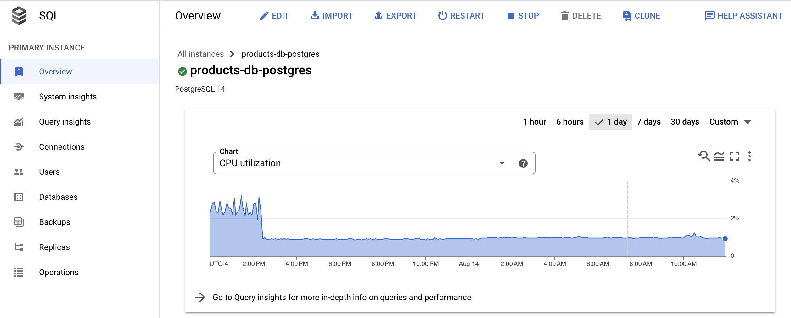
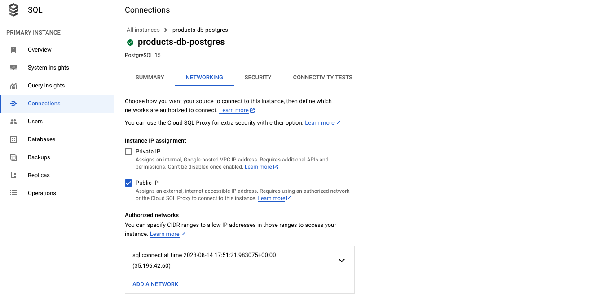
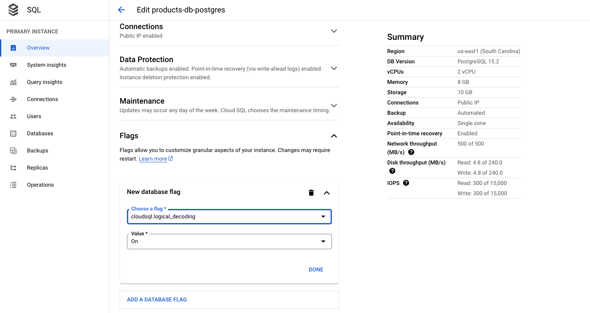

# Cloud SQL for PostgreSQL

Airbyte's certified Postgres connector offers the following features:

- Multiple methods of keeping your data fresh, including [Change Data Capture (CDC)](https://docs.airbyte.com/understanding-airbyte/cdc) and replication using the [xmin system column](https://docs.airbyte.com/integrations/sources/postgres#xmin).
- All available [sync modes](https://docs.airbyte.com/cloud/core-concepts#connection-sync-modes), providing flexibility in how data is delivered to your destination.
- Reliable replication at any table size with [checkpointing](https://docs.airbyte.com/understanding-airbyte/airbyte-protocol/#state--checkpointing) and chunking of database reads.


## Quick Start



Here is an outline of the minimum required steps to configure a connection to Postgres on Google Cloud SQL:

1. Create a dedicated read-only Postgres user with permissions for replicating data
2. Create a new Postgres source in the Airbyte UI using `xmin` system column
3. (Airbyte Cloud Only) Allow inbound traffic from Airbyte IPs

Once this is complete, you will be able to select Postgres as a source for replicating data.

#### Step 1: Create a dedicated read-only Postgres user

These steps create a dedicated read-only user for replicating data. Alternatively, you can use an existing Postgres user in your database. To create a user, first [connect to your database](https://cloud.google.com/sql/docs/postgres/connect-overview#external-connection-methods). If you are getting started, you can use [Cloud Shell to connect directly from the UI](https://cloud.google.com/sql/docs/postgres/connect-instance-cloud-shell).

The following commands will create a new user:

```roomsql
CREATE USER <user_name> PASSWORD 'your_password_here';
```

Now, provide this user with read-only access to relevant schemas and tables. Re-run this command for each schema you expect to replicate data from (e.g. `public`):

```roomsql
GRANT USAGE ON SCHEMA <schema_name> TO <user_name>;
GRANT SELECT ON ALL TABLES IN SCHEMA <schema_name> TO <user_name>;
ALTER DEFAULT PRIVILEGES IN SCHEMA <schema_name> GRANT SELECT ON TABLES TO <user_name>;
```

#### Step 2: Create a new Postgres source in Airbyte UI

From your [Airbyte Cloud](https://cloud.airbyte.com/workspaces) or Airbyte Open Source account, select `Sources` from the left navigation bar, search for `Postgres`, then create a new Postgres source.


To fill out the required information:

1. Enter the hostname, port number, and name for your Postgres database.
2. You may optionally opt to list each of the schemas you want to sync. These are case-sensitive, and multiple schemas may be entered. By default, `public` is the only selected schema.
3. Enter the username and password you created in [Step 1](#step-1-create-a-dedicated-read-only-postgres-user).
4. Select an SSL mode. You will most frequently choose `require` or `verify-ca`. Both of these always require encryption. `verify-ca` also requires certificates from your Postgres database. See here to learn about other SSL modes and SSH tunneling.
5. Select `Standard (xmin)` from available replication methods. This uses the [xmin system column](https://docs.airbyte.com/integrations/sources/postgres#xmin) to reliably replicate data from your database.
   1. If your database is particularly large (> 500 GB), you will benefit from [configuring your Postgres source using logical replication (CDC)](https://docs.airbyte.com/integrations/sources/postgres#cdc).

<!-- env:cloud -->

#### Step 3: (Airbyte Cloud Only) Allow inbound traffic from Airbyte IPs.

If you are on Airbyte Cloud, you will always need to modify your database configuration to allow inbound traffic from Airbyte IPs. To allowlist IPs in Cloud SQL:

1. In your Google Cloud SQL database dashboard, select `Connections` from the left menu. Then, select `Add Network` under the `Connectivity` section.



2. Add a new network, and enter the Airbyte's IPs, which you can find in our [Airbyte Security documentation](../../../operating-airbyte/security#network-security-1).

Now, click `Set up source` in the Airbyte UI. Airbyte will now test connecting to your database. Once this succeeds, you've configured an Airbyte Postgres source!

<!-- /env:cloud -->

## Advanced Configuration

### Setup using CDC

Airbyte uses [logical replication](https://www.postgresql.org/docs/10/logical-replication.html) of the Postgres write-ahead log (WAL) to incrementally capture deletes using a replication plugin:

- See [here](https://docs.airbyte.com/understanding-airbyte/cdc) to learn more on how Airbyte implements CDC.
- See [here](https://docs.airbyte.com/integrations/sources/postgres/postgres-troubleshooting#cdc-requirements) to learn more about Postgres CDC requirements and limitations.

We recommend configuring your Postgres source with CDC when:

- You need a record of deletions.
- You have a very large database (500 GB or more).
- Your table has a primary key but doesn't have a reasonable cursor field for incremental syncing (`updated_at`).

These are the additional steps required (after following the [quick start](#quick-start)) to configure your Postgres source using CDC:

1. Provide additional `REPLICATION` permissions to read-only user
2. Enable logical replication on your Postgres database
3. Create a replication slot on your Postgres database
4. Create publication and replication identities for each Postgres table
5. Enable CDC replication in the Airbyte UI

#### Step 1: Prepopulate your Postgres source configuration

We recommend following the steps in the [quick start](#quick-start) section to confirm that Airbyte can connect to your Postgres database prior to configuring CDC settings.

For CDC, you must connect to primary/master databases. Pointing the connector configuration to replica database hosts for CDC will lead to failures.

#### Step 2: Provide additional permissions to read-only user

To configure CDC for the Postgres source connector, grant `REPLICATION` permissions to the user created in [step 1 of the quick start](#step-1-create-a-dedicated-read-only-postgres-user):

```
ALTER USER <user_name> REPLICATION;
```

#### Step 3: Enable logical replication on your Postgres database

To enable logical replication on Cloud SQL for Postgres, set the `cloudsql.logical_decoding` flag to on. You can find the `Flags` section in the `Edit Configuration` view of your database:



#### Step 4: Create a replication slot on your Postgres database

Airbyte requires a replication slot configured only for its use. Only one source should be configured that uses this replication slot.

For this step, Airbyte requires use of the pgoutput plugin. To create a replication slot called `airbyte_slot` using pgoutput, provide the instance superuser (default `postgres`) with `REPLICATION` permissions, and run the following:

```
ALTER user postgres with REPLICATION;
SELECT pg_create_logical_replication_slot('airbyte_slot', 'pgoutput');
```

The output of this command will include the name of the replication slot to fill into the Airbyte source setup page.

#### Step 5: Create publication and replication identities for each Postgres table

For each table you want to replicate with CDC, follow the steps below:

1. Add the replication identity (the method of distinguishing between rows) for each table you want to replicate:

```
ALTER TABLE tbl1 REPLICA IDENTITY DEFAULT;
```

In rare cases, if your tables use data types that support [TOAST](https://www.postgresql.org/docs/current/storage-toast.html) or have very large field values, consider instead using replica identity type full: `
ALTER TABLE tbl1 REPLICA IDENTITY FULL;`.

2. Create the Postgres publication. You should include all tables you want to replicate as part of the publication:

```
CREATE PUBLICATION airbyte_publication FOR TABLE tbl1, tbl2, tbl3;`
```

The publication name is customizable. Refer to the [Postgres docs](https://www.postgresql.org/docs/10/sql-alterpublication.html) if you need to add or remove tables from your publication in the future.

:::note
The Airbyte UI currently allows selecting any tables for CDC. If a table is selected that is not part of the publication, it will not be replicated even though it is selected. If a table is part of the publication but does not have a replication identity, that replication identity will be created automatically on the first run if the Airbyte user has the necessary permissions.
:::

#### Step 6: Enable CDC replication in Airbyte UI

In your Postgres source, change the replication mode to `Logical Replication (CDC)`, and enter the replication slot and publication you just created.

## Postgres Replication Methods

The Postgres source currently offers 3 methods of replicating updates to your destination: CDC, xmin and standard (with a user defined cursor). See [here](https://docs.airbyte.com/integrations/sources/postgres#postgres-replication-methods) for more details.

## Connecting with SSL or SSH Tunnel

See [these instructions](https://docs.airbyte.com/integrations/sources/postgres#connecting-with-ssl-or-ssh-tunneling) to learn more about SSL modes and connecting via SSH tunnel.

## Limitations & Troubleshooting

To see connector limitations, or troubleshoot your Postgres connector, see more [in our Postgres troubleshooting guide](https://docs.airbyte.com/integrations/sources/postgres/postgres-troubleshooting).
