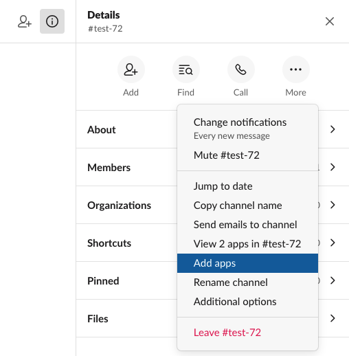

# Slack

<HideInUI>

This page contains the setup guide and reference information for the [Slack](https://www.slack.com) source connector.

</HideInUI>

## Prerequisites

OAuth or API Token (via Slack App or Legacy API Key) is required for access to Slack.

You can no longer create "Legacy" API Keys, but if you already have one, you can use it with this source. Fill it into the API key section.

We recommend creating a restricted, read-only key specifically for Airbyte access. This will allow you to control which resources Airbyte should be able to access.

Note that refresh token are entirely optional for Slack and are not required to use Airbyte. You can learn more about refresh tokens [here](https://api.slack.com/authentication/rotation).

## Setup guide

### Step 1: Set up Slack

:::info

If you are using an "legacy" Slack API, skip to the Airbyte Open Source additional setup steps section below.

:::

In order to pull data out of your Slack instance, you need to create a Slack App. This may sound daunting, but it is actually pretty straight forward. Slack supplies [documentation](https://api.slack.com/start) on how to build apps. Feel free to follow that if you want to do something fancy. We'll describe the steps we followed to creat the Slack App for this tutorial.

:::info

This tutorial assumes that you are an administrator on your slack instance. If you are not, you will need to coordinate with your administrator on the steps that require setting permissions for your app.

:::

1. Go to the [apps page](https://api.slack.com/apps)
2. Click "Create New App"
3. It will request a name and the slack instance you want to create the app for. Make sure you select the instance form which you want to pull data.
4. Completing that form will take you to the "Basic Information" page for your app.
5. Now we need to grant the correct permissions to the app. \(This is the part that requires you to be an administrator\). Go to "Permissions". Then under "Bot Token Scopes" click on "Add an OAuth Scope". We will now need to add the following scopes:

   ```text
    channels:history
    channels:join
    channels:read
    files:read
    groups:read
    links:read
    reactions:read
    remote_files:read
    team:read
    usergroups:read
    users.profile:read
    users:read
   ```

   This may look daunting, but the search functionality in the dropdown should make this part go pretty quick.

6. Scroll to the top of the page and click "Install to Workspace". This will generate a "Bot User OAuth Access Token". We will need this in a moment.
7. Now go to your slack instance. For any public channel go to info =&gt; more =&gt; add apps. In the search bar search for the name of your app. \(If using the desktop version of slack, you may need to restart Slack for it to pick up the new app\). Airbyte will only replicate messages from channels that the Slack bot has been added to.

   

8. In Airbyte, create a Slack source. The "Bot User OAuth Access Token" from the earlier should be used as the token.
9. You can now pull data from your slack instance!

<!-- env:oss -->

**Airbyte Open Source additional setup steps**

You can no longer create "Legacy" API Keys, but if you already have one, you can use it with this source. Fill it into the API key section.

We recommend creating a restricted, read-only key specifically for Airbyte access. This will allow you to control which resources Airbyte should be able to access.

<!-- /env:oss -->

### Step 2: Set up the Slack connector in Airbyte

<!-- env:cloud -->

**For Airbyte Cloud:**

1. [Log into your Airbyte Cloud](https://cloud.airbyte.com/workspaces) account.
2. In the left navigation bar, click **Sources**. In the top-right corner, click **+new source**.
3. On the Set up the source page, enter the name for the Slack connector and select **Slack** from the Source type dropdown.
4. Select `Authenticate your account` and log in and Authorize to the Slack account.
5. **Required** Enter your `start_date`.
6. **Required** Enter your `lookback_window`, which corresponds to amount of days in the past from which you want to sync data.
7. Toggle `join_channels`, if you want to join all public channels or to sync data only from channels the bot is already in. If not set, you'll need to manually add the bot to all the channels from which you'd like to sync messages.
8. Enter your `channel_filter`, this should be list of channel names (without leading '#' char) that limits the channels from which you'd like to sync. If no channels are specified, Airbyte will replicate all data.
9. Toggle `include_private_channels` if you want to sync data from private channels. You will need to manually add the bot to private channels, `join_channel` does not work with private channels.
10. Click **Set up source**.
<!-- /env:cloud -->

<!-- env:oss -->

**For Airbyte Open Source:**

1. Navigate to the Airbyte Open Source dashboard.
2. Set the name for your source.
3. **Required** Enter your `start_date`.
4. **Required** Enter your `lookback_window`, which corresponds to amount of days in the past from which you want to sync data.
5. Toggle `join_channels`, if you want to join all channels or to sync data only from channels the bot is already in. If not set, you'll need to manually add the bot to all the channels from which you'd like to sync messages.
6. Enter your `channel_filter`, this should be list of channel names (without leading '#' char) that limits the channels from which you'd like to sync. If no channels are specified, Airbyte will replicate all data.
7. Toggle `include_private_channels` if you want to sync data from private channels. You will need to manually add the bot to private channels, `join_channel` does not work with private channels.
8. Enter your `api_token`.
9. Click **Set up source**.
<!-- /env:oss -->

<HideInUI>

## Supported sync modes

The Slack source connector supports the following [sync modes](https://docs.airbyte.com/cloud/core-concepts#connection-sync-modes):

| Feature           | Supported? |
| :---------------- | :--------- |
| Full Refresh Sync | Yes        |
| Incremental Sync  | Yes        |
| Namespaces        | No         |

## Supported Streams

For most of the streams, the Slack source connector uses the [Conversations API](https://api.slack.com/docs/conversations-api) under the hood.

- [Channels \(Conversations\)](https://api.slack.com/methods/conversations.list)
- [Channel Members \(Conversation Members\)](https://api.slack.com/methods/conversations.members)
- [Messages \(Conversation History\)](https://api.slack.com/methods/conversations.history) It will only replicate messages from non-archive, public and private channels that the Slack App is a member of.
- [Users](https://api.slack.com/methods/users.list)
- [Threads \(Conversation Replies\)](https://api.slack.com/methods/conversations.replies)

## Performance considerations

The connector is restricted by normal Slack [requests limitation](https://api.slack.com/docs/rate-limits).

It is recommended to sync required channels only, this can be done by specifying config variable `channel_filter` in settings.

## Data type map

| Integration Type | Airbyte Type |
| :--------------- | :----------- |
| `string`         | `string`     |
| `number`         | `number`     |
| `array`          | `array`      |
| `object`         | `object`     |

## Limitations & Troubleshooting

<details>
<summary>
Expand to see details about Slack connector limitations and troubleshooting.
</summary>

### Connector limitations

#### Rate limiting

Slack has [rate limit restrictions](https://api.slack.com/docs/rate-limits).

### Troubleshooting

- Check out common troubleshooting issues for the Slack source connector on our Airbyte Forum [here](https://github.com/airbytehq/airbyte/discussions).

</details>

## Changelog

<details>
  <summary>Expand to review</summary>

| Version | Date       | Pull Request                                             | Subject                                                                              |
|:--------| :--------- | :------------------------------------------------------- | :----------------------------------------------------------------------------------- |
| 1.1.2   | 2024-05-23 | [38619](https://github.com/airbytehq/airbyte/pull/38619) | Fix cursor granularity for the `channel_messages` stream                             |
| 1.1.1   | 2024-05-02 | [36661](https://github.com/airbytehq/airbyte/pull/36661) | Schema descriptions                                                                  |
| 1.1.0   | 2024-04-18 | [37332](https://github.com/airbytehq/airbyte/pull/37332) | Add the capability to sync from private channels                                     |
| 1.0.0   | 2024-04-02 | [35477](https://github.com/airbytehq/airbyte/pull/35477) | Migration to low-code CDK                                                            |
| 0.4.1   | 2024-03-27 | [36579](https://github.com/airbytehq/airbyte/pull/36579) | Upgrade airbyte-cdk version to emit record counts as floats                          |
| 0.4.0   | 2024-03-19 | [36267](https://github.com/airbytehq/airbyte/pull/36267) | Pin airbyte-cdk version to `^0`                                                      |
| 0.3.9   | 2024-02-12 | [35157](https://github.com/airbytehq/airbyte/pull/35157) | Manage dependencies with Poetry                                                      |
| 0.3.8   | 2024-02-09 | [35131](https://github.com/airbytehq/airbyte/pull/35131) | Fixed the issue when `schema discovery` fails with `502` due to the platform timeout |
| 0.3.7   | 2024-01-10 | [1234](https://github.com/airbytehq/airbyte/pull/1234)   | Prepare for airbyte-lib                                                              |
| 0.3.6   | 2023-11-21 | [32707](https://github.com/airbytehq/airbyte/pull/32707) | Threads: do not use client-side record filtering                                     |
| 0.3.5   | 2023-10-19 | [31599](https://github.com/airbytehq/airbyte/pull/31599) | Base image migration: remove Dockerfile and use the python-connector-base image      |
| 0.3.4   | 2023-10-06 | [31134](https://github.com/airbytehq/airbyte/pull/31134) | Update CDK and remove non iterable return from records                               |
| 0.3.3   | 2023-09-28 | [30580](https://github.com/airbytehq/airbyte/pull/30580) | Add `bot_id` field to threads schema                                                 |
| 0.3.2   | 2023-09-20 | [30613](https://github.com/airbytehq/airbyte/pull/30613) | Set default value for channel_filters during discover                                |
| 0.3.1   | 2023-09-19 | [30570](https://github.com/airbytehq/airbyte/pull/30570) | Use default availability strategy                                                    |
| 0.3.0   | 2023-09-18 | [30521](https://github.com/airbytehq/airbyte/pull/30521) | Add unexpected fields to streams `channel_messages`, `channels`, `threads`, `users`  |
| 0.2.0   | 2023-05-24 | [26497](https://github.com/airbytehq/airbyte/pull/26497) | Fixed `lookback window` value limitations                                            |
| 0.1.26  | 2023-05-17 | [26186](https://github.com/airbytehq/airbyte/pull/26186) | Limited the `lookback window` range for input configuration                          |
| 0.1.25  | 2023-03-20 | [22889](https://github.com/airbytehq/airbyte/pull/22889) | Specified date formatting in specification                                           |
| 0.1.24  | 2023-03-20 | [24126](https://github.com/airbytehq/airbyte/pull/24126) | Increase page size to 1000                                                           |
| 0.1.23  | 2023-02-21 | [21907](https://github.com/airbytehq/airbyte/pull/21907) | Do not join channels that not gonna be synced                                        |
| 0.1.22  | 2023-01-27 | [22022](https://github.com/airbytehq/airbyte/pull/22022) | Set `AvailabilityStrategy` for streams explicitly to `None`                          |
| 0.1.21  | 2023-01-12 | [21321](https://github.com/airbytehq/airbyte/pull/21321) | Retry Timeout error                                                                  |
| 0.1.20  | 2022-12-21 | [20767](https://github.com/airbytehq/airbyte/pull/20767) | Update schema                                                                        |
| 0.1.19  | 2022-12-01 | [19970](https://github.com/airbytehq/airbyte/pull/19970) | Remove OAuth2.0 broken `refresh_token` support                                       |
| 0.1.18  | 2022-09-28 | [17315](https://github.com/airbytehq/airbyte/pull/17315) | Always install latest version of Airbyte CDK                                         |
| 0.1.17  | 2022-08-28 | [16085](https://github.com/airbytehq/airbyte/pull/16085) | Increase unit test coverage                                                          |
| 0.1.16  | 2022-08-28 | [16050](https://github.com/airbytehq/airbyte/pull/16050) | Fix SATs                                                                             |
| 0.1.15  | 2022-03-31 | [11613](https://github.com/airbytehq/airbyte/pull/11613) | Add 'channel_filter' config and improve performance                                  |
| 0.1.14  | 2022-01-26 | [9575](https://github.com/airbytehq/airbyte/pull/9575)   | Correct schema                                                                       |
| 0.1.13  | 2021-11-08 | [7499](https://github.com/airbytehq/airbyte/pull/7499)   | Remove base-python dependencies                                                      |
| 0.1.12  | 2021-10-07 | [6570](https://github.com/airbytehq/airbyte/pull/6570)   | Implement OAuth support with OAuth authenticator                                     |
| 0.1.11  | 2021-08-27 | [5830](https://github.com/airbytehq/airbyte/pull/5830)   | Fix sync operations hang forever issue                                               |
| 0.1.10  | 2021-08-27 | [5697](https://github.com/airbytehq/airbyte/pull/5697)   | Fix max retries issue                                                                |
| 0.1.9   | 2021-07-20 | [4860](https://github.com/airbytehq/airbyte/pull/4860)   | Fix reading threads issue                                                            |
| 0.1.8   | 2021-07-14 | [4683](https://github.com/airbytehq/airbyte/pull/4683)   | Add float_ts primary key                                                             |
| 0.1.7   | 2021-06-25 | [3978](https://github.com/airbytehq/airbyte/pull/3978)   | Release Slack CDK Connector                                                          |

</details>

</HideInUI>
