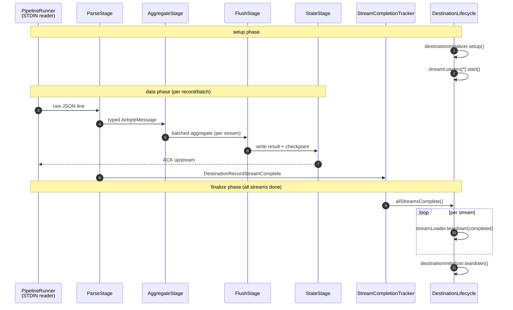

# Bulk CDK

The Bulk CDK is the Kotlin framework that every modern Airbyte destination connector is built on. It lives at [`airbyte-cdk/bulk/`](../../airbyte-cdk/bulk) and is split into three independently versioned modules: `core/base`, `core/extract`, `core/load`. Most of the work covered in this doc is in `core/load` -- the destination-side framework. The pipeline-rewrite + lifecycle work was done in summer 2025 ([#64163](https://github.com/airbytehq/airbyte/pull/64163), [#64555](https://github.com/airbytehq/airbyte/pull/64555), [#64881](https://github.com/airbytehq/airbyte/pull/64881), [#64887](https://github.com/airbytehq/airbyte/pull/64887)). The independent-SemVer-per-module migration was [#63740](https://github.com/airbytehq/airbyte/pull/63740). The 1.x major bump that surfaced an `AirbyteValueCoercer` API break landed in early 2026.

> *Quick file reference: [Appendix §8.1 -- Bulk CDK](08-appendix-key-file-paths.md#81-bulk-cdk).*

## Introduction

Before the Bulk CDK, destination connectors lived in `airbyte-cdk/java` and inherited from a deep class hierarchy that mixed framework code with connector-specific code. The Bulk CDK is a clean-slate rewrite around three principles:

1. **Composition over inheritance.** Each connector implements a few small interfaces -- `DestinationWriter`, `StreamLoader`, `AirbyteValueCoercer`, a SQL generator, a schema mapper. The framework handles the rest.
2. **One pipeline, many destinations.** The dataflow pipeline (parse → aggregate → flush → state) runs identically for every connector; what differs is the per-batch flush implementation each connector plugs in.
3. **Independent SemVer per module.** `core/base`, `core/extract`, and `core/load` each have their own `version.properties` and can be released independently, so a load-side change doesn't force every source connector to rebuild.

The framework code lives under `airbyte-cdk/bulk/core/load/src/main/kotlin/io/airbyte/cdk/load/`, organized by concern: `check`, `command`, `config`, `data`, `dataflow`, `file`, `message`, `schema`, `spec`, `state`, `table`, `test`, `util`, `write`.

## 2.1 Module Layout and Independent SemVer

The Bulk CDK is published as three Maven artifacts under group `io.airbyte.bulk-cdk` ([`airbyte-cdk/bulk/build.gradle:42`](../../airbyte-cdk/bulk/build.gradle)):

| Module | Path | Current version |
|--------|------|------|
| `core/base` | [`airbyte-cdk/bulk/core/base/`](../../airbyte-cdk/bulk/core/base) | `1.0.3` (`version.properties:1`) |
| `core/extract` | [`airbyte-cdk/bulk/core/extract/`](../../airbyte-cdk/bulk/core/extract) | `1.1.6` (`version.properties:1`) |
| `core/load` | [`airbyte-cdk/bulk/core/load/`](../../airbyte-cdk/bulk/core/load) | `1.0.11` (`version.properties:1`) |

Three independent `version.properties` files are loaded by [`airbyte-cdk/bulk/build.gradle:13-33`](../../airbyte-cdk/bulk/build.gradle). The previous scheme used a single monotonically-incrementing integer shared across base+load. Switching to SemVer-per-module ([#63740](https://github.com/airbytehq/airbyte/pull/63740)) decoupled the release cadences and made breaking changes legible: a major-version bump on `core/load` (e.g. `0.x` → `1.0`) signals that connector consumers must update.

Beyond `core/*`, the `airbyte-cdk/bulk/toolkits/` directory holds optional toolkits that connectors opt into (e.g. `load-db`, `load-object-storage`, `load-iceberg-parquet`, `legacy-task-loader`, `legacy-task-load-db`, `legacy-task-load-object-storage`). The `legacy-task-*` toolkits exist because the pre-rewrite "task-based" pipeline was kept available for connectors that hadn't migrated to the dataflow pipeline yet -- see [§6 File Transfer](06-file-transfer.md) for the canonical example.

### 2.1.1 The `AirbyteValueCoercer` 1.x bump

Shortly after the move to SemVer-per-module, a breaking change in the `AirbyteValueCoercer.coerce` signature forced `core/load` to bump from `0.x` to `1.0`. The class is at [`airbyte-cdk/bulk/core/load/src/main/kotlin/io/airbyte/cdk/load/data/AirbyteValueCoercer.kt:37`](../../airbyte-cdk/bulk/core/load/src/main/kotlin/io/airbyte/cdk/load/data/AirbyteValueCoercer.kt). The breaking change was surfaced and the load CDK bumped to `1.1.0` in a single chore commit -- it's the canonical example of "use the major-version channel to signal a contract change every consumer must absorb."

## 2.2 The Dataflow Pipeline

The destination-side data path lives in [`airbyte-cdk/bulk/core/load/src/main/kotlin/io/airbyte/cdk/load/dataflow/`](../../airbyte-cdk/bulk/core/load/src/main/kotlin/io/airbyte/cdk/load/dataflow). It replaces the older task-graph pipeline (still preserved under `toolkits/legacy-task-loader/`) with a simpler linear stage pipeline ([#64163](https://github.com/airbytehq/airbyte/pull/64163) was the original spike, [#64887](https://github.com/airbytehq/airbyte/pull/64887) added the test coverage that made it shippable).



The five pipeline stages live in [`airbyte-cdk/bulk/core/load/src/main/kotlin/io/airbyte/cdk/load/dataflow/stages/`](../../airbyte-cdk/bulk/core/load/src/main/kotlin/io/airbyte/cdk/load/dataflow/stages):

| Stage | File | Responsibility |
|-------|------|----------------|
| Parse | `ParseStage.kt` | Deserialize STDIN messages into typed `AirbyteMessage`s; route stream-complete signals to `StreamCompletionTracker` |
| Aggregate | `AggregateStage.kt` | Build per-stream aggregates (batches of records) until a size/time threshold trips |
| Flush | `FlushStage.kt` | Hand the aggregate to the per-stream `StreamLoader` to write to the destination |
| State | `StateStage.kt` | Track which checkpoints have been durably committed; emit state acks upstream |

The runner glue lives in [`airbyte-cdk/bulk/core/load/src/main/kotlin/io/airbyte/cdk/load/dataflow/pipeline/`](../../airbyte-cdk/bulk/core/load/src/main/kotlin/io/airbyte/cdk/load/dataflow/pipeline): `DataFlowPipeline.kt`, `DataFlowStage.kt`, `DataFlowStageIO.kt`, `PipelineCompletionHandler.kt`, `PipelineRunner.kt`.

Per-concern configuration lives in [`airbyte-cdk/bulk/core/load/src/main/kotlin/io/airbyte/cdk/load/dataflow/config/model/`](../../airbyte-cdk/bulk/core/load/src/main/kotlin/io/airbyte/cdk/load/dataflow/config/model): `AggregatePublishingConfig.kt`, `DataFlowSocketConfig.kt`, `LifecycleParallelismConfig.kt`, `MediumConverterConfig.kt`, `ConnectorInputStreams.kt`. There is no single `ResourceConfig` class -- resource sizing is split per concern so each can evolve independently ([#64885](https://github.com/airbytehq/airbyte/pull/64885) introduced this split).

## 2.3 The Lifecycle: setup, finalize, teardown

The framework's outermost layer is `DestinationLifecycle`, which sequences the pipeline within a setup/teardown bracket.

`DestinationLifecycle` -- [`airbyte-cdk/bulk/core/load/src/main/kotlin/io/airbyte/cdk/load/dataflow/DestinationLifecycle.kt:22`](../../airbyte-cdk/bulk/core/load/src/main/kotlin/io/airbyte/cdk/load/dataflow/DestinationLifecycle.kt). The `run()` method at line 32 executes five phases in order:

1. **Setup** -- `destinationInitializer.setup()` (create the warehouse, validate credentials, etc.).
2. **Init streams** -- for each stream in the configured catalog, instantiate a `StreamLoader` via `DestinationWriter.createStreamLoader(stream)` and call `start()`.
3. **Pipeline** -- run the dataflow pipeline until STDIN closes.
4. **Finalize individual streams** -- `finalizeIndividualStreams()` at line 82 calls `streamLoader.teardown(completionTracker.allStreamsComplete())` at line 96, **one call per stream**.
5. **Teardown destination** -- `teardownDestination()` at line 106 calls `destinationInitializer.teardown()`.

### 2.3.1 Finalization (PR [#64555](https://github.com/airbytehq/airbyte/pull/64555))

"Finalization" is the per-stream end-of-sync hook a connector uses to materialize whatever it was buffering. Each connector implements it inside `StreamLoader.teardown`. The interface is at [`airbyte-cdk/bulk/core/load/src/main/kotlin/io/airbyte/cdk/load/write/StreamLoader.kt:17`](../../airbyte-cdk/bulk/core/load/src/main/kotlin/io/airbyte/cdk/load/write/StreamLoader.kt):

```kotlin
interface StreamLoader {
    val stream: DestinationStream
    suspend fun start()
    suspend fun teardown(completedSuccessfully: Boolean)
}
```

Whether the sync completed successfully is tracked by `StreamCompletionTracker` -- [`airbyte-cdk/bulk/core/load/src/main/kotlin/io/airbyte/cdk/load/dataflow/finalization/StreamCompletionTracker.kt:15`](../../airbyte-cdk/bulk/core/load/src/main/kotlin/io/airbyte/cdk/load/dataflow/finalization/StreamCompletionTracker.kt). It exposes:

- `accept(msg: DestinationRecordStreamComplete)` -- record that a stream emitted its stream-complete signal.
- `allStreamsComplete()` -- did every expected stream finish cleanly?

`DestinationLifecycle.finalizeIndividualStreams` calls this and passes the boolean down to each `StreamLoader.teardown`, so the per-stream finalization knows whether to commit-and-drop-staging or to leave-staging-for-debugging.

### 2.3.2 Teardown semantic mismatch (a quirk to know about)

The two `teardown` entry points use **inverse boolean semantics**:

| Method | Arg name | `true` means |
|--------|----------|-------------|
| `StreamLoader.teardown(completedSuccessfully)` | `completedSuccessfully` | the stream finished cleanly |
| `DestinationWriter.teardown(hadFailure)` | `hadFailure` | the sync failed |

The destination-level signature is at [`airbyte-cdk/bulk/core/load/src/main/kotlin/io/airbyte/cdk/load/write/DestinationWriter.kt:21`](../../airbyte-cdk/bulk/core/load/src/main/kotlin/io/airbyte/cdk/load/write/DestinationWriter.kt): `suspend fun teardown(hadFailure: Boolean = false) {}`. As of today, `DestinationLifecycle.teardownDestination()` calls it with **no argument**, so the default `hadFailure = false` is always passed -- the destination-level teardown effectively can't observe failures even if a stream-level teardown saw them. This is a bug worth tracking, but the existing connectors don't rely on the destination-level boolean.

## 2.4 Direct Load Table Stream Loaders (PR [#74715](https://github.com/airbytehq/airbyte/pull/74715))

Every database destination using direct load (Postgres, Snowflake, ClickHouse, MSSQL) picks one of three pluggable `StreamLoader` strategies. All three live in [`airbyte-cdk/bulk/core/load/src/main/kotlin/io/airbyte/cdk/load/table/directload/DirectLoadTableStreamLoader.kt`](../../airbyte-cdk/bulk/core/load/src/main/kotlin/io/airbyte/cdk/load/table/directload/DirectLoadTableStreamLoader.kt):

| Class | Line | Use case |
|-------|------|----------|
| `DirectLoadTableAppendStreamLoader` | 26 | Append-only / incremental |
| `DirectLoadTableAppendTruncateStreamLoader` | 141 | Full-refresh / overwrite |
| `DirectLoadTableDedupTruncateStreamLoader` | 266 | Dedup + full-refresh (write into temp, swap into real table) |

Snowflake (see [§5.1](05-other-destinations.md#51-destination-snowflake)) wires up Append-Truncate and Dedup-Truncate ([`SnowflakeWriter.kt:16-18, 101, 113, 125`](../../airbyte-integrations/connectors/destination-snowflake/src/main/kotlin/io/airbyte/integrations/destination/snowflake/write/SnowflakeWriter.kt)). ClickHouse wires Append and Append-Truncate only ([`ClickHouseWriter.kt:13-14, 45-72`](../../airbyte-integrations/connectors/destination-clickhouse/src/main/kotlin/io/airbyte/integrations/destination/clickhouse/write/ClickHouseWriter.kt)) -- dedup is handled by ClickHouse's `ReplacingMergeTree` engine rather than by a temp-table swap, so the Dedup-Truncate loader isn't needed (see [§3.4](03-clickhouse.md#34-dedup-via-replacingmergetree-not-temp-table-swap)).

### 2.4.1 The temp-table drop fix

`DirectLoadTableDedupTruncateStreamLoader` writes the incoming batch into a temp table, runs the `MERGE` / `DELETE+INSERT` upsert against the real table, then drops the temp table. The drop was originally placed in a path that ran on every teardown, including failed runs. In failure cases, the next attempt would find the old temp table and -- depending on the connector -- either re-merge stale data (duplicates) or fail with "table already exists". [#74715](https://github.com/airbytehq/airbyte/pull/74715) moved the drop into the success branch only. Tests live at [`airbyte-cdk/bulk/core/load/src/test/kotlin/io/airbyte/cdk/load/table/directload/DirectLoadTableStreamLoaderTest.kt`](../../airbyte-cdk/bulk/core/load/src/test/kotlin/io/airbyte/cdk/load/table/directload/DirectLoadTableStreamLoaderTest.kt) (lines 42, 77, 104, 160, 199 cover drop-on-success and no-drop-on-failure).

## 2.5 `AirbyteValueCoercer`

The single class responsible for taking a typed `AirbyteValue` (after JSON deserialization + schema typing) and coercing it into whatever the destination accepts (a JDBC value, a Parquet primitive, etc.). Lives at [`airbyte-cdk/bulk/core/load/src/main/kotlin/io/airbyte/cdk/load/data/AirbyteValueCoercer.kt:37`](../../airbyte-cdk/bulk/core/load/src/main/kotlin/io/airbyte/cdk/load/data/AirbyteValueCoercer.kt) (`@Singleton`).

```kotlin
@Singleton
class AirbyteValueCoercer {
    fun coerce(value: AirbyteValue, type: AirbyteType, respectLegacyUnions: Boolean): AirbyteValue { /* ... */ }
}
```

The `respectLegacyUnions` flag is the lever for the 1.x breaking change ([§2.1.1](#211-the-airbytevaluecoercer-1x-bump)). Older connectors that expected unions to fall through to one of their member types pass `true`; new connectors that prefer strict typing pass `false`.

Per-connector coercers compose with this one rather than reimplementing it -- e.g. [`SnowflakeValueCoercer`](../../airbyte-integrations/connectors/destination-snowflake/src/main/kotlin/io/airbyte/integrations/destination/snowflake/write/transform/SnowflakeValueCoercer.kt), [`ClickhouseCoercer`](../../airbyte-integrations/connectors/destination-clickhouse/src/main/kotlin/io/airbyte/integrations/destination/clickhouse/write/transform/ClickhouseCoercer.kt), [`S3DataLakeValueCoercer`](../../airbyte-integrations/connectors/destination-s3-data-lake/src/main/kotlin/io/airbyte/integrations/destination/s3_data_lake/write/transform/S3DataLakeValueCoercer.kt).

## 2.6 Past Issues

### 2.6.1 Temp tables leaking across failed retries ([PR #74715](https://github.com/airbytehq/airbyte/pull/74715))

The most visible Bulk CDK incident in the era covered by this doc.

#### How we got there

`DirectLoadTableDedupTruncateStreamLoader` originally dropped its temp table in `teardown` unconditionally. If a sync failed after writing some rows to the temp table but before the upsert, the next attempt would either:
- Re-run the upsert against a temp table that still had stale rows from the previous attempt (silent duplicates in dedup mode).
- Fail with "temp table already exists" depending on the connector's create-temp-table SQL.

We saw both behaviors in the wild on Postgres and Snowflake. The bug was a "looks right at line-of-code level, wrong at lifecycle level" issue: the drop was where you'd expect it, but the success/failure signal wasn't being consulted.

#### What we did to fix it

1. Moved the temp-table drop into the `completedSuccessfully == true` branch of `teardown`.
2. Added two test cases in [`DirectLoadTableStreamLoaderTest.kt`](../../airbyte-cdk/bulk/core/load/src/test/kotlin/io/airbyte/cdk/load/table/directload/DirectLoadTableStreamLoaderTest.kt) -- one verifying drop-on-success, one verifying no-drop-on-failure (lines 160 and 199).
3. Bumped the load CDK and forced consumers to pick up the fix via the auto-upgrade workflow ([§7.2](07-ci-cd-tooling.md#72-auto-upgrade-certified-connectors-cdk)).

#### Lessons

- **The `completedSuccessfully` boolean is the most important signal in `StreamLoader.teardown`.** Every code path that mutates persistent destination state has to consult it.
- **Test the lifecycle, not just the SQL.** The original PR had SQL-level tests for the upsert; what was missing was a test that simulated a failure mid-teardown and asserted the temp table survived.
- **The destination-level teardown is currently always called with `hadFailure = false`** (see [§2.3.2](#232-teardown-semantic-mismatch-a-quirk-to-know-about)). Connectors should not rely on it for failure-aware cleanup -- do it stream-by-stream.

### 2.6.2 Acceptance-test re-enabling churn (ClickHouse / Postgres rewrites)

Across the ClickHouse and Postgres migrations, the standard pattern was to disable nearly every acceptance test at the start of the rewrite, then re-enable them one-by-one as features came online. This produced ~30 small "re-enable test X" PRs per connector ([#61509](https://github.com/airbytehq/airbyte/pull/61509), [#61515](https://github.com/airbytehq/airbyte/pull/61515), [#61519](https://github.com/airbytehq/airbyte/pull/61519), [#61728](https://github.com/airbytehq/airbyte/pull/61728), [#61734](https://github.com/airbytehq/airbyte/pull/61734), [#61735](https://github.com/airbytehq/airbyte/pull/61735) on ClickHouse; [#68142](https://github.com/airbytehq/airbyte/pull/68142), [#68151](https://github.com/airbytehq/airbyte/pull/68151), [#69086](https://github.com/airbytehq/airbyte/pull/69086) on Postgres). The volume of PRs made it hard to tell from `git log` whether the connector was making progress or thrashing. The lesson, captured in the Redshift migration plan ([§5.4](05-other-destinations.md#54-destination-redshift-migration-plan)), is to **track progress via a checklist that lists every test by name and its enable/disable status**, not by counting merged PRs.

## 2.7 Potential Improvements

### 2.7.1 Surface the destination-level failure signal

**Current:** `DestinationLifecycle.teardownDestination()` calls `destinationInitializer.teardown()` with no argument, defaulting `hadFailure` to `false`. No connector can act on a destination-wide failure during teardown (e.g. mark a warehouse-level token as suspect, drop a transient schema).

**With a propagated signal:** Pass a destination-wide success/failure boolean -- derived from `streamLoaders.all { it.lastTeardownSucceeded }` or the pipeline's overall outcome -- into `destinationInitializer.teardown`. Connectors could then implement destination-level cleanup (e.g. drop a per-sync schema only if every stream finished cleanly).

Concretely: change `DestinationWriter.teardown(hadFailure: Boolean = false)` to `teardown(hadFailure: Boolean)` (drop the default), thread the value through `DestinationLifecycle`, and add a test that asserts a synthetic failure propagates.

### 2.7.2 Promote the file-transfer toolkit to the dataflow pipeline

**Current:** File transfer lives only in [`airbyte-cdk/bulk/toolkits/legacy-task-loader/`](../../airbyte-cdk/bulk/toolkits/legacy-task-loader) ([§6](06-file-transfer.md)). Connectors that want to use file transfer have to consume the legacy task-based pipeline rather than the modern dataflow pipeline.

**With a port to `core/load/dataflow/`:** Add `DestinationFile` handling to `ParseStage` and a corresponding `FileFlushStage`, so file-mode is a first-class citizen of the new pipeline. The migration is non-trivial because the legacy file-transfer queue is bookkeeping-heavy ([`PipelineEventBookkeepingRouter.kt`](../../airbyte-cdk/bulk/toolkits/legacy-task-loader/src/main/kotlin/io/airbyte/cdk/load/state/PipelineEventBookkeepingRouter.kt)), but unifying the two pipelines would let us delete `legacy-task-loader` and `legacy-task-load-object-storage` entirely.

### 2.7.3 Reduce `version.properties` toil

**Current:** Three modules, three `version.properties` files, and every PR touching CDK source has to bump the right one or CI fails. PRs that touch multiple modules sometimes need three bumps, and the test-only escape hatch (`#64913`) is a useful relief valve, but the manual-edit step is friction.

**With a generated/auto-bumped version:** Have the CI infer the bump kind from the diff -- patch for additive non-API changes, minor for new API, major for signature breaks -- and emit the bump as part of the PR rather than asking the author to choose. This is a long-term direction; the short-term improvement is clearer documentation of "which module owns which classes" so PR authors don't bump the wrong file.

Pragmatic note: none of these are "drop everything and rewrite" recommendations. They are the patterns I'd reach for first the next time we revisit this area.

---

[Back to Index](../../KNOWLEDGE-TRANSFER.md)
