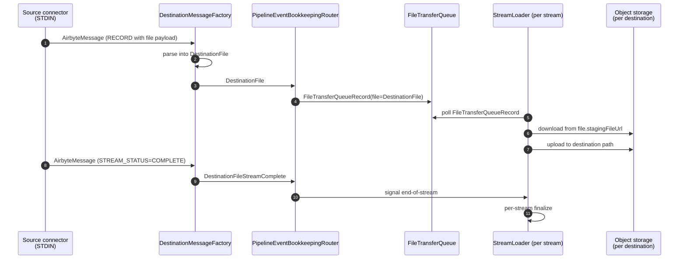

# File Transfer

File transfer is the destination-side path for moving raw files (not records) through the replication pipeline. A source emits `RECORD` messages with a `file` payload pointing at a staging URL; the destination downloads the file and writes it to the user's storage. The work landed across roughly nine PRs in late 2024 / early 2025 ([#48308](https://github.com/airbytehq/airbyte/pull/48308), [#48385](https://github.com/airbytehq/airbyte/pull/48385), [#48468](https://github.com/airbytehq/airbyte/pull/48468), [#48598](https://github.com/airbytehq/airbyte/pull/48598), [#48622](https://github.com/airbytehq/airbyte/pull/48622), [#48692](https://github.com/airbytehq/airbyte/pull/48692), [#48727](https://github.com/airbytehq/airbyte/pull/48727), [#49931](https://github.com/airbytehq/airbyte/pull/49931), [#50961](https://github.com/airbytehq/airbyte/pull/50961)).

> *Quick file reference: [Appendix §8.5 -- File Transfer](08-appendix-key-file-paths.md#85-file-transfer).*

## Introduction

The destination-side of file transfer was added to the Bulk CDK before the dataflow-pipeline rewrite ([§2.2](02-bulk-cdk.md#22-the-dataflow-pipeline)). As of today, **file transfer lives only in the `legacy-task-loader` toolkit** -- it has not yet been ported to `core/load/dataflow/`. Two consequences flow from this:

1. Destinations that want to use file transfer have to consume the legacy task-based pipeline (the `legacy-task-load-*` toolkits).
2. The path from `RECORD(file=...)` on STDIN to the destination's file-write hook is bookkeeping-heavy. It's correct but it isn't the same shape as the record-mode dataflow.

The unification is a tracked improvement ([§6.4.1](#641-port-to-the-dataflow-pipeline)) but is not in scope for the doc as of writing.

## 6.1 The `DestinationFile` message

The message is `DestinationFile`, defined at [`airbyte-cdk/bulk/toolkits/legacy-task-loader/src/main/kotlin/io/airbyte/cdk/load/message/DestinationMessage.kt:357`](../../airbyte-cdk/bulk/toolkits/legacy-task-loader/src/main/kotlin/io/airbyte/cdk/load/message/DestinationMessage.kt). (The class name in the existing summary as "`DestinationFileMessage`" is wrong; the actual class is `DestinationFile` and the inner protocol message it wraps is `AirbyteRecordMessageFile`.)

```kotlin
data class DestinationFile(
    override val stream: DestinationStream,
    val emittedAtMs: Long,
    val fileMessage: AirbyteRecordMessageFile
) : DestinationFileDomainMessage {
    // ...
}
```

The inner `AirbyteRecordMessageFile` has five JSON-mapped fields:

| Field | JSON key | Meaning |
|-------|----------|---------|
| `fileUrl` | `file_url` | The staging URL where the source put the file (typically S3 or local volume) |
| `bytes` | `bytes` | File size in bytes |
| `fileRelativePath` | `file_relative_path` | Path relative to a per-stream root, used by the destination to construct the final filename |
| `modified` | `modified` | Source-side modification timestamp |
| `sourceFileUrl` | `source_file_url` | The original URL on the source side (for provenance) |

A separate `DestinationFileStreamComplete` at [line 464](../../airbyte-cdk/bulk/toolkits/legacy-task-loader/src/main/kotlin/io/airbyte/cdk/load/message/DestinationMessage.kt) parallels `DestinationRecordStreamComplete` -- it signals "no more files for this stream", which the destination uses to commit any per-stream finalization (e.g. write a manifest).

The sealed interface that file messages implement is `DestinationFileDomainMessage` at [line 71](../../airbyte-cdk/bulk/toolkits/legacy-task-loader/src/main/kotlin/io/airbyte/cdk/load/message/DestinationMessage.kt).

There is also a separate `FileReference` data class at [line 342](../../airbyte-cdk/bulk/toolkits/legacy-task-loader/src/main/kotlin/io/airbyte/cdk/load/message/DestinationMessage.kt) used in `RECORD` messages that *reference* a file rather than being the file payload themselves -- this is for record-mode connectors that want to pin one column to a file URL without switching the whole stream to file mode.

## 6.2 How a file flows through the legacy pipeline



The router that coordinates this is `PipelineEventBookkeepingRouter` at [`airbyte-cdk/bulk/toolkits/legacy-task-loader/src/main/kotlin/io/airbyte/cdk/load/state/PipelineEventBookkeepingRouter.kt`](../../airbyte-cdk/bulk/toolkits/legacy-task-loader/src/main/kotlin/io/airbyte/cdk/load/state/PipelineEventBookkeepingRouter.kt) (key lines: 14-21 for the routing types, 66 for the file-mode dispatch, 135-145 for queue insertion, 297 for the stream-complete handling). The queue type itself is `FileTransferQueueMessage`, defined at [`FileTransferQueueMessageLegacy.kt:11`](../../airbyte-cdk/bulk/toolkits/legacy-task-loader/src/main/kotlin/io/airbyte/cdk/load/message/FileTransferQueueMessageLegacy.kt) -- the carrier is `FileTransferQueueRecord(file: DestinationFile)` at line 17.

For object-storage destinations specifically, the file-write logic lives in `FilePartAccumulatorLegacy` at [`airbyte-cdk/bulk/toolkits/legacy-task-load-object-storage/src/main/kotlin/io/airbyte/cdk/load/write/object_storage/FilePartAccumulatorLegacy.kt:41`](../../airbyte-cdk/bulk/toolkits/legacy-task-load-object-storage/src/main/kotlin/io/airbyte/cdk/load/write/object_storage/FilePartAccumulatorLegacy.kt), which handles multipart upload assembly for the destination-side upload.

## 6.3 Enabling file transfer in a connector

File transfer is **opt-in per destination** via a Micronaut property. The flag is:

```yaml
airbyte:
  destination:
    core:
      file-transfer:
        enabled: true
```

Set in a connector's `application.yaml` (per [#48385](https://github.com/airbytehq/airbyte/pull/48385)). For test fixtures, the same flag is reachable as a boolean kwarg `useFileTransfer: Boolean` on `IntegrationTest`, `DestinationProcess`, `DockerizedDestination`, `NonDockerizedDestination` (both in the `core/load` test fixtures and the `legacy-task-loader` test fixtures). Default is `false` -- connectors that haven't opted in will silently ignore file payloads.

## 6.4 Past Issues

### 6.4.1 File delete on overwrite ([PR #48622](https://github.com/airbytehq/airbyte/pull/48622))

#### How we got there

The initial file-transfer implementation didn't delete files from the destination on overwrite-mode syncs. Users running a full refresh against an object-storage destination ended up with the *union* of the previous and current sync's files, with no obvious way to tell them apart. The bug came from treating files like records -- records-in-overwrite are wiped by table-level truncate at the destination; files have no analogous primitive.

#### What we did to fix it

1. Added an explicit "list and delete previous files" step at the start of an overwrite sync.
2. Scoped the delete by generation_id stamped on the destination-side path, so concurrent syncs (different generations) don't delete each other's files.
3. Re-enabled the file-related DAT (Destination Acceptance Test) suite ([#48727](https://github.com/airbytehq/airbyte/pull/48727)) which surfaced the original bug.

#### Lessons

- **File-mode is not record-mode-with-bigger-payloads.** Overwrite semantics need explicit per-mode design rather than reusing the table-truncate primitive.
- **DAT acceptance tests catch real issues only when they're enabled.** The fix here was as much "re-enable the test that already existed" as "write new test logic."

### 6.4.2 Initial integration testing gaps ([PR #48692](https://github.com/airbytehq/airbyte/pull/48692))

The first cut of file-transfer integration tests existed but ran only in single-record / single-file scenarios. They missed: large files (which exercise the multipart upload path in `FilePartAccumulatorLegacy`); files larger than memory; and concurrent multi-stream file flows. [#48692](https://github.com/airbytehq/airbyte/pull/48692) added these scenarios to the integration suite. No customer-visible incident, but a category of bugs we would have shipped without it.

The lesson: when adding a new pipeline mode, the integration test suite has to cover **size**, **count**, and **concurrency** independently; testing only one dimension at a time leaves gaps that aren't visible in PR review.

## 6.5 Potential Improvements

### 6.5.1 Port to the dataflow pipeline

**Current:** File transfer lives entirely under `legacy-task-loader` and `legacy-task-load-object-storage`. Destinations that use file transfer have to consume the legacy task-based pipeline; they can't use the modern dataflow pipeline at [`airbyte-cdk/bulk/core/load/src/main/kotlin/io/airbyte/cdk/load/dataflow/`](../../airbyte-cdk/bulk/core/load/src/main/kotlin/io/airbyte/cdk/load/dataflow/).

**With a port:** Add `DestinationFile` handling to `ParseStage` and a `FileFlushStage` to the dataflow pipeline; route via `FlushStage` for record streams and `FileFlushStage` for file streams. The migration is non-trivial because `PipelineEventBookkeepingRouter` is the bookkeeping heart of file transfer and has no dataflow-pipeline analog yet. Once ported, the `legacy-task-loader` and `legacy-task-load-object-storage` toolkits can be deleted in their entirety.

### 6.5.2 First-class file-reference column type

**Current:** `FileReference` ([§6.1](#61-the-destinationfile-message)) exists as a domain class but isn't a first-class `AirbyteType` -- columns that hold file URLs are typed as `string` in the catalog. Destinations have no way to tell a "this is a real string" from a "this is a file URL we should download."

**With a type:** Add `FileReferenceType` to the AirbyteType hierarchy, surface it in the source-side catalog, and let destinations choose to materialize it as a downloaded file rather than a literal URL. This is a protocol-level change and would need source-side coordination.

### 6.5.3 Drop the dual `useFileTransfer` test plumbing

**Current:** The test-fixture `useFileTransfer: Boolean` flag exists in both `core/load`'s test fixtures **and** `legacy-task-loader`'s test fixtures. New tests sometimes set the flag on one but not the other and end up running in record-mode by accident.

**With unification:** After the dataflow-pipeline port ([§6.5.1](#651-port-to-the-dataflow-pipeline)), there is one set of test fixtures, one flag, and no ambiguity. Until then, the simplest improvement is to make the legacy test-fixture flag a forwarder to the modern one (and rip out the duplicate code paths).

Pragmatic note: §6.5.1 is the biggest improvement but the biggest investment -- multiple weeks of work. §6.5.2 only pays off with source-side cooperation and is the kind of change that needs a design RFC first. §6.5.3 is small and self-contained; do it next time someone touches the area.

---

[Back to Index](../../KNOWLEDGE-TRANSFER.md)
