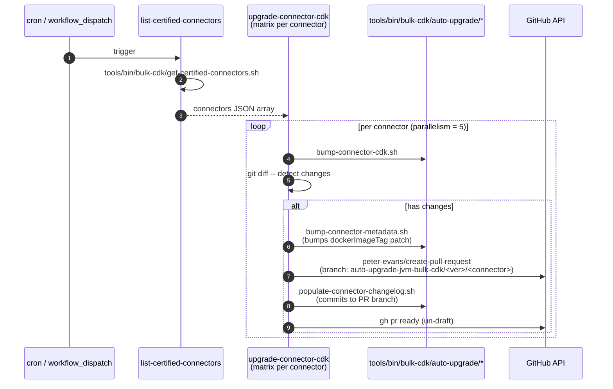

# CI/CD Tooling

The Bulk CDK ships independent SemVer modules ([§2.1](02-bulk-cdk.md#21-module-layout-and-independent-semver)); the connectors that consume it ship their own docker tags. The CI/CD tooling described here automates the cross-cutting parts of that release model: enforcing that CDK source changes are paired with a version bump, scheduling automated CDK upgrades into every certified connector, and bumping connector dependencies for security advisories. The work shipped between April and August 2025 ([#58118](https://github.com/airbytehq/airbyte/pull/58118), [#58125](https://github.com/airbytehq/airbyte/pull/58125), [#58126](https://github.com/airbytehq/airbyte/pull/58126), [#58604](https://github.com/airbytehq/airbyte/pull/58604), [#58648](https://github.com/airbytehq/airbyte/pull/58648), [#59206](https://github.com/airbytehq/airbyte/pull/59206), [#62482](https://github.com/airbytehq/airbyte/pull/62482), [#64913](https://github.com/airbytehq/airbyte/pull/64913)) with continued maintenance into 2026.

> *Quick file reference: [Appendix §8.6 -- CI/CD Tooling](08-appendix-key-file-paths.md#86-cicd-tooling).*

## Introduction

Before this set of workflows, the loop "the CDK shipped a new version → every connector picks it up" was manual. A maintainer ran a script locally, opened a few dozen PRs by hand, and merged them as time allowed. The connectors that needed the new CDK most urgently were typically the slowest to pick it up because everyone else was waiting for someone to do the toil. The workflows here collapse that loop into a single scheduled run.

Two distinct sets of workflows handle the CDK lifecycle:

1. **Per-module CDK version-bump enforcement** -- if you touch CDK source code in a PR, you must also bump the matching `version.properties`, or CI fails. ([§7.1](#71-per-module-cdk-version-bump-enforcement))
2. **Scheduled auto-upgrade of certified connectors** -- once a month, scan certified connectors, open a PR to bump each one to the latest published Bulk CDK. ([§7.2](#72-auto-upgrade-certified-connectors-cdk))

Beyond these, several support workflows exist for ad-hoc bumps via slash command ([§7.3](#73-slash-command-driven-bumps)) and a "test-only changes" escape hatch ([§7.4](#74-test-only-changes-escape-hatch)).

## 7.1 Per-module CDK version-bump enforcement

The Bulk CDK has three modules with independent SemVer ([§2.1](02-bulk-cdk.md#21-module-layout-and-independent-semver)); each has its own `version.properties`. The enforcement workflow is in [`.github/workflows/java-cdk-tests.yml`](../../.github/workflows/java-cdk-tests.yml). It runs on every PR and has two jobs that matter here:

| Job | Lines | Role |
|-----|-------|------|
| `changes-in-bulk-cdk-packages` | 44-69 | Use `dorny/paths-filter` to detect which of `base`, `extract`, `load` had source-file changes |
| `run-check-bulk-cdk-version` | 71-118 | For each module that changed, run the corresponding Gradle task (`:airbyte-cdk:bulk:checkBaseVersion`, `:checkExtractVersion`, `:checkLoadVersion`) |
| `bulk-cdk-version-check-result` | 151 | Aggregate the three sub-checks into a single required check that branch-protection can gate on |

The paths-filter (line 59) is the key piece -- it scopes detection to the right module:

```yaml
base:    - 'airbyte-cdk/bulk/core/base/**'
extract: - 'airbyte-cdk/bulk/core/extract/**'
         - 'airbyte-cdk/bulk/toolkits/extract-*/**'
         - 'airbyte-cdk/bulk/toolkits/*source*/**'
load:    - 'airbyte-cdk/bulk/core/load/**'
         - 'airbyte-cdk/bulk/toolkits/load-*/**'
         - 'airbyte-cdk/bulk/toolkits/legacy-task-load*/**'
```

A PR that touches `airbyte-cdk/bulk/core/load/` but doesn't bump `airbyte-cdk/bulk/core/load/version.properties` fails the `checkLoadVersion` job. The Gradle task compares the local `version.properties` to the latest version published to Maven; if they match, it fails.

The "what should I bump?" question is up to the author -- `version.properties` is a single string and the workflow doesn't enforce SemVer rules (e.g. it doesn't reject a patch bump for a breaking API change). That's a tradeoff: a stricter check would require static analysis of every PR's Kotlin diff, which is expensive. In practice, code review catches semver violations and the `AirbyteValueCoercer` 1.x bump ([§2.1.1](02-bulk-cdk.md#211-the-airbytevaluecoercer-1x-bump)) is the kind of major signal that gets attention regardless of automation.

## 7.2 Auto-upgrade certified connectors CDK

Workflow: [`.github/workflows/auto-upgrade-certified-connectors-cdk.yml`](../../.github/workflows/auto-upgrade-certified-connectors-cdk.yml). Scheduled at `cron: "37 16 1 * *"` (16:37 UTC on the first of every month, line 5). Also callable on-demand via `workflow_dispatch` and `workflow_call` (so the enterprise repo can invoke it on its own connectors).



The matrix fans out across every certified connector ([`auto-upgrade-certified-connectors-cdk.yml:44`](../../.github/workflows/auto-upgrade-certified-connectors-cdk.yml)), capped at 5 in parallel (`max-parallel: 5`, line 46) to avoid blowing through GitHub API rate limits. `fail-fast: false` means one connector's failure does not abort the others.

For each connector:

1. **Compute the upgrade** -- the per-connector upgrade script reads the connector's current Bulk CDK version, compares it to the latest published, and writes the new version into the connector's Gradle file.
2. **Detect changes** (lines 95-103) -- `git diff --quiet`; skip if nothing changed.
3. **Bump connector version** (lines 105-112) -- run [`tools/bin/bulk-cdk/auto-upgrade/bump-connector-metadata.sh`](../../tools/bin/bulk-cdk/auto-upgrade/bump-connector-metadata.sh) (line 110) to patch-bump the connector's `dockerImageTag` in `metadata.yaml`.
4. **Create a draft PR** (lines 114-136) -- branch name `auto-upgrade-jvm-bulk-cdk/<new_cdk_version>/<connector>` (line 121). The PR is created as a draft because the changelog hasn't been written yet.
5. **Write the changelog** (lines 138-156) -- run [`populate-connector-changelog.sh`](../../tools/bin/bulk-cdk/auto-upgrade/populate-connector-changelog.sh) with the connector name, new version, PR number, and message "Upgrade to Bulk CDK <ver>." Commit and push to the PR branch.
6. **Un-draft** (lines 159-163) -- `gh pr ready <pr-number>`.

The deliberate "draft → push changelog commit → un-draft" sequence prevents code review from happening on a PR that's still missing the changelog -- a class of "looks fine, ship it" mistakes that bit us early on.

The `airbyte-enterprise` branch (line 141 check) is the same workflow run by the internal-cloud repo against its own connectors; the changelog step is skipped there because the enterprise repo doesn't maintain user-facing changelogs.

## 7.3 Slash-command-driven bumps

Two on-demand workflows complement the scheduled flow:

| Workflow | Trigger | Purpose |
|----------|---------|---------|
| [`bump-version-command.yml`](../../.github/workflows/bump-version-command.yml) | `workflow_dispatch` + `/bump-version <connector> <bump-type>` comment | Patch/minor/major bump for a single connector |
| [`update-connector-cdk-version-command.yml`](../../.github/workflows/update-connector-cdk-version-command.yml) | `/update-connector-cdk-version <connector>` comment | Bump the Bulk CDK reference for a single connector |

These are useful for two scenarios the scheduled flow doesn't cover:
- **Security advisories** -- bumping a single connector ahead of the monthly schedule (e.g. [#72973](https://github.com/airbytehq/airbyte/pull/72973), [#72975](https://github.com/airbytehq/airbyte/pull/72975) for CVE fixes to `destination-customer-io` and `destination-hubspot`).
- **One-off contributor bumps** -- a contributor can run the slash command without needing local repo access.

The dispatcher that converts slash-command comments into workflow calls is [`slash-commands.yml`](../../.github/workflows/slash-commands.yml).

## 7.4 Test-only-changes escape hatch ([PR #64913](https://github.com/airbytehq/airbyte/pull/64913))

The version-bump enforcement in [§7.1](#71-per-module-cdk-version-bump-enforcement) is intentionally strict: any change to the matched paths forces a `version.properties` bump. But not every change ships. A PR that only adds tests (no production code change) shouldn't force a bump, because shipping `version.properties` from a test-only PR triggers a Maven publish that doesn't ship any new behavior.

[#64913](https://github.com/airbytehq/airbyte/pull/64913) added the escape hatch: if every changed file in the relevant module is under `src/test/` or `src/testFixtures/`, the version check is skipped. Implementation lives in the `:airbyte-cdk:bulk:checkBaseVersion` (and Extract/Load) Gradle tasks rather than in the workflow YAML, so the same rule applies whether the check runs in CI or locally.

The tradeoff is that a test-only PR can ship without a published Maven artifact -- which is exactly the desired behavior, but it also means consumers can't pick up the new test fixtures via a Maven coordinate until a real bump happens. In practice this is fine because consumers reach for the test fixtures by source-set dependency, not by version.

## 7.5 Skip missing connectors ([PR #62482](https://github.com/airbytehq/airbyte/pull/62482))

The CDK compatibility test ([`cdk-destination-connector-compatibility-test.yml`](../../.github/workflows/cdk-destination-connector-compatibility-test.yml)) and the auto-upgrade workflow ([§7.2](#72-auto-upgrade-certified-connectors-cdk)) both enumerate connectors from a static list (`tools/bin/bulk-cdk/get-certified-connectors.sh`). Before [#62482](https://github.com/airbytehq/airbyte/pull/62482), if the list contained a connector that had been deleted or renamed, the workflow failed at "directory does not exist" and aborted the entire matrix.

The fix: when a connector listed but-not-found is detected, skip it with a warning and continue. This is the kind of defensive engineering that you don't notice working but you do notice missing: a single stale entry in `get-certified-connectors.sh` used to take out a monthly run.

## 7.6 Past Issues

### 7.6.1 The empty action / workflow dispatcher missteps ([PRs #58118](https://github.com/airbytehq/airbyte/pull/58118), [#58604](https://github.com/airbytehq/airbyte/pull/58604))

#### How we got there

Early iterations of the auto-upgrade workflow used a custom "empty action" pattern -- a no-op composite action whose only job was to be addressable from `workflow_dispatch`. The pattern was clever but obscure: someone reading the workflow couldn't tell where the actual work happened. We tried two iterations of the dispatcher before settling on the current shape ([§7.3](#73-slash-command-driven-bumps)).

#### What we did to fix it

1. Replaced the empty-action pattern with a straightforward `workflow_dispatch` + `workflow_call` combination on the actual workflow.
2. Centralized all slash-command routing in `slash-commands.yml`, which is the single place a reader has to look to understand "what does `/<command>` do".
3. Renamed the workflow in [#59206](https://github.com/airbytehq/airbyte/pull/59206) to match its current behavior (the original name predated the rework).

#### Lessons

- **Workflow indirection is expensive to read.** Even when it's technically correct, a chain of three "dispatcher → empty action → real workflow" hops is hostile to the next person.
- **Name the workflow after what it does, not when it was added.** "v2" / "new" / "improved" in workflow filenames ages badly.

### 7.6.2 Static connector list staleness ([PR #62482](https://github.com/airbytehq/airbyte/pull/62482) -- covered in [§7.5](#75-skip-missing-connectors-pr-62482))

Same story as [§7.5](#75-skip-missing-connectors-pr-62482); not repeated here. The general lesson: any workflow whose input is a static list needs a "gracefully skip missing entries" code path, because the list will drift from reality on its own.

## 7.7 Potential Improvements

### 7.7.1 Compute the list of certified connectors dynamically

**Current:** [`tools/bin/bulk-cdk/get-certified-connectors.sh`](../../tools/bin/bulk-cdk/get-certified-connectors.sh) is a script that walks `airbyte-integrations/connectors/*/metadata.yaml` and filters by `ab_internal.sl >= 200`. It works, but the script lives in `tools/bin/` and the metadata convention lives in the connector dir, so the link is invisible.

**With a Gradle task:** Expose the same query as `./gradlew listCertifiedConnectors` (returning JSON). The workflow shells out to Gradle. The advantage is that the rule lives next to the connector code; the cost is that Gradle startup is slower than a shell script.

### 7.7.2 Auto-categorize the version bump (patch / minor / major)

**Current:** [§7.1](#71-per-module-cdk-version-bump-enforcement) accepts any bump as long as the file changed. A PR that adds a breaking API change and only patch-bumps will pass CI.

**With a heuristic:** Use a Kotlin source analyzer (e.g. `revapi`, `metalava`) to detect public-API signature changes between HEAD and the latest published Maven artifact. Map the detected change to a minimum bump requirement and enforce it. The cost is the analyzer dependency and a non-trivial config surface; the benefit is automatic enforcement of the SemVer contract the project already aspires to.

### 7.7.3 Replace the `peter-evans/create-pull-request` step with a thinner action

**Current:** [§7.2](#72-auto-upgrade-certified-connectors-cdk) uses a popular third-party action for PR creation. It works but does a lot of magic (auto-stashes uncommitted changes, auto-creates a branch, auto-detects "no changes"). Some of that magic surprised us during the early rollout.

**With `gh pr create`:** Wrap `git checkout -b ... && git commit && git push && gh pr create` directly. Slightly more verbose, much more transparent. Worth doing if we ever debug another auto-upgrade outage that traces back to action behavior.

Pragmatic note: §7.7.1 is mostly a refactor; §7.7.2 is a real capability improvement but a real investment; §7.7.3 is the kind of fix you make after one bad outage, not before.

---

[Back to Index](../../KNOWLEDGE-TRANSFER.md)
