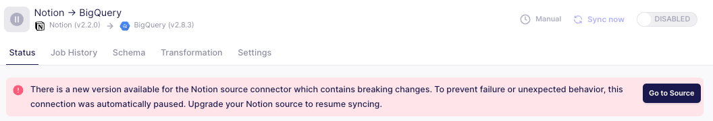

# Managing Connector Updates in Airbyte

While maintaining an Airbyte instance, you'll need to manage connector updates. These are essential for improved functionality, reliability, and compatibility over time. Our team and community contributors are dedicated to maintaining up-to-date connectors. Reasons for updates can be broadly categorized into bug fixes, new features, and changes that impact the user experience or the functionality of the connector.

The issue of compatibility is important in maintaining connectors because as various APIs and databases you're syncing with Airbyte evolve over time, we must review the connectors for compatibility with those changes. Sometimes, this kind of update introduces a breaking change. Without making the changes necessary for an update of this type, your connection will eventually stop working because it will be incompatible with the source or destination API.

This guide helps you understand the types of updates you may see, their impact on your Airbyte environment, and the actions you may need to take in response to certain types of updates.

## Understanding Connector Versions 
To manage connection updates effectively, it's important to understand versioning and how to interpret the changelog entries. 

Every connector in Airbyte's catalog follows semantic versioning ([semver](https://semver.org/))
Major.Minor.Patch (e.g., 1.2.5)

A connector reaching version 1.0 is considered mature and comes with semver guarantees. 

* **Patch updates (1.0.x):** These typically contain bug fixes and small improvements that won't affect your existing configurations.
* **Minor updates (1.x.0):** These might introduce new features like streams or properties, but they are designed to be fully backward compatible with your existing setup.
* **Major updates (x.0.0):** These are significant changes that may require you to adjust your configurations. We'll discuss this in more detail below.

Each connector's changelog details its update history. You can find it in the [connector catalog](../integrations/) at the end of each individual connector's entry.

<Arcade id="vMZISMWeitH8X7kT1ArF" title="Review a Connector Changelog" paddingBottom="calc(61.37931034482759% + 41px)" />

## How Airbyte Handles Connector Updates

### Airbyte Cloud
**Minor and Patch Updates:** These are applied automatically and immediately to your instance. You don't need to take any action.

**Major Updates:** These are opt-in during a specified timeframe to give you a window to prepare for the change. Airbyte will alert you of a new major version that includes a breaking change, but continue to sync until the cutoff date for upgrade. If you choose not to opt-in by the deadline, any syncs using the affected connector will be paused to prevent compatibility issues. Examples of major version changes are listed in our [breaking change documentation]./using-airbyte/schema-change-management#resolving-breaking-changes)

Updates involving a breaking change will be called out in the UI. The example below shows a prompt that you might see if a connector has passed its cutoff date for upgrade. 

## Airbyte Open Source (OSS) and Self-Managed Enterprise (SME)

Airbyte recommends using an updated version of Airbyte when updating connections. 

**All Updates (Major, Minor, Patch):** These are opt-in via the settings page. You'll see a badge in the sidebar indicating available updates.

**Minor and Patch Updates:** Once you opt-in, these are applied immediately and globally to all connectors of that type in your instance.

**Major Updates:** These require a two-step opt-in process:
1. Opt-in to the update on the settings page.

2. While there is an option available to upgrade all connections at once, we recommend that you accept the update for each individual connection using the affected connector. This allows you to review and potentially adjust the connection settings before applying the update.

<Arcade id="WfelDcLx6EivqngiTlFR" title="Settings > Connector Upgrade Prompts" paddingBottom="calc(61.37931034482759% + 41px)" />

Note that in an Airbyte Open Source or Self-Managed Enterprise instance, syncs are not automatically paused. This differs from what you would see in Airbyte Cloud. Although syncs will not be paused if you miss the deadline for a major update, we recommended you update promptly to avoid potential compatibility issues.

## Actions to Take in Response to Connector Updates

### Review the Changelog: 
Before applying any update, carefully review the changelog to understand the changes and their potential impact on your existing connections. You can find the changelog for any connector by navigating to the bottom of the documentation for the connector and expanding the view. 

### Plan for Major Updates: 
Major updates may require you to adjust connection settings or even make changes to your data pipelines. Be sure to allocate time and resources for this.

:::info
Important Note: Airbyte provides tooling that guarantees safe connector version bumps and enforces automated version bumps for minor and patch updates.  You will always need to manually update for major version bumps.
:::