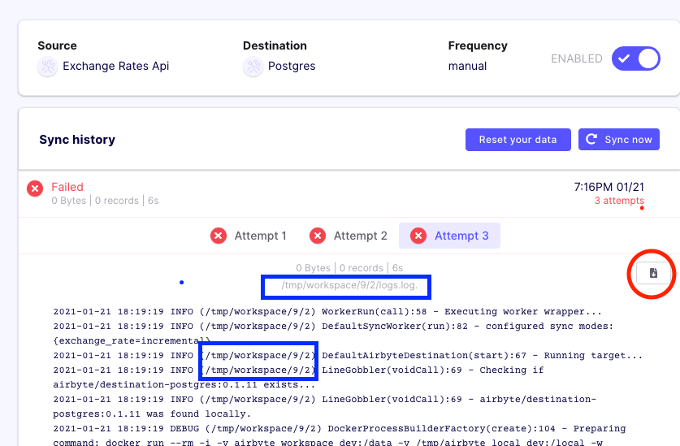

# Browsing Output Logs

## Overview

This tutorial will describe how to explore Airbyte Workspace folders.

This is useful if you need to browse the docker volumes where extra output files of Airbyte server and workers are stored since they may not be accessible through the UI.

## Exploring the Logs folders

When running a Sync in Airbyte, you have the option to look at the logs in the UI as shown next.

### Identifying Workspace IDs

In the screenshot below, you can notice the highlighted blue boxes are showing the id numbers that were used for the selected "Attempt" for this sync job.

In this case, the job was running in `/tmp/workspace/9/2/` folder since the tab of the third attempt is being selected in the UI \(first attempt would be `/tmp/workspace/9/0/`\).



The highlighted button in the red circle on the right would allow you to download the logs.log file.  
However, there are actually more files being recorded in the same workspace folder... Thus, we might want to dive deeper to explore these folders and gain a better understanding of what is being run by Airbyte.

### Understanding the Docker run commands

Scrolling down a bit more, we can also read the different docker commands being used internally are starting with:

```text
docker run --rm -i -v airbyte_workspace:/data -v /tmp/airbyte_local:/local -w /data/9/2 --network host ...
```

From there, we can observe that Airbyte is calling the `-v` option to use a docker named volume called `airbyte_workspace` that is mounted in the container at the location `/data`.

Following [Docker Volume documentation](https://docs.docker.com/storage/volumes/), we can inspect and manipulate persisted configuration data in these volumes.

### Opening a Unix shell prompt to browse the Docker volume

For example, we can run any docker container/image to browse the content of this named volume by mounting it similarly, let's use the [busybox](https://hub.docker.com/_/busybox) image.

```text
docker run -it --rm --volume airbyte_workspace:/data busybox
```

This will drop you into an `sh` shell inside the docker container to allow you to do what you want inside a BusyBox system from which we can browse the filesystem and accessing to log files:

```text
ls /data/9/2/
```

Example Output:

```text
catalog.json                  normalize                     tap_config.json
logs.log                      singer_rendered_catalog.json  target_config.json
```

### Browsing from the host shell

Or, if you don't want to transfer to a shell prompt inside the docker image, you can simply run Shell commands using docker commands as a proxy like this:

```bash
docker run -it --rm --volume airbyte_workspace:/data busybox ls /data/9/2
```

Example Output:

```text
catalog.json                 singer_rendered_catalog.json
logs.log                     tap_config.json
normalize                    target_config.json
```

### Reading the content of the catalog.json file

For example, it is often useful to inspect the content of the [catalog](../understanding-airbyte/beginners-guide-to-catalog.md) file. You could do so by running a `cat` command:

```bash
docker run -it --rm --volume airbyte_workspace:/data busybox cat /data/9/2/catalog.json
```

Example Output:

```text
{"streams":[{"stream":{"name":"exchange_rate","json_schema":{"type":"object","properties":{"CHF":{"type":"number"},"HRK":{"type":"number"},"date":{"type":"string"},"MXN":{"type":"number"},"ZAR":{"type":"number"},"INR":{"type":"number"},"CNY":{"type":"number"},"THB":{"type":"number"},"AUD":{"type":"number"},"ILS":{"type":"number"},"KRW":{"type":"number"},"JPY":{"type":"number"},"PLN":{"type":"number"},"GBP":{"type":"number"},"IDR":{"type":"number"},"HUF":{"type":"number"},"PHP":{"type":"number"},"TRY":{"type":"number"},"RUB":{"type":"number"},"HKD":{"type":"number"},"ISK":{"type":"number"},"EUR":{"type":"number"},"DKK":{"type":"number"},"CAD":{"type":"number"},"MYR":{"type":"number"},"USD":{"type":"number"},"BGN":{"type":"number"},"NOK":{"type":"number"},"RON":{"type":"number"},"SGD":{"type":"number"},"CZK":{"type":"number"},"SEK":{"type":"number"},"NZD":{"type":"number"},"BRL":{"type":"number"}}},"supported_sync_modes":["full_refresh"],"default_cursor_field":[]},"sync_mode":"full_refresh","cursor_field":[]}]}
```

### Extract catalog.json file from docker volume

Or if you want to copy it out from the docker image onto your host machine:

```bash
docker cp airbyte-server:/tmp/workspace/9/2/catalog.json .
cat catalog.json
```

### Browsing on Kubernetes

If you are running on Kubernetes, use the following commands instead to browsing and copy the files to your local.

To browse, identify the pod you are interested in and exec into it. You will be presented with a terminal that will accept normal linux commands e.g ls.
```bash
kubectl exec -it <pod name> -n <namespace pod is in> -c main bash
e.g.
kubectl exec -it destination-bigquery-worker-3607-0-chlle  -n jobs  -c main bash
root@destination-bigquery-worker-3607-0-chlle:/config# ls
FINISHED_UPLOADING  destination_catalog.json  destination_config.json
```

To copy the file on to your local in order to preserve it's contents:
```bash
kubectl cp <namespace pods are in>/<normalisation-pod-name>:/config/destination_catalog.json ./catalog.json
e.g.
kubectl cp jobs/normalization-worker-3605-0-sxtox:/config/destination_catalog.json ./catalog.json
cat ./catalog.json
```


## CSV or JSON local Destinations: Check local data folder

If you setup a pipeline using one of the local File based destinations \(CSV or JSON\), Airbyte is writing the resulting files containing the data in the special `/local/` directory in the container. By default, this volume is mounted from `/tmp/airbyte_local` on the host machine. So you need to navigate to this [local folder](file:///tmp/airbyte_local/) on the filesystem of the machine running the Airbyte deployment to retrieve the local data files.

:::caution

Please make sure that Docker Desktop has access to `/tmp` (and `/private` on a MacOS, as /tmp has a symlink that points to /private. It will not work otherwise). You allow it with "File sharing" in `Settings -> Resources -> File sharing -> add the one or two above folder` and hit the "Apply & restart" button.

:::

Or, you can also run through docker commands as proxy:

```bash
#!/usr/bin/env bash

echo "In the container:"

docker run -it --rm -v /tmp/airbyte_local:/local busybox find /local

echo ""
echo "On the host:"

find /tmp/airbyte_local
```

Example Output:

```text
In the container:
/local
/local/data
/local/data/exchange_rate_raw.csv

On the host:
/tmp/airbyte_local
/tmp/airbyte_local/data
/tmp/airbyte_local/data/exchange_rate_raw.csv
```

## Notes about running on macOS vs Linux

Note that Docker for Mac is not a real Docker host, now it actually runs a virtual machine behind the scenes and hides it from you to make things "simpler".

Here are some related links as references on accessing Docker Volumes:

* on macOS [Using Docker containers in 2019](https://stackoverflow.com/a/55648186)
* official doc [Use Volume](https://docs.docker.com/storage/volumes/#backup-restore-or-migrate-data-volumes)

From these discussions, we've been using on macOS either:

1. any docker container/image to browse the virtual filesystem by mounting the volume in order to access them, for example with [busybox](https://hub.docker.com/_/busybox)
2. or extract files from the volume by copying them onto the host with [Docker cp](https://docs.docker.com/engine/reference/commandline/cp/)

However, as a side remark on Linux, accessing to named Docker Volume can be easier since you simply need to:

```text
docker volume inspect <volume_name>
```

Then look at the `Mountpoint` value, this is where the volume is actually stored in the host filesystem and you can directly retrieve files directly from that folder.

