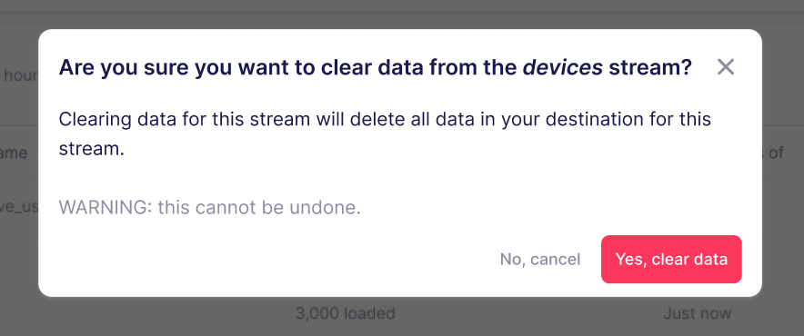

# Clearing your data

:::info

As of Airbyte v1.0.0, the term "Clear" has replaced "Reset" in the Airbyte UI and documentation. The functionality described on this page is the new "Clear" functionality. Prior to Airbyte 1.0, "Reset" was used to describe similar functionality, including a mandatory re-sync of the data, which has been removed.

:::

From time-to-time, you may want to erase all of the data that Airbyte has created in your destination. This can be accomplished with a Clear sync - either clearing a single stream, or all streams.

Note that there is no way to recover from a clear sync, so please be certain that you wish to erase all the data in your destination.

:::warning

Not all sources keep their history forever. If you perform a Clear Sync, and your source does not retain all of its records, this may lead to data loss.

:::

A Clear can be triggered either from the UI or Airbyte API. Airbyte allows you to clear all streams in the connection or only a single stream through the UI. You may also be prompted to clear some streams when making configuration changes that apply to multiple streams. Airbyte additionally supports the clearing of multiple streams through the API.

## Steps to Clear Data

To perform a full removal of the data for all your streams, navigate to a connection's `Settings` tab and click "Clear data". Confirm the selection to remove all previously synced data from the destination for that connection.

To clear data for a single stream, navigate to a Connection's status page, click the three grey dots next to any stream, and select "Clear data". This will clear the data for just that stream. You will then need to sync the connection again in order to reload data for that stream.

You will also automatically be prompted to clear affected streams if you edit any stream settings or approve any non-breaking schema changes. To ensure data continues to sync accurately, Airbyte recommends doing a clear of those streams as your streams could sync incorrectly if a clear is not performed.

Similarly to a sync, a clear can be completed as successful, failed, or cancelled. To resolve a failed clearing of data, you should manually drop the tables in the destination so that Airbyte can continue syncing accurately into the destination.

In order to backfill all historical data, a sync should be initiated after your clear succeeds.

:::note
A single stream clear will sync all enabled streams on the next sync.
:::

## Clear behavior

When clearing data is successfully completed, all the records are deleted from your destination tables (and files, if using local JSON or local CSV as the destination). The tables or files are not removed, they will only be emptied.

Clearing your data causes data downtime, meaning that your final tables will be empty once the Clear is complete. Clearing your data also blocks the running of regularly-scheduled syncs until they are complete. If you choose to clear your data while another sync is running, it will enqueue, and start at the end of the currently running sync.

:::tip
If you have any orphaned tables or files that are no longer being synced to, they should be cleaned up separately, as Airbyte will not clean them up for you. This can occur when the `Destination Namespace` or `Stream Prefix` connection configuration is changed for an existing connection.
:::
