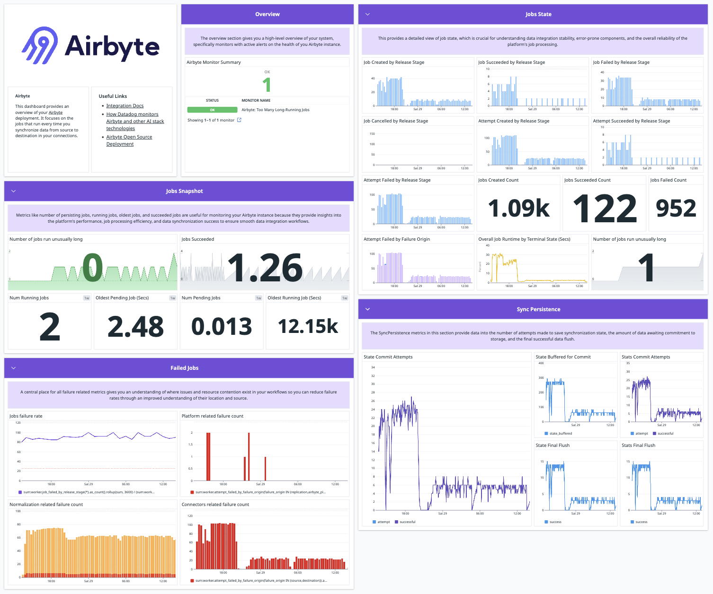

# Monitoring Airbyte

Airbyte offers extensive logging capabilities.

## Connection logging

All Airbyte instances include extensive logging for each connector. These logs give you detailed reports on each data sync. [Learn more about browsing logs](browsing-output-logs).

## Datadog Integration

Airbyte uses Datadog to monitor Airbyte Cloud performance on a [number of metrics](https://docs.datadoghq.com/integrations/airbyte/#data-collected) important to your experience. This integration isn't available for public use, but it could become available later as an enterprise feature to help you monitor your own deployment. If you're an enterprise customer and Datadog integration is important to you, let us know.



<!--
## Airbyte OpenTelemetry Integration

Setting up this integration for Airbyte instances involves three straightforward steps:

1. **Deploy an OpenTelemetry Collector**: Follow the official [Kubernetes Getting Started documentation](https://opentelemetry.io/docs/collector/getting-started/#kubernetes) to deploy a collector in your kubernetes cluster.

2. **Update the chart values**: Modify your `values.yaml` file in the Airbyte repository to include the `metrics-reporter` container. This submits Airbyte metrics to the OpenTelemetry collector:

```yaml
global:
  metrics:
    metricClient: "otel"
    otelCollectorEndpoint: "http://otel-collector.opentelemetry.svc:4317"

metrics:
  enabled: true
```

:::note
Update the value of `otelCollectorEndpoint` with your collector URL.
:::

3. **Re-deploy Airbyte**: With the updated chart values, you're ready to deploy your Airbyte application by upgrading the chart. 
-->
