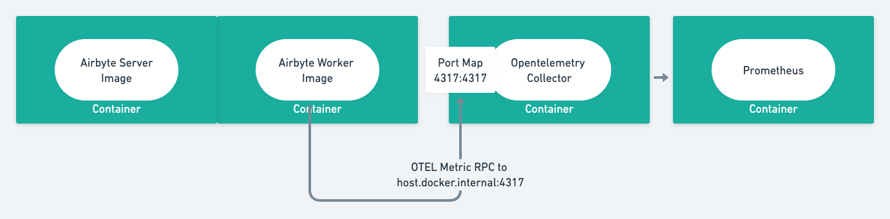

# Collecting Metrics

Airbyte supports two ways to collect metrics - using datadog or open telemetry. 
Fill in `METRIC_CLIENT` field in `.env` file to get started!

**Prerequisite:** 
In order to get metrics from airbyte we need to deploy a container / pod called metrics-reporter like below 
```
airbyte-metrics: 
  image: airbyte/metrics-reporter:${VERSION} 
  container_name: airbyte-metrics 
  environment: 
    - METRIC_CLIENT=${METRIC_CLIENT} 
    - OTEL_COLLECTOR_ENDPOINT=${OTEL_COLLECTOR_ENDPOINT}
```


# Open Telemetry

1. In `.env` change `METRIC_CLIENT` to `otel`. 
2. Similarly, configure `OTEL_COLLECTOR_ENDPOINT` to tell Airbyte where to send metrics RPC to.

## Example

### Run Opentelemetry and Airbyte locally

In this example we will run Airbyte locally along with an Open Telemetry Collector. The Open telemetry collector
will expose port 4317 to the localhost as the receiving endpoint.



Steps:

1. Setting up Open telemetry. In this example we will use the repository from `opentelemetry-java-docs`. 
Run the following commands to have it up and running.

```bash
  git clone https://github.com/open-telemetry/opentelemetry-java-docs
  cd opentelemetry-java-docs/otlp/docker
  docker-compose up
```

2. Configure Airbyte `.env` file. 
   1. Change `METRIC_CLIENT` to `otel` to indicate Airbyte to use Open telemetry to emit metric data.
   2. Change `OTEL_COLLECTOR_ENDPOINT` to `"http://host.docker.internal:4317"` because Open Telemetry 
   Collector has enabled port forward from localhost:4317 to container port 4317. To send data to Collector container port 4317, we want to need to export data to physical machine's localhost:4317, which in docker will be represented as `http://host.docker.internal:4317`. 
   > Do *not* use `localhost:4317` or you will send data to the same container where Airbyte Worker is running.
   3. Start Airbyte server by running `docker-compose up` under airbyte repository. Go to `localhost:8000` to visit Airbyte and start a sync, then go to `localhost:9090` to access Prometheus - you should be able to see the metrics there. Alternatively, 

### Run Opentelemetry and Airbyte on kubernetes

> **Prerequisite:** Read https://github.com/airbytehq/airbyte/blob/master/docs/deploying-airbyte/on-kubernetes.md to understand how to start Airbyte on Kubernetes

We will use `stable` in this example.

Steps:
1. Run open telemetry collector in the same Kubernetes context. Here we follow example in [OpenTelemetry doc](https://opentelemetry.io/docs/collector/getting-started/#kubernetes)
2. edit `kube/overlays/stable/.env` and add the following lines:

```aidl
METRIC_CLIENT=otel
OTEL_COLLECTOR_ENDPOINT=<address>
```

If you started open telemetry collector in the link above, the address should be `http://otel-collector:4317`. 
Note the format - unlike the base `.env`, there is no quote in `.env` file under kubernetes.


## Tutorial 

Deploy the airbyte metric pod :
```
---
apiVersion: apps/v1
kind: Deployment
metadata:
  name: {{ .Release.Name }}-metrics
  namespace: {{ .Release.Namespace }}
  labels: {{ set . "component" "metrics" | include "labels" | nindent 4 }}
spec:
  selector:
    matchLabels: {{ set . "component" "metrics" | include "labels" | nindent 6 }}
  template:
    metadata:
      labels: {{ set . "component" "metrics" | include "labels" | nindent 8 }}
    spec:
      containers:
      - name: airbyte-metrics
        image: "airbyte/metrics-reporter:latest"
        imagePullPolicy: IfNotPresent
        env:
        - name: AIRBYTE_VERSION
          value: latest
        - name: DATABASE_PASSWORD
          valueFrom:
            secretKeyRef:
              name: {{ include "airbyte.database.secret.name" . }}
              key: DATABASE_PASSWORD
        - name: DATABASE_URL
          value: {{ include "airbyte.database.url" . | quote }}
        - name: DATABASE_USER
          valueFrom:
            secretKeyRef:
              name: {{ .Release.Name }}-secrets
              key: DATABASE_USER
        - name: CONFIGS_DATABASE_MINIMUM_FLYWAY_MIGRATION_VERSION
          value: 0.35.15.001
        - name: METRIC_CLIENT
          value: otel
        - name: OTEL_COLLECTOR_ENDPOINT
          value: http://otel-collector:4317
```


Deploy an Open telemetry pod like below :

```
apiVersion: apps/v1
kind: Deployment
metadata:
  name: otel-collector
  namespace: {{ .Release.Namespace }}
  labels: {{ set . "component" "otel-collector" | include "labels" | nindent 4 }} 
spec:
  selector:
    matchLabels: {{ set . "component" "otel-collector" | include "labels" | nindent 6 }} 
  replicas: 1
  template:
    metadata:
      labels: {{ set . "component" "otel-collector" | include "labels" | nindent 8 }} 
    spec:
      containers:
      - command:
          - "/otelcol"
          - "--config=/conf/otel-collector-config.yaml"
        image: "otel/opentelemetry-collector:latest"
        name: otel-collector
        ports:
        - containerPort: 4317 # Default endpoint for OpenTelemetry receiver.
        - containerPort: 8889 # Port for Prometheus instance
        volumeMounts:
        - name: config
          mountPath: /conf
      volumes:
        - configMap:
            name: otel-collector-conf
            items:
              - key: otel-collector-config
                path: otel-collector-config.yaml
          name: config
```

WIth this Config Map :

```
apiVersion: v1
kind: ConfigMap
metadata:
  name: otel-collector-conf
  namespace: {{ .Release.Namespace }}
  labels: {{ set . "component" "otel-collector" | include "labels" | nindent 4 }} 
data:
  otel-collector-config: |
    receivers:
      otlp:
        protocols:
          grpc:
           endpoint: "0.0.0.0:4317"
    processors:
      batch:
      memory_limiter:
        limit_mib: 1500
        spike_limit_mib: 512
        check_interval: 5s
    exporters:
      prometheus:
        endpoint: "0.0.0.0:8889"
        namespace: "default"
    service:
      pipelines:
        metrics:
          receivers: [otlp]
          processors: [memory_limiter, batch]
          exporters: [prometheus]
```

Then we need a service to be able to access both open telemetry GRPC and Prometheus
```
apiVersion: v1
kind: Service
metadata:
  name: otel-collector
  namespace: {{ .Release.Namespace }}
  labels: {{ set . "component" "otel-collector" | include "labels" | nindent 4 }} 
spec:
  ports:
  - name: otlp-grpc # Default endpoint for OpenTelemetry gRPC receiver.
    port: 4317
    protocol: TCP
    targetPort: 4317
  - name: prometheus
    port: 8889
  selector: {{ set . "component" "otel-collector" | include "labels" | nindent 6 }}
```

And finally We can add a service monitor to receive metrics in prometheus and optionally add some prometheus rules to generate alerts. 
You can replace with your prometheus name.
```
apiVersion: monitoring.coreos.com/v1
kind: ServiceMonitor
metadata:
  name: {{ .Release.Name }}
  namespace: {{ .Release.Namespace }}
  labels:
    {{ set . "component" "metrics" | include "labels" | nindent 4 }}
    prometheus: <your_prometheus_name>
spec:
  endpoints:
    - interval: 30s
      port: prometheus
      path: /metrics
      relabelings:
      - action: labeldrop
        regex: (service|endpoint|namespace|container)
  selector:
    matchLabels: {{ set . "component" "otel-collector" | include "labels" | nindent 6 }}
```

One rule example :
```
apiVersion: monitoring.coreos.com/v1
kind: PrometheusRule
metadata:
  name: {{ .Release.Name }}-rules
  namespace: {{ .Release.Namespace }}
  labels:
    {{ set . "component" "prometheus-rules" | include "labels" | nindent 4 }}
    prometheus: <your_prometheus_name>
spec:
  groups:
    - name: airbyte
      rules:
        - alert: AirbyteJobFail
          for: 0m
          expr: min(airbyte_job_failed_by_release_stage) > 0
          labels:
            priority: P2
          annotations:
            summary: {{ `"An Airbyte Job has failed"` }}     
```


# Datadog
TBD

## Metrics
Visit [OssMetricsRegistry.java](https://github.com/airbytehq/airbyte/blob/master/airbyte-metrics/metrics-lib/src/main/java/io/airbyte/metrics/lib/OssMetricsRegistry.java) to get a complete list of metrics Airbyte is sending.

