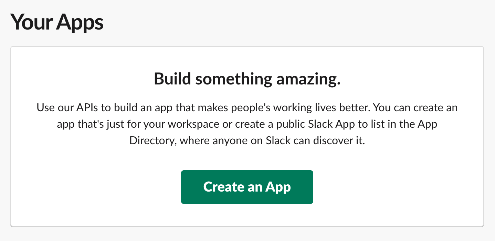
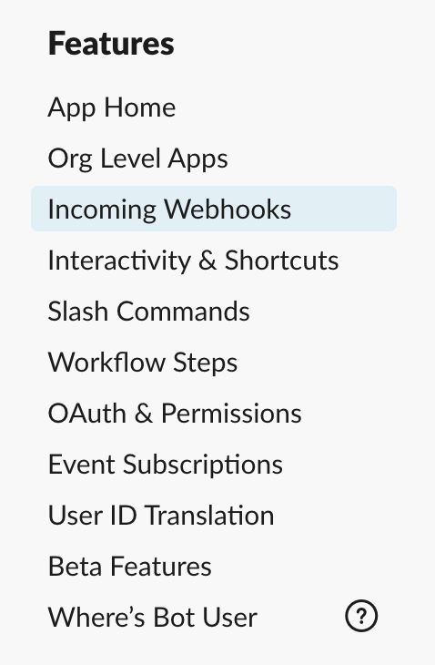
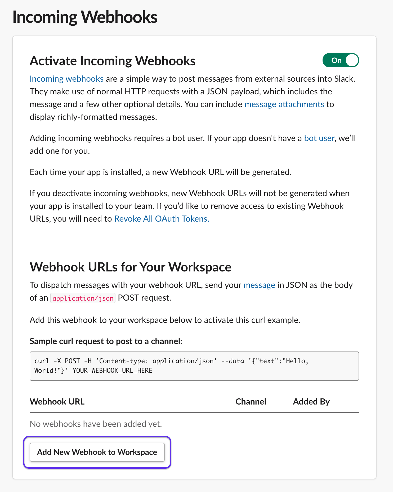
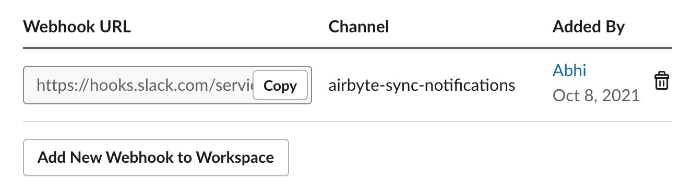
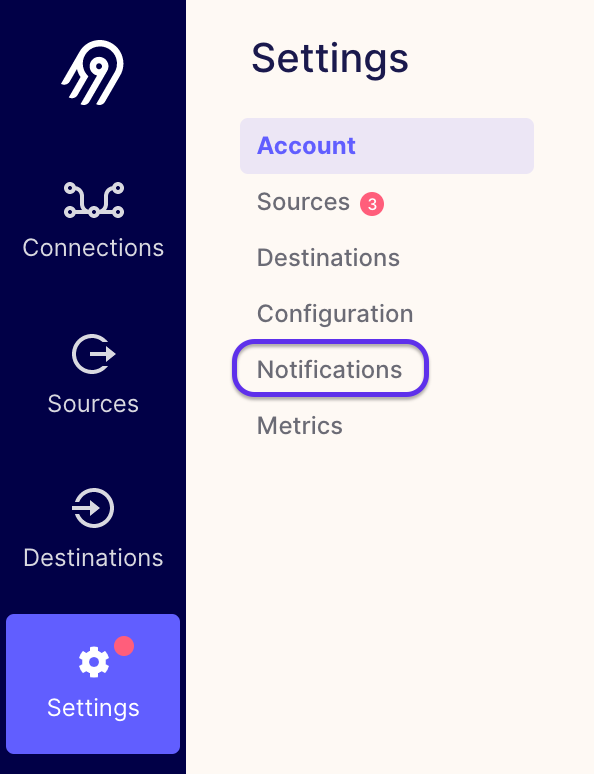
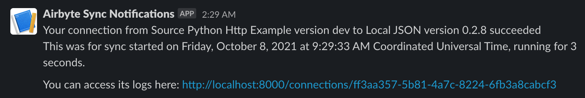

# Configuring Sync Notifications

## Overview

You can set up Airbyte to notify you when syncs have **failed** or **succeeded**. This is achieved through a webhook, a URL that you can input into other applications to get real time data from Airbyte.

## Set up Slack Notifications on Sync Status

If you're more of a visual learner, just head over to [this video](https://www.youtube.com/watch?v=NjYm8F-KiFc&ab_channel=Airbyte) to learn how to do this. Otherwise, keep reading!

**Set up the bot.**

Navigate to https://api.slack.com/apps/. Hit `Create an App`. 

   

Then click `From scratch`. Enter your App Name (e.g. Airbyte Sync Notifications) and pick your desired Slack workspace. 

**Set up the webhook URL.**

Now on the left sidebar, click on `Incoming Webhooks`. 

Click the slider button in the top right to turn the feature on. Then click `Add New Webhook to Workspace`.

Pick the channel that you want to receive Airbyte notifications in (ideally a dedicated one), and click `Allow` to give it permissions to access the channel. You should see the bot show up in the selected channel now.

Now you should see an active webhook right above the `Add New Webhook to Workspace` button.

 

Click `Copy.`

**Add the webhook to Airbyte.**

Assuming you have a [running instance of Airbyte](../deploying-airbyte/README.md), we can navigate to the UI. Click on Settings and then click on `Notifications`.

Simply paste the copied webhook URL in `Connection status Webhook URL` and you're ready to go! On this page, you can click one or both of the sliders to decide whether you want notifications on sync successes, failures, or both. Make sure to click `Save changes` before you leave.

Your Webhook URL should look something like this:

**Test it out.**

From the settings page, you can click `Test` to send a test message to the channel. Or, just run a sync now and try it out! If all goes well, you should receive a notification in your selected channel that looks like this:

You're done!
