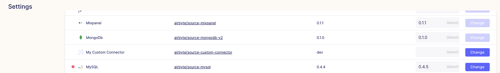

# Delete Custom Connectors in the Setting Page

## Overview

This tutorial will describe how to delete a Custom Connector that was added manually in the UI.

For this tutorial I'll use the Custom Connector shown bellow:



Make sure you had deleted all connections that use your custom connector!


## Connect to Airbyte Database and Remove the Connector

First you need to connect in the Airbyte Database
```shell
docker exec -ti airbyte-db psql -U docker -d airbyte
```
If you're using a external database see [Configuring Airbyte Database](configuring-airbyte-db.md)


If your connector is a destination change `source` to `destination` in the commands below.


When connected to the database you can run the following command to delete the Custom Connector:
```
select config_blob -> 'sourceDefinitionId' from airbyte_configs where config_blob @> '{"name": "My Custom Connector"}';
```
Copy the result, in my case the ID is: `25c5221d-dce2-4163-ade9-739ef790f503`.

Change the value to yours, and finally remove the connector image:
```
delete from airbyte_configs where config_blob @> '{"sourceDefinitionId": "25c5221d-dce2-4163-ade9-739ef790f503"}';
```

There is a [Github issue](https://github.com/airbytehq/airbyte/issues/3954) to implement this feature directly in the UI.

If you need to use more fields to select a specific connector see the example:
```
select config_blob -> 'sourceDefinitionId' from airbyte_configs where config_blob @> '{"name": "BigQuery", "dockerImageTag": "0.1.2"}';
```
This will use the Connector Name and the Version, to check all fields you can use try to run:
```
select config_blob from airbyte_configs where config_blob @> '{"name": "My Custom Connector"}';
```
