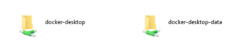

# Windows - Browsing Local File Output

## Overview

This tutorial will describe how to look for json and csv files in when using local destinations on Windows on a local deployment.

There can be confusion when using local destinations in Airbyte on Windows, especially if you are running WSL2 to power Docker. There are also two folders generated at the root folder of your Docker folder which will point you in the wrong direction.

## Locating where your temp folder is

While running Airbyte's Docker image on Windows with WSL2, you can access your temp folder by doing the following:

1. Open File Explorer \(Or any folder where you can access the address bar\)
2. Type in `\\wsl$` in the address bar
3. The folders below will be displayed

   

4. You can start digging here, but it is recommended to start searching from here and just search for the folder name you used for your local files. The folder address should be similar to `\\wsl$\docker-desktop\tmp\docker-desktop-root\containers\services\docker\rootfs\tmp\airbyte_local`
5. You should be able to locate your local destination CSV or JSON files in this folder.

Note that there are scenarios where you may not be able to browse to the actual files in which case, use the below method to take a local copy.

## Use Docker to Copy your temp folder files

Note that this method does not allow direct access to any files directly, instead it creates local, readable copies.

1. Open and standard CMD shell
2. Type the following (where `<local path>` is the path on your Windows host machine to place copies)
   `docker cp airbyte-server:/tmp/airbyte_local <local path>`
3. This will copy the entire `airbyte_local` folder to your host machine.

Note that if you know the specific filename or wildcard, you can add append it to the source path of the `docker cp` command.
   
## Notes

1. Local JSON and Local CSV files do not persist between Docker restarts. This means that once you turn off your Docker image, your data is lost. This is consistent with the `tmp` nature of the folder.
2. In the root folder of your docker files, it might generate tmp and var folders that only have empty folders inside.

