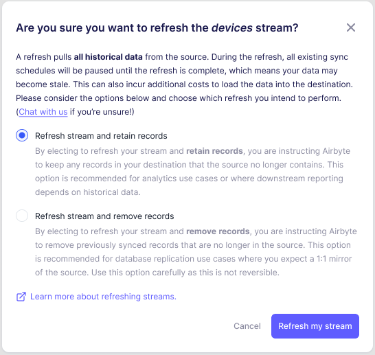

# Refreshes

:::info

This page describes a coming-soon feature. Refreshes will be available as of Airbyte v1.0.0.

:::

## Refreshes Overview

As of Airbyte 1.0, Refresh Syncs have been added to the Airbyte platform. A Refresh Sync erases the current cursor you have set for any incremental streams, effectively ‘rewinding’ the sync back to the beginning. This is helpful in the following scenarios:

- The source you're syncing from does not sync record deletions/removals, and you wish to mirror the source stream, which would include removing deleted records
- The source you are syncing from is unreliable and you wish to re-attempt the sync
- Something has gone wrong with your sync, and you wish to try again

`Refresh Syncs` do not create data downtime. While the `Refresh Sync` is running, the previous data in your destination remains available to query. Only at the successful conclusion of a `Refresh Sync` will the newly refreshed data be swapped or merged into place. This is an improvement from the previous `Reset Syncs` that Airbyte had in earlier iterations.

When performing a `Refresh Sync`, any records you’ve already imported will be imported again for the stream(s) being refreshed (assuming they are still present within the source), leading to a slower and more expensive sync than you might be used to. `Refresh Syncs` will block any scheduled syncs from occurring until they are complete. During a `Refresh Sync`, the streams that are not being refreshed will also sync normally in order to lower data latency . All `Refresh Syncs` are resumable if the underlying source and destination support [checkpointing](/understanding-airbyte/airbyte-protocol/#state--checkpointing).

Depending on the sync mode you’ve selected, you’ll be able to choose between the following refresh options:

| Stream Sync Mode               | Refresh stream and remove records | Refresh stream and retain records | Clear     |
| ------------------------------ | --------------------------------- | --------------------------------- | --------- |
| Incremental \| Append + Dedupe | Available                         | Available                         | Available |
| Full Refresh \| Overwrite      | Not available                     | Not available                     | Available |
| Full Refresh \| Append         | Not available                     | Not available                     | Available |
| Incremental \| Append          | Not available                     | Available                         | Available |

For supported destinations, and depending on the sync mode you have selected, there are two types of refreshes - "retaining history" and "removing history". Both kinds of Refresh Syncs can be triggered from the UI and via the Airbyte API at either the stream or connection levels (although both might not be available depending on your sync mode).

## Refresh and Remove Records

`Refresh and Remove Records Syncs` will only display data in the destination’s final tables that was newly synced since the refresh was initiated. This is the simplest type of `Refresh Sync`.

:::warning

Not all sources keep their history forever. If you perform a Refresh and Remove Records Sync, and your source does not retain all of its records, this may lead to data loss. If you need to keep all history, then we recommend using `Refresh and Retain Records`. If that is not an option, then you should back up the data in your destination before running the Refresh and Remove Records.

:::

## Refresh and Retain Records

`Refresh and Retain Records Syncs` keep the records you had previously, and merge in the new data from this sync onward with the data previously stored in your destination. Using a `Refresh and Retain Records Sync` with a Deduplicated Sync mode is the best way to recover from an unreliable (e.g. lossy or buggy) source.

:::warning

`Refresh and Retain Records Syncs` will lead to increased data storage in your destination (as the old and new copies of your data are both stored). This may also lead to increased compute costs and slower syncs, depending on your destination.

:::

## Resumability

Airbyte strives to create resilient syncs that can handle many types of issues (for example, networking issues, flaky source APIs or under provisioned destination servers). Whenever possible, Airbyte syncs are resumable, including standard Full Refresh + Overwrite and Full Refresh + Append syncs, along with the Refreshes we are describing on this page. “Resumable” in this context means that if something goes wrong in the first attempt of your sync, we will immediately try again with a subsequent attempt - in fact, Airbyte will keep retrying as long as the source is producing new records and the destination can commit them. In order to achieve this resumability, Airbyte may deliver a record more than once - Airbyte is a deliver at-least-once system.

Consider a Postgres source. We could build a query that does `select * from users`, which would guarantee that each row is emitted only once, but that would lead to some problems:

- First, it would keep a long-lasting transaction lock on the users table for the whole duration of the sync which would slow down the source
- Tables over a certain size won’t be able to fit in memory, again dramatically slowing down your database while syncing (or even crashing the database)
- There’s no logical cursor that we can resume from if we need to retry the sync

So, to get around all of these issues, we instead issue queries that look more like this:

- `select * from users where CTID >= X AND CTID < Y`
- `select * from users where CTID >= Y AND CTID < Z`
- `...`

CTID is a special postgres column that we use to paginate the contents of the table, and this affords us a cursor we can use to break the query into chunks, both keeping the database happy, and allowing Airbyte to resume the sync half-way though if needed. However, if the sync only got partially through a query, the records in that query will be re-sent on the second attempt. If you want your destination to only contain a unique instance for each record, please choose a destination and sync mode that includes deduplication.

This example uses a database source, but the same logic holds for API sources as well. A series of requests to a user's API endpoint might be:

- `curl -x GET api.com/v1/users?page=1`
- `curl -x GET api.com/v1/users?page=2`
- `...`

## Data Generations

With the advent of Refresh and Retain History Syncs, Airbyte has provided a way for you to determine if any given record is from before or after the refresh took place. This is helpful when disambiguating historic data which may have changed due to an unreliable source. We call this information the “Generation” of the data, indicated by the `_airbyte_generation_id` column. Every time a Refresh Sync (of either type) occurs, the generation increases. `_airbyte_generation_id` is a monotonically increasing counter which maps to this notion of “generation” of data. Data which was synced before the addition of this feature will have a generation of `null`.

### Example: Understanding and Recovering from a Flaky Source

Consider the following example. You are extracting data into your data warehouse and notice that data for March, 2024 is missing. You are using an append sync mode.

| year_month (pk) | total_sales | \_airbyte_extracted_at | \_airbyte_generation_id | \_airbyte_meta                 | \_airbyte_raw_id |
| --------------- | ----------- | ---------------------- | ----------------------- | ------------------------------ | ---------------- |
| 2024-01         | $100        | 2024-01-01 12:00:00    | 0                       | `{ changes: [], sync_id: 1, }` | aaa-aaa          |
| 2024-02         | $200        | 2024-01-01 12:00:00    | 0                       | `{ changes: [], sync_id: 1, }` | bbb-bbb          |
| 2024-04         | $400        | 2024-01-01 12:00:00    | 0                       | `{ changes: [], sync_id: 1, }` | ccc-ccc          |

You decide to do a Refresh and Retain History Sync, and now have the missing row

| year_month (pk) | total_sales | \_airbyte_extracted_at | \_airbyte_generation_id | \_airbyte_meta                 | \_airbyte_raw_id |
| --------------- | ----------- | ---------------------- | ----------------------- | ------------------------------ | ---------------- |
| 2024-01         | $100        | 2024-01-01 12:00:00    | 0                       | `{ changes: [], sync_id: 1, }` | aaa-aaa          |
| 2024-02         | $300        | 2024-01-01 12:00:00    | 0                       | `{ changes: [], sync_id: 1, }` | bbb-bbb          |
| 2024-04         | $400        | 2024-01-01 12:00:00    | 0                       | `{ changes: [], sync_id: 1, }` | ccc-ccc          |
| 2024-01         | $100        | 2024-01-02 12:00:00    | 1                       | `{ changes: [], sync_id: 2, }` | ddd-ddd          |
| 2024-02         | $200        | 2024-01-02 12:00:00    | 1                       | `{ changes: [], sync_id: 2, }` | eee-eee          |
| 2024-03         | $300        | 2024-01-02 12:00:00    | 1                       | `{ changes: [], sync_id: 2, }` | fff-fff          |
| 2024-04         | $400        | 2024-01-02 12:00:00    | 1                       | `{ changes: [], sync_id: 2, }` | ggg-ggg          |

It is now possible to compute the different total values of `sum(total_sales)` for _each generation_, and then if they are different, to look for records which didn’t exist before and after the reset, in different generations. If you aren’t using an append sync mode, the data for both the previous and current generations will be retained in your destination’s raw tables, but not displayed in the final tables. A similar analysis could be performed looking for records which exist in the current generations, but not the previous.

### Example: Discovering Deletes from a Source that Hides Them.

Another example of using generation Id: You are extracting data into your data warehouse from a source which doesn’t track deletes. You are using an append+dedupe sync mode, and you want to detect when a record has been deleted from the source:

| user_id (pk) | name   | \_airbyte_extracted_at | \_airbyte_generation_id | \_airbyte_meta                 | \_airbyte_raw_id |
| ------------ | ------ | ---------------------- | ----------------------- | ------------------------------ | ---------------- |
| 1            | Evan   | 2024-01-01 12:00:00    | 0                       | `{ changes: [], sync_id: 1, }` | aaa-aaa          |
| 2            | Davin  | 2024-01-01 12:00:00    | 0                       | `{ changes: [], sync_id: 1, }` | bbb-bbb          |
| 3            | Benoit | 2024-01-01 12:00:00    | 0                       | `{ changes: [], sync_id: 1, }` | ccc-ccc          |

Time passes, and you opt to do a Refresh and Remove History Sync to see if any user was removed in the source. Your final table now looks like:

| user_id (pk) | name   | \_airbyte_extracted_at | \_airbyte_generation_id | \_airbyte_meta                 | \_airbyte_raw_id |
| ------------ | ------ | ---------------------- | ----------------------- | ------------------------------ | ---------------- |
| 1            | Evan   | 2024-02-02 12:00:00    | 1                       | `{ changes: [], sync_id: 2, }` | ddd-ddd          |
| 2            | Davin  | 2024-01-01 12:00:00    | 0                       | `{ changes: [], sync_id: 1, }` | bbb-bbb          |
| 3            | Benoit | 2024-02-02 12:00:00    | 1                       | `{ changes: [], sync_id: 2, }` | eee-eee          |

Notice that user #2’s latest entry doesn’t belong to the current (e.g. `max(_airbyte_generation_id)`) generation. This informs you that the source no longer includes a record for this primary key, and it has been deleted. In your downstream tables or analysis, you can opt to exclude this record.
