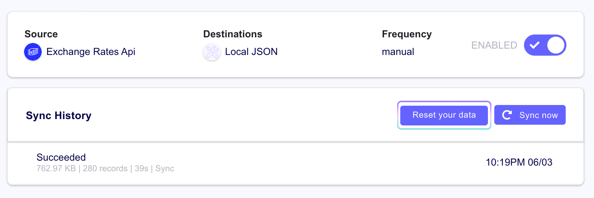

# Resetting Your Data

The reset button gives you a blank slate, of sorts, to perform a fresh new sync. This can be useful if you are just testing Airbyte or don't necessarily require the data replicated to your destination to be saved permanently.

As outlined above, you can click on the `Reset your data` button to give you that clean slate. Just as a heads up, here is what it does and doesn't do:

The reset button **DOES**:

* Delete all records in your destination tables
* Delete all records in your destination file

The reset button **DOES NOT**:

* Delete the destination tables
* Delete a destination file if using the LocalCSV or LocalJSON Destinations

Because of this, if you have any orphaned tables or files that are no longer being synced to, they will have to be cleaned up later, as Airbyte will not clean them up for you.

