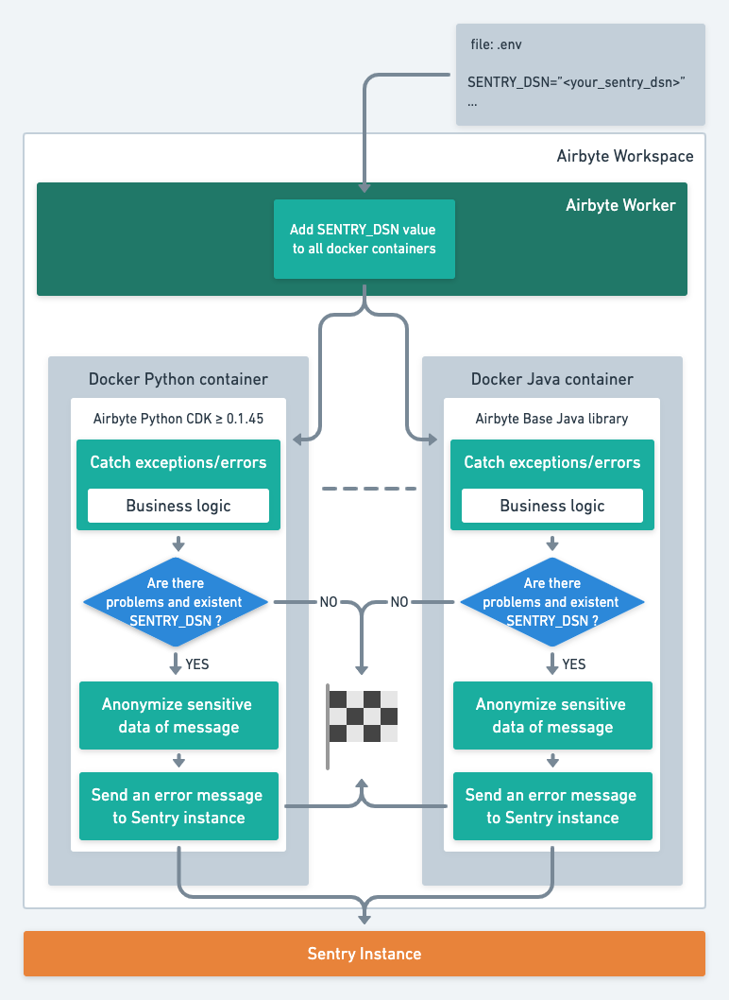

# Sentry Integration

Airbyte provides an opportunity to aggregate connectors' exceptions and errors via [Sentry](https://sentry.io/).
By default, this option is off. There are 2 possible mechanisms for its activation:
1. Define the `SENTRY_DSN` environment variable into Dockerfile of necessary connectors.
2. Define the `SENTRY_DSN` into the workspace environment file (`.env`). Workers will add this variable to all docker connectors automatically.

Most connectors written using the Airbyte Python or Java CDKs automatically detect this environment variable and activate Sentry profiling accordingly. 

## UML diagram

