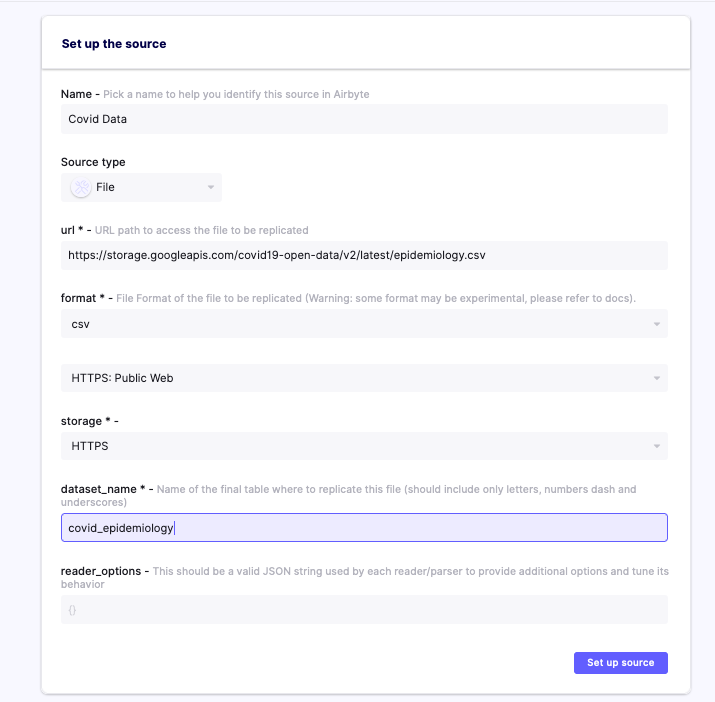
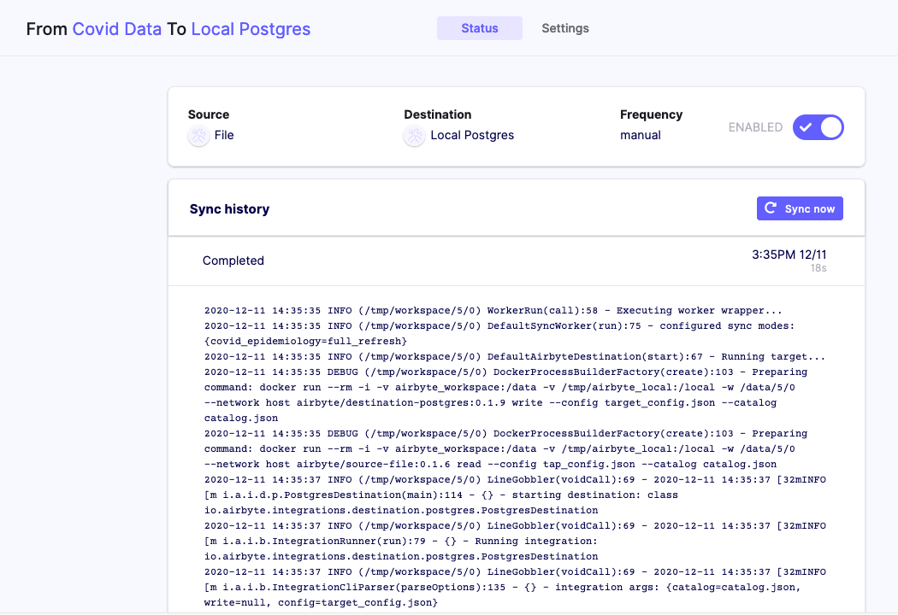

# Transformations with SQL (Part 1/3)

:::warning
Normalization and Custom Transformation are deprecated features.
Destinations using Normalization will be replaced by [Typing and Deduping](/using-airbyte/core-concepts/typing-deduping.md).
Custom Transformation will be removed on March 31. For more information, visit [here](https://github.com/airbytehq/airbyte/discussions/34860).
:::

This tutorial will describe how to integrate SQL based transformations with Airbyte syncs using plain SQL queries.

This is the first part of ELT tutorial. The second part goes deeper with [Transformations with dbt](transformations-with-dbt.md) and then wrap-up with a third part on [Transformations with Airbyte](transformations-with-airbyte.md).

## \(Examples outputs are updated with Airbyte version 0.23.0-alpha from May 2021\)

### First transformation step: Normalization

At its core, Airbyte is geared to handle the EL \(Extract Load\) steps of an ELT process. These steps can also be referred in Airbyte's dialect as "Source" and "Destination".

However, this is actually producing a table in the destination with a JSON blob column... For the typical analytics use case, you probably want this json blob normalized so that each field is its own column.

So, after EL, comes the T \(transformation\) and the first T step that Airbyte actually applies on top of the extracted data is called "Normalization". You can find more information about it [here](../../using-airbyte/core-concepts/basic-normalization.md).

Airbyte runs this step before handing the final data over to other tools that will manage further transformation down the line.

To summarize, we can represent the ELT process in the diagram below. These are steps that happens between your "Source Database or API" and the final "Replicated Tables" with examples of implementation underneath:


Anyway, it is possible to short-circuit this process \(no vendor lock-in\) and handle it yourself by turning this option off in the destination settings page.

This could be useful if:

1. You have a use-case not related to analytics that could be handled with data in its raw JSON format.
2. You can implement your own transformer. For example, you could write them in a different language, create them in an analytics engine like Spark, or use a transformation tool such as dbt or Dataform.
3. You want to customize and change how the data is normalized with your own queries.

In order to do so, we will now describe how you can leverage the basic normalization outputs that Airbyte generates to build your own transformations if you don't want to start from scratch.

Note: We will rely on docker commands that we've gone over as part of another [Tutorial on Exploring Docker Volumes](../browsing-output-logs.md).

### \(Optional\) Configure some Covid \(data\) source and Postgres destinations

If you have sources and destinations already setup on your deployment, you can skip to the next section.

For the sake of this tutorial, let's create some source and destination as an example that we can refer to afterward. We'll be using a file accessible from a public API, so you can easily reproduce this setup:

```text
Here are some examples of public API CSV:
https://storage.googleapis.com/covid19-open-data/v2/latest/epidemiology.csv
```



And a local Postgres Database, making sure that "Basic normalization" is enabled:


After setting up the connectors, we can trigger the sync and study the logs:



Notice that the process ran in the `/tmp/workspace/5/0` folder.

### Identify Workspace ID with Normalize steps

If you went through the previous setup of source/destination section and run a sync, you were able to identify which workspace was used, let's define some environment variables to remember this:

```bash
NORMALIZE_WORKSPACE="5/0/"
```

Or if you want to find any folder where the normalize step was run:

```bash
# find automatically latest workspace where normalization was run
NORMALIZE_WORKSPACE=`docker run --rm -i -v airbyte_workspace:/data  busybox find /data -path "*normalize/models*" | sed -E "s;/data/([0-9]+/[0-9]+/)normalize/.*;\1;g" | sort | uniq | tail -n 1`
```

### Export Plain SQL files

Airbyte is internally using a specialized tool for handling transformations called dbt.

The Airbyte Python module reads the `destination_catalog.json` file and generates dbt code responsible for interpreting and transforming the raw data.

The final output of dbt is producing SQL files that can be run on top of the destination that you selected.

Therefore, it is possible to extract these SQL files, modify them and run it yourself manually outside Airbyte!

You would be able to find these at the following location inside the server's docker container:

```text
/tmp/workspace/${NORMALIZE_WORKSPACE}/build/run/airbyte_utils/models/generated/airbyte_tables/<schema>/<your_table_name>.sql
```

In order to extract them, you can run:

```bash
#!/usr/bin/env bash
docker cp airbyte-server:/tmp/workspace/${NORMALIZE_WORKSPACE}/build/run/airbyte_utils/models/generated/ models/

find models
```

Example Output:

```text
models/airbyte_tables/quarantine/covid_epidemiology_f11.sql
```

Let's inspect the generated SQL file by running:

```bash
cat models/**/covid_epidemiology*.sql
```

Example Output:

```sql
 create  table "postgres".quarantine."covid_epidemiology_f11__dbt_tmp"
  as (

with __dbt__CTE__covid_epidemiology_ab1_558 as (

-- SQL model to parse JSON blob stored in a single column and extract into separated field columns as described by the JSON Schema
select
    jsonb_extract_path_text(_airbyte_data, 'key') as "key",
    jsonb_extract_path_text(_airbyte_data, 'date') as "date",
    jsonb_extract_path_text(_airbyte_data, 'new_tested') as new_tested,
    jsonb_extract_path_text(_airbyte_data, 'new_deceased') as new_deceased,
    jsonb_extract_path_text(_airbyte_data, 'total_tested') as total_tested,
    jsonb_extract_path_text(_airbyte_data, 'new_confirmed') as new_confirmed,
    jsonb_extract_path_text(_airbyte_data, 'new_recovered') as new_recovered,
    jsonb_extract_path_text(_airbyte_data, 'total_deceased') as total_deceased,
    jsonb_extract_path_text(_airbyte_data, 'total_confirmed') as total_confirmed,
    jsonb_extract_path_text(_airbyte_data, 'total_recovered') as total_recovered,
    _airbyte_emitted_at
from "postgres".quarantine._airbyte_raw_covid_epidemiology
-- covid_epidemiology
),  __dbt__CTE__covid_epidemiology_ab2_558 as (

-- SQL model to cast each column to its adequate SQL type converted from the JSON schema type
select
    cast("key" as
    varchar
) as "key",
    cast("date" as
    varchar
) as "date",
    cast(new_tested as
    float
) as new_tested,
    cast(new_deceased as
    float
) as new_deceased,
    cast(total_tested as
    float
) as total_tested,
    cast(new_confirmed as
    float
) as new_confirmed,
    cast(new_recovered as
    float
) as new_recovered,
    cast(total_deceased as
    float
) as total_deceased,
    cast(total_confirmed as
    float
) as total_confirmed,
    cast(total_recovered as
    float
) as total_recovered,
    _airbyte_emitted_at
from __dbt__CTE__covid_epidemiology_ab1_558
-- covid_epidemiology
),  __dbt__CTE__covid_epidemiology_ab3_558 as (

-- SQL model to build a hash column based on the values of this record
select
    *,
    md5(cast(

    coalesce(cast("key" as
    varchar
), '') || '-' || coalesce(cast("date" as
    varchar
), '') || '-' || coalesce(cast(new_tested as
    varchar
), '') || '-' || coalesce(cast(new_deceased as
    varchar
), '') || '-' || coalesce(cast(total_tested as
    varchar
), '') || '-' || coalesce(cast(new_confirmed as
    varchar
), '') || '-' || coalesce(cast(new_recovered as
    varchar
), '') || '-' || coalesce(cast(total_deceased as
    varchar
), '') || '-' || coalesce(cast(total_confirmed as
    varchar
), '') || '-' || coalesce(cast(total_recovered as
    varchar
), '')

 as
    varchar
)) as _airbyte_covid_epidemiology_hashid
from __dbt__CTE__covid_epidemiology_ab2_558
-- covid_epidemiology
)-- Final base SQL model
select
    "key",
    "date",
    new_tested,
    new_deceased,
    total_tested,
    new_confirmed,
    new_recovered,
    total_deceased,
    total_confirmed,
    total_recovered,
    _airbyte_emitted_at,
    _airbyte_covid_epidemiology_hashid
from __dbt__CTE__covid_epidemiology_ab3_558
-- covid_epidemiology from "postgres".quarantine._airbyte_raw_covid_epidemiology
  );
```

#### Simple SQL Query

We could simplify the SQL query by removing some parts that may be unnecessary for your current usage \(such as generating a md5 column; [Why exactly would I want to use that?!](https://blog.getdbt.com/the-most-underutilized-function-in-sql/)\).

It would turn into a simpler query:

```sql
create table "postgres"."public"."covid_epidemiology"
as (
    select
        _airbyte_emitted_at,
        (current_timestamp at time zone 'utc')::timestamp as _airbyte_normalized_at,

        cast(jsonb_extract_path_text("_airbyte_data",'key') as varchar) as "key",
        cast(jsonb_extract_path_text("_airbyte_data",'date') as varchar) as "date",
        cast(jsonb_extract_path_text("_airbyte_data",'new_tested') as float) as new_tested,
        cast(jsonb_extract_path_text("_airbyte_data",'new_deceased') as float) as new_deceased,
        cast(jsonb_extract_path_text("_airbyte_data",'total_tested') as float) as total_tested,
        cast(jsonb_extract_path_text("_airbyte_data",'new_confirmed') as float) as new_confirmed,
        cast(jsonb_extract_path_text("_airbyte_data",'new_recovered') as float) as new_recovered,
        cast(jsonb_extract_path_text("_airbyte_data",'total_deceased') as float) as total_deceased,
        cast(jsonb_extract_path_text("_airbyte_data",'total_confirmed') as float) as total_confirmed,
        cast(jsonb_extract_path_text("_airbyte_data",'total_recovered') as float) as total_recovered
    from "postgres".public._airbyte_raw_covid_epidemiology
);
```

#### Customize SQL Query

Feel free to:

- Rename the columns as you desire
  - avoiding using keywords such as `"key"` or `"date"`
- You can tweak the column data type if the ones generated by Airbyte are not the ones you favor
  - For example, let's use `Integer` instead of `Float` for the number of Covid cases...
- Add deduplicating logic

  - if you can identify which columns to use as Primary Keys

    \(since airbyte isn't able to detect those automatically yet...\)

  - \(Note: actually I am not even sure if I can tell the proper primary key in this dataset...\)

- Create a View \(or materialized views\) instead of a Table.
- etc

```sql
create view "postgres"."public"."covid_epidemiology" as (
    with parse_json_cte as (
        select
            _airbyte_emitted_at,

            cast(jsonb_extract_path_text("_airbyte_data",'key') as varchar) as id,
            cast(jsonb_extract_path_text("_airbyte_data",'date') as varchar) as updated_at,
            cast(jsonb_extract_path_text("_airbyte_data",'new_tested') as float) as new_tested,
            cast(jsonb_extract_path_text("_airbyte_data",'new_deceased') as float) as new_deceased,
            cast(jsonb_extract_path_text("_airbyte_data",'total_tested') as float) as total_tested,
            cast(jsonb_extract_path_text("_airbyte_data",'new_confirmed') as float) as new_confirmed,
            cast(jsonb_extract_path_text("_airbyte_data",'new_recovered') as float) as new_recovered,
            cast(jsonb_extract_path_text("_airbyte_data",'total_deceased') as float) as total_deceased,
            cast(jsonb_extract_path_text("_airbyte_data",'total_confirmed') as float) as total_confirmed,
            cast(jsonb_extract_path_text("_airbyte_data",'total_recovered') as float) as total_recovered
        from "postgres".public._airbyte_raw_covid_epidemiology
    ),
    cte as (
        select
            *,
            row_number() over (
                partition by id
                order by updated_at desc
            ) as row_num
        from parse_json_cte
    )
    select
        substring(id, 1, 2) as id, -- Probably not the right way to identify the primary key in this dataset...
        updated_at,
        _airbyte_emitted_at,

        case when new_tested = 'NaN' then 0 else cast(new_tested as integer) end as new_tested,
        case when new_deceased = 'NaN' then 0 else cast(new_deceased as integer) end as new_deceased,
        case when total_tested = 'NaN' then 0 else cast(total_tested as integer) end as total_tested,
        case when new_confirmed = 'NaN' then 0 else cast(new_confirmed as integer) end as new_confirmed,
        case when new_recovered = 'NaN' then 0 else cast(new_recovered as integer) end as new_recovered,
        case when total_deceased = 'NaN' then 0 else cast(total_deceased as integer) end as total_deceased,
        case when total_confirmed = 'NaN' then 0 else cast(total_confirmed as integer) end as total_confirmed,
        case when total_recovered = 'NaN' then 0 else cast(total_recovered as integer) end as total_recovered
    from cte
    where row_num = 1
);
```

Then you can run in your preferred SQL editor or tool!

If you are familiar with dbt or want to learn more about it, you can continue with the following [tutorial using dbt](transformations-with-dbt.md)...
