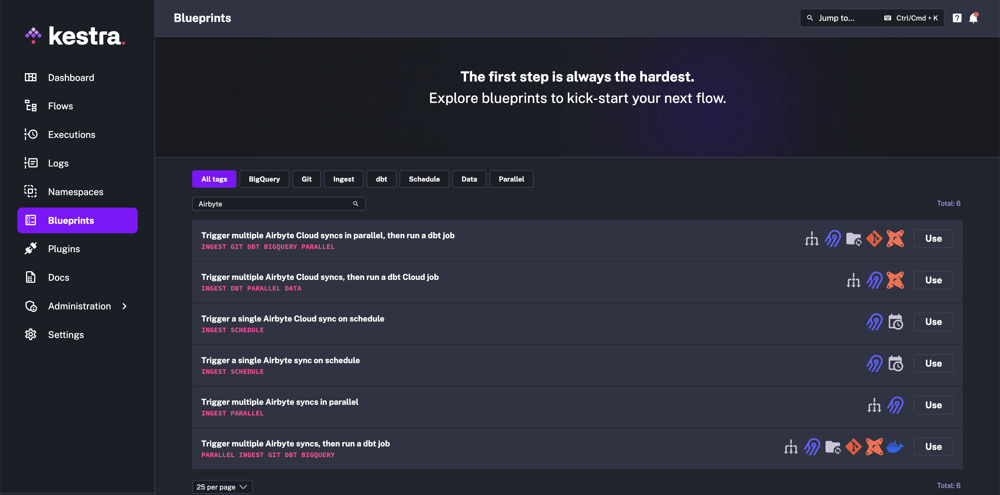

# Using the Kestra Plugin

Kestra has an official plugin for Airbyte, including support for self-hosted Airbyte and Airbyte Cloud. This plugin allows you to trigger data replication jobs (`Syncs`) and wait for their completion before proceeding with any downstream tasks. Alternatively, you may also run those syncs in a fire-and-forget way by setting the `wait` argument to `false`.

After Airbyte tasks successfully ingest raw data, you can easily start running downstream data transformations with dbt, Python, SQL, Spark, and many more, using a variety of available plugins. Check the [plugin documentation](https://kestra.io/plugins/) for a list of all supported integrations.

## Available tasks

These are the two main tasks to orchestrate Airbyte syncs:

1. The `io.kestra.plugin.airbyte.connections.Sync` task will sync connections for a self-hosted Airbyte instance

2. The `io.kestra.plugin.airbyte.cloud.jobs.Sync` task will sync connections for Airbyte Cloud

## **1. Set up the tools**

First, make sure you have Docker installed. We'll be using the `docker-compose` command, so your installation should contain `docker-compose`. When you use [Docker Desktop](https://docs.docker.com/compose/install/#scenario-one-install-docker-desktop), Docker Compose is already included.

### Start Airbyte

If this is your first time using Airbyte, we suggest following the [Quickstart Guide](https://github.com/airbytehq/airbyte/tree/e378d40236b6a34e1c1cb481c8952735ec687d88/docs/quickstart/getting-started.md). When creating Airbyte connections intended to be orchestrated with Kestra, set your Connection's **sync frequency** to **manual**. Kestra will automate triggering Airbyte jobs in response to external events or based on a schedule you’ll provide.

### Install Kestra

If you haven’t started Kestra yet, download [the Docker Compose file](https://raw.githubusercontent.com/kestra-io/kestra/develop/docker-compose.yml):

```yaml
curl -o docker-compose.yml https://raw.githubusercontent.com/kestra-io/kestra/develop/docker-compose.yml
```

Then, run `docker compose up -d` and [navigate to the UI](http://localhost:8080/). You can start [building your first flows](https://kestra.io/docs/getting-started) using the integrated code editor in the UI.


## 2. Create a flow from the UI

Kestra UI provides a wide range of Blueprints to help you get started.

Navigate to Blueprints. Then type "Airbyte" in the search bar to find the desired integration. This way, you can easily accomplish fairly standardized data orchestration tasks, such as the following:

1. [Run a single Airbyte sync](https://kestra.io/blueprints/airbyte-sync) on a schedule
2. [Run multiple Airbyte syncs in parallel](https://kestra.io/blueprints/airbyte-sync-parallel)
3. [Run multiple Airbyte syncs in parallel, then clone a Git repository with dbt code and trigger dbt CLI commands](https://kestra.io/blueprints/airbyte-sync-parallel-with-dbt)
4. [Run a single Airbyte Cloud sync](https://kestra.io/blueprints/airbyte-cloud-sync) on a schedule
5. [Run multiple Airbyte Cloud syncs in parallel, then clone a Git repository with dbt code and trigger dbt CLI commands](https://kestra.io/blueprints/airbyte-cloud-dbt)
6. [Run multiple Airbyte Cloud syncs in parallel, then run a dbt Cloud job](https://kestra.io/blueprints/airbyte-cloud-dbt-cloud)

Select a blueprint matching your use case and click "Use".



Then, within the editor, adjust the connection ID and task names and click "Save". Finally, trigger your flow.

## 3. Simple demo

Here is an example flow that triggers multiple Airbyte connections in parallel to sync data for multiple **Pokémon**.

```yaml
id: airbyte_syncs
namespace: company.team
description: Gotta catch ‘em all!

tasks:
  - id: data_ingestion
    type: io.kestra.core.tasks.flows.Parallel
    tasks:
      - id: charizard
        type: io.kestra.plugin.airbyte.connections.Sync
        connectionId: 9bb96539-73e7-4b9a-9937-6ce861b49cb9
      - id: pikachu
        type: io.kestra.plugin.airbyte.connections.Sync
        connectionId: 39c38950-b0b9-4fce-a303-06ced3dbfa75
      - id: psyduck
        type: io.kestra.plugin.airbyte.connections.Sync
        connectionId: 4de8ab1e-50ef-4df0-aa01-7f21491081f1

taskDefaults:
  - type: io.kestra.plugin.airbyte.connections.Sync
    values:
      url: http://host.docker.internal:8000/
      username: "{{ secret('AIRBYTE_USERNAME') }}"
      password: "{{ secret('AIRBYTE_PASSWORD') }}"

triggers:
  - id: every_minute
    type: io.kestra.core.models.triggers.types.Schedule
    cron: "*/1 * * * *"
```

## Next steps

If you liked that demo, check out [the blog post](https://airbyte.com/blog/everything-as-code-for-data-infrastructure-with-airbyte-and-kestra-terraform-providers) about using Airbyte and Kestra Terraform providers together to manage Everything as Code.

If you encounter anything unexpected while reproducing this tutorial, you can open [a GitHub issue](https://github.com/kestra-io/kestra) or [ask via Kestra Community Slack](https://kestra.io/slack). Lastly, give Kestra [a GitHub star](https://github.com/kestra-io/kestra) if you like the project.
